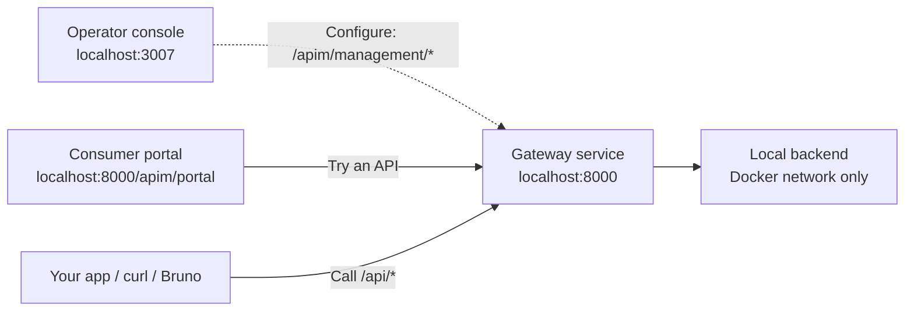

# Local APIM Simulator

For agent-driven development and operation, start with the [system operating model](docs/AGENT-SYSTEM.md) and its [implementation plan](docs/AGENT-SYSTEM-PLAN.md).

An independent, community-built simulator for testing Azure API Management (APIM) workflows quickly and cheaply on your own machine.

**Unofficial project. Not affiliated with, endorsed by, or supported by Microsoft.** Azure and Azure API Management are Microsoft product names. This repository implements a documented subset of APIM behaviour; it is not Microsoft's APIM service or self-hosted gateway.

The default stack needs no Azure account, subscription, or cloud deployment. Use it for local gateway work, policy testing, auth flows, and debugging. Local results establish the [supported simulator contracts](docs/FIDELITY-CONTRACTS.md), not full Azure compatibility or production performance. The [Azure comparison lab](examples/azure-validation/README.md) is a separate, optional cloud workflow that can incur Azure charges.

## Start Here

Follow the [getting-started journey](docs/GETTING-STARTED.md): start the stack, call anonymous echo, see a protected call fail, request a portal subscription, use its key in Scalar, and inspect the gateway trace. Each step has an expected result and a recovery point.

```bash
make up
curl -i http://localhost:8000/api/echo
```

The first build downloads dependencies and container images. Subsequent local requests use the running containers. Docker Hardened Images require `docker login dhi.io`; the [public-image overrides](#container-hardening) are available if you need them.

| Address | Role | What you do here |
| --- | --- | --- |
| [localhost:3007](http://localhost:3007) | Operator console — **Manage APIs** | Define APIs and policies, inspect configuration, test and trace requests. Choose **Load Local Demo**, then connect. |
| [localhost:8000](http://localhost:8000/api/echo) | Gateway and local API service | Applications, curl and Bruno call configured routes such as `/api/echo`. Local health, trace and management endpoints also live under `/apim/`. |
| [localhost:8000/apim/portal](http://localhost:8000/apim/portal) | Consumer developer portal — **Explore APIs** | Discover products, request subscription keys and try APIs with the embedded Scalar client. |

There are two browser interfaces and one gateway service. The developer portal is served by that gateway on port `8000`; it is not another container or port. The console on `3007` calls the gateway's management API using a tenant key. API consumers use the gateway with the API's required subscription key and/or bearer token.

In the portal, request a subscription to **API learning demo**, select its key and try `/demo/echo`. This protected route reaches the same mock backend as anonymous `/api/echo`; a call without a valid subscription key returns `401`.



For the smallest runtime, use `make up-gateway` (gateway and mock backend, without the operator console). Start with the [ten-minute API lesson](docs/API-BASICS.md), then the [local address guide](docs/LOCAL-ADDRESSES.md). Keep `localhost` as the default; existing `sslip.io` edge/TLS stacks are useful when hostnames and certificates are part of the test.

See [what we learned from Azurite and the Service Bus emulator](docs/EMULATOR-DESIGN.md) for the compatibility, lifecycle and support principles behind this local workflow.

The default configuration is temporary: management edits are lost when the gateway container stops or restarts. [Save edits and reset a chosen stack](docs/LOCAL-LIFECYCLE.md) before changing its lifecycle. Report simulator defects in [this project's issue tracker](https://github.com/nickromney/apim-simulator/issues).

## Security Note

- Keep this stack local-only. Do not expose it to the internet or use it as a production gateway.
- Demo passwords, tenant keys, and subscription keys in this repository are intentional and exist only for local examples, tutorials, and smoke tests.
- Do not expose or port-forward the demo Keycloak service on `localhost:8180`, especially when running management-enabled stacks.

The [security lab](examples/apim-security/README.md) exercises real local TLS/mTLS, signed scoped identities, encrypted configuration and recovery, outbound restrictions, WAF/request limits, governance locks, durable audit and gateway failover. Run `make -C examples/apim-security up` followed by `make -C examples/apim-security verify`.

## About the Simulator

The simulator gives you a local APIM-shaped gateway with:

- config-driven APIs, operations, products, subscriptions, version sets, backends, named values, policy fragments, tags, users, groups, loggers, and diagnostics
- APIM-style auth flows, including anonymous, subscription-key, JWT/OIDC, scope, role, claim, and client-certificate checks
- a practical XML policy subset, including routing, transforms, throttling, caching, JWT validation, backend selection, and `send-request`
- tenant-key-protected management APIs, per-request traces, replay, and a local operator console
- product publication, legal terms, subscription limits and approval workflows, plus a consumer portal with version selection and draft/preview/publish customization
- API-scoped debug credentials, local monitoring logs/alerts, OpenAPI export, and a continuously synchronized local API Center catalog
- Terraform/OpenTofu import and static compatibility reporting
- direct public, edge HTTP, edge TLS, private/internal, OIDC, MCP, hello starter, todo demo, and OTEL/[LGTM](https://github.com/grafana/docker-otel-lgtm) runtime shapes

Local internal caching is supported for the `cache-*` policies. External cache backends remain out of scope. Call and bandwidth quotas and selectable sliding-window/token-bucket throttling run locally.

The [policy guide lab](examples/apim-policies/README.md) exercises thirteen Microsoft policy guides with a separate Compose pub/sub and secret-store container.

The [Azure comparison lab](examples/azure-validation/README.md) deploys isolated
policy fixtures to a real APIM and compares their outcomes with the simulator.
Its dated reports distinguish live matches from cases blocked by Azure Policy.

## Prerequisites

Before running the simulator:

- run `make prereqs` for the full-stack checks (Docker, `mkcert` and common host ports); the default HTTP stack itself needs Docker, while TLS/OTEL stacks also need `mkcert` and its installed local CA
- make sure Docker Engine or Docker Desktop is running
- use `uv` if you want to run smoke scripts, import helpers, or tests from the host
- use `npm` only for the browser-facing demo checks such as Playwright, Bruno, or the UI toolchain

## Local Validation

Install the local lefthook gates once after cloning:

```bash
make hooks
```

This runs `lefthook install`. You can also run it directly if you prefer.

Pre-commit checks run fast staged-file validation for Python, shell, and YAML
files. Pre-push runs the repo local CI gate:

```bash
make local-ci
```

Skip hooks only when you have a reason:

```bash
LEFTHOOK=0 git push
git push --no-verify
```

GitHub CI no longer runs automatically on pushes or pull requests. Run the
preserved workflow on demand with:

```bash
gh workflow run ci.yml
```

### Test suites

The Python suite separates tests of the application from tests of the
repository's shipped artifacts:

```bash
make test-python                     # everything
uv run --extra dev pytest -m "not repo"      # application behaviour only
uv run --extra dev pytest -m "repo"          # Dockerfile, catalog, packaging
```

A change to `app/` has to satisfy the first of those. The `repo` suite guards
what is shipped around the application, and is deselected for mutation runs
because it can kill no mutant in `app/`.

### Complexity and mutation testing

Two quality gates sit alongside the tests. Both are documented in full at
[docs/complexity.md](docs/complexity.md) and
[docs/mutation-testing.md](docs/mutation-testing.md).

```bash
make complexity                      # fail if anything is over the ratchet
make complexity-report THRESHOLD=8   # what to split next, highest first
make mutation MODULE=app.backend_pool
make mutation-baseline               # score the curated module list
```

Coverage says a line ran. Mutation testing says whether the suite would notice
if that line changed, and the answer is often no: `app/backend_pool.py` read as
88% covered while 106 of its mutants had no test that reached them at all.

## Dependency Cooldown

This repository carries repo-local dependency age gates so local installs and
container builds do not rely on host dotfiles.

- Python resolution via `uv` uses a seven-day cutoff in [`pyproject.toml`](pyproject.toml)
- npm package roots ship local `.npmrc` with `min-release-age=7`, and individual example roots can temporarily override it when we intentionally roll a fresh release forward
- frontend Dockerfiles copy `.npmrc` before `npm ci` so image builds keep the
  same cooldown policy

## Container Hardening

The stateless services now default to a tighter local runtime posture:

- non-root users in the Python and nginx containers
- read-only root filesystems for the gateway, mock backend, MCP example, hello
  example, todo API, todo frontend, and edge proxy
- read-only roots for the [LGTM](https://github.com/grafana/docker-otel-lgtm) container and the private smoke runner, with
  writable state moved onto named volumes or `tmpfs`
- `cap_drop: [ALL]`, `security_opt: ["no-new-privileges:true"]`, `tmpfs` for
  writable scratch paths, and `init: true` where it helps process handling
- a prebuilt static operator console image instead of `npm install && vite dev`
  inside the running container
- Docker Hardened runtime bases by default for the shipped Python and nginx
  images

By default, the shipped runtime images use Docker Hardened Images for the
Python and nginx stages. If you need the non-DHI path instead, create a local
override file and set the upstream image refs explicitly:

```bash
cp .env.example .env
```

Then uncomment the upstream overrides:

- `PYTHON_BUILD_IMAGE=python:3.13-slim`
- `PYTHON_RUNTIME_IMAGE=python:3.13-slim`
- `NGINX_RUNTIME_IMAGE=nginx:1.27-alpine`
- `EDGE_PROXY_IMAGE=nginx:1.27-alpine`
- `SMOKE_RUNNER_IMAGE=python:3.13-slim`

If you stay on the default path, authenticate once with:

```bash
docker login dhi.io
```

The Docker-backed CI jobs use the same idea as the platform repo: they check
whether the runner already has `dhi.io` credentials and use the hardened image
defaults when available, otherwise they fall back to the upstream image
overrides automatically. There is no separate nightly DHI workflow.

Keycloak is still the main exception. The shipped `start-dev` path rebuilds
Quarkus artifacts on startup, so it cannot use a read-only root without moving
to a custom optimized image.

## Release Artifacts

Tagged releases publish two downstream-friendly artifacts:

- `apim-simulator-runtime-vX.Y.Z.zip`, a narrow source context containing only
  `.dockerignore`, `Dockerfile`, `LICENSE.md`, `app/`, `contracts/`,
  `pyproject.toml`, and `uv.lock`
- `ghcr.io/<owner>/apim-simulator`, built from that same runtime context with
  the Dockerfile's Docker Hardened Image defaults, BuildKit provenance, SBOM,
  and GitHub artifact attestations

The runtime zip deliberately excludes examples, docs, tests, compose overlays,
and the UI. Its Dockerfile is patched during packaging so Gitea can build the
zip as a standalone container context.

Build the same artifact locally with:

```bash
make runtime-artifact
```

Manual release workflow runs can also build the image without publishing it,
choose `dhi` or `public` base images for that manual build, and optionally push
the resulting image to GHCR. Tag releases always use the Docker Hardened Image
profile and push the image.

The current Docker Hardened `node` image is also not a drop-in npm builder for
this repo. It ships `node`, but not `npm`, so the Node build stages still stay
on the upstream Node builder images for now while the final shipped nginx image
stays on a hardened runtime base.

## Choose the Right Stack

| Scenario | Start command | Entry point | Use when |
| --- | --- | --- | --- |
| Gateway and operator console | `make up` | [Developer portal](http://localhost:8000/apim/portal), [Manage APIs](http://localhost:3007) | Browse APIs and manage the simulator |
| Gateway only | `make up-gateway` | [http://localhost:8000](http://localhost:8000) | You want the smallest gateway path |
| Direct public gateway with OTEL | `make up-otel` | [http://localhost:8000](http://localhost:8000), [https://lgtm.apim.127.0.0.1.sslip.io:8443](https://lgtm.apim.127.0.0.1.sslip.io:8443) | You want logs, metrics, and traces immediately |
| Todo demo with OTEL | `make up-todo-otel` | [http://localhost:3000](http://localhost:3000) | You want the richest browser-backed teaching flow |
| Hello starter | `make up-hello` | [http://localhost:8000/api/hello](http://localhost:8000/api/hello) | You want the smallest backend scaffold behind APIM |
| OIDC example | `make up-oidc` | [http://localhost:8000](http://localhost:8000) | You want JWT plus subscription flows |
| AI gateway example | `make up-ai` | [http://localhost:8000](http://localhost:8000) | You want an LLM backend behind token-limit and token-metric policies |
| AI Foundry integration | `make up-ai-foundry` | [http://localhost:8000](http://localhost:8000) | You want the gateway fronting the sibling AI Foundry simulator (semantic cache, content safety) |
| BFF pattern demo | `make -C examples/bff up` / `make -C examples/bff up-series` | [http://localhost:8000](http://localhost:8000) | You want web/mobile BFFs and an optional second APIM hop |
| Shared gateway RBAC example | `make up-shared` | [http://localhost:8000](http://localhost:8000) | You want one gateway shared by several workload identities, segregated by role |
| AWS API Gateway comparison | `make up-aws` | [http://localhost:4566](http://localhost:4566) | You want an AWS-shaped gateway beside the simulator for comparison |
| MCP example | `make up-mcp` | [http://localhost:8000/mcp](http://localhost:8000/mcp) | You want an MCP server behind APIM |
| Edge HTTP | `make up-edge` | [http://edge.apim.127.0.0.1.sslip.io:8088](http://edge.apim.127.0.0.1.sslip.io:8088) | You want forwarded-header and reverse-proxy behaviour |
| Edge TLS | `make up-tls` | [https://edge.apim.127.0.0.1.sslip.io:9443](https://edge.apim.127.0.0.1.sslip.io:9443) | You want local TLS termination behaviour |
| Private internal stack | `make up-private` | no host gateway port | You want the MCP stack reachable only from the internal compose network |
| Operator console | `make up-ui` | `http://localhost:3007` | You want the fastest control-room view of a running management-enabled stack |
| Developer portal with Scalar | `make up` | `http://localhost:8000/apim/portal` | Browse products, request keys and use interactive OpenAPI documentation |
| Every compose stack at once | `make up-all` | slot-based; printed during startup | You want the whole repo up simultaneously without port collisions |

## Quick Start

### New To APIM?

Start with the [getting-started journey](docs/GETTING-STARTED.md) through one real local request:

```bash
make up
```

The walkthrough starts as an API consumer in the [developer portal](http://localhost:8000/apim/portal#getting-started) and finishes in the [operator console](http://localhost:3007), where the trace explains why the gateway allowed or rejected a call. Use the browser-backed todo flow afterward to explore a writable application.

### Browser-Backed Teaching Flow

For the most complete end-to-end flow:

```bash
make up-todo-otel
make smoke-todo
make verify-todo-otel
```

Then open:

- [http://localhost:3000](http://localhost:3000)
- [https://lgtm.apim.127.0.0.1.sslip.io:8443/d/apim-simulator-overview/apim-simulator-overview](https://lgtm.apim.127.0.0.1.sslip.io:8443/d/apim-simulator-overview/apim-simulator-overview)

### Smallest path

For the smallest possible gateway bring-up:

```bash
make up-gateway
curl http://localhost:8000/apim/health
curl http://localhost:8000/api/echo
```

## Run Many Stacks At Once

The default `make up-*` targets keep the repo’s current ports and compose
project names. Nothing changes unless you opt in.

Use `STACK_SLOT` when you want an isolated copy of a stack with a predictable
port shift and a unique compose project name:

```bash
STACK_SLOT=1 make up-otel
STACK_SLOT=1 make smoke-oidc
```

Each slot shifts the published host ports by `100`, so slot `1` moves the
default gateway from `8000` to `8100`, Grafana from `8443` to `8543`, Keycloak
from `8180` to `8280`, and the todo frontend from `3000` to `3100`.

If you prefer a raw offset, use `PORT_OFFSET` directly:

```bash
PORT_OFFSET=200 make up-ui
```

To start the root-managed Compose stacks with non-conflicting ports:

```bash
make up-all
make down-all
```

BFF uses a focused Makefile; run `make examples` for the demo entrypoints.

`up-all` assigns a distinct slot to each stack automatically, including the
todo, OIDC, edge, UI, hello, and private variants.

## Tutorial Mirror

For a simulator-native version of the Microsoft Learn getting-started sequence, see:

- [apim-get-started](docs/tutorials/apim-get-started/README.md)
- [tutorial01.sh](docs/tutorials/apim-get-started/tutorial01.sh) through [tutorial11.sh](docs/tutorials/apim-get-started/tutorial11.sh) for self-contained mirrored tutorial shortcuts kept alongside the matching markdown guides; use `--dry-run` to preview, `--setup`/`--execute` to apply a step, and `--verify` to validate it
- [tutorial-cleanup.sh](docs/tutorials/apim-get-started/tutorial-cleanup.sh) to preview with `--dry-run` or stop the tutorial compose stacks with `--execute`

## Interacting with the Simulator

### Choosing the right base URL

Use the gateway URL that matches where your application is running:

- from the local machine, use [http://localhost:8000](http://localhost:8000)
- from another container on the same compose network, use [http://apim-simulator:8000](http://apim-simulator:8000)
- for the edge HTTP stack, use [http://edge.apim.127.0.0.1.sslip.io:8088](http://edge.apim.127.0.0.1.sslip.io:8088)
- for the edge TLS stack, use [https://edge.apim.127.0.0.1.sslip.io:9443](https://edge.apim.127.0.0.1.sslip.io:9443)

### Gateway health and startup

Use these first when checking reachability:

```bash
curl http://localhost:8000/apim/health
curl http://localhost:8000/apim/startup
```

### Management API access

The management API exists only when the loaded config enables `tenant_access`.

These shipped configs enable it:

- [examples/basic.json](examples/basic.json)
- [examples/mcp/http.json](examples/mcp/http.json)
- [examples/oidc/keycloak.json](examples/oidc/keycloak.json)
- [examples/migrating-from-aws-api-gateway/apim.http-api.json](examples/migrating-from-aws-api-gateway/apim.http-api.json)

These shipped configs keep it off by default:

- the `apim.*.json` files under [examples/hello-api/](examples/hello-api/)
- [examples/todo-app/apim.json](examples/todo-app/apim.json)

When the management API is enabled, use the tenant key header:

```bash
curl \
  -H "X-Apim-Tenant-Key: local-dev-tenant-key" \
  http://localhost:8000/apim/management/status
```

The operator console uses the same management surface. Start it with:

```bash
make up-ui
```

Then open `http://localhost:3007`, use `Load Local Demo`, and connect to `http://localhost:8000`.
The console supports API/operation authoring, bounded OpenAPI import, scoped
policy editing and effective-policy inspection, and metadata-driven request
testing with traces. See the [operator workflow](docs/OPERATOR-CONSOLE.md) and
[fidelity contracts](docs/FIDELITY-CONTRACTS.md) for supported behavior and limits.

### Management CLI

`apimsim` is a thin HTTP client over the same management API — no business
logic, just requests and pretty-printed JSON. It ships as a console script
via this repo's `pyproject.toml`, so `uv sync` installs it into the project's
virtualenv. Point it at a running simulator with `--base-url`/`APIM_BASE_URL`
and `--tenant-key`/`APIM_TENANT_KEY`:

```bash
uv run apimsim --tenant-key local-dev-tenant-key apis
uv run apimsim --tenant-key local-dev-tenant-key api default
uv run apimsim --tenant-key local-dev-tenant-key replay /api/health
uv run apimsim trace <trace_id>
```

It also covers authoring: importing an OpenAPI document, editing policy XML,
and deleting resources (destructive commands require `--yes`):

```bash
uv run apimsim --tenant-key local-dev-tenant-key import-openapi weather --file openapi.json
uv run apimsim --tenant-key local-dev-tenant-key set-policy api weather --file policy.xml
uv run apimsim --tenant-key local-dev-tenant-key delete-api weather --yes
```

Inspect commands and proposed requests without contacting the gateway:

```bash
uv run apimsim commands
uv run apimsim --tenant-key local-dev-tenant-key inspect
uv run apimsim --dry-run set-policy api weather --file policy.xml
uv run apimsim --tenant-key local-dev-tenant-key policy --effective api weather
```

`inspect` collects bounded read-only metadata and preserves partial failures in
a non-atomic JSON report. Preview includes the supplied body; keep sensitive payloads in local artifacts.
It checks request construction, while the gateway validates authorization and
policy semantics. Replay can cause backend and runtime side effects. See the
[agent operating model](docs/AGENT-SYSTEM.md) for the complete verification loop.
Run `uv run apimsim --help` for the full command list.

### Developer portal and Scalar API client

Open <http://localhost:8000/apim/portal> after `make up`. The native portal
handles product discovery, subscriptions, approval and signed portal identities.
Select an API, version and subscription key to load its interactive
[Scalar API Reference](https://github.com/scalar/scalar) and request client.
Request bodies, schemas, parameters and response examples come from the running
API configuration. Use **Reload API reference** after editing that API.

Scalar's pinned browser bundle is included in the Python app, Docker image,
wheel and runtime archive. No CDN, hosted proxy, account or additional service
is needed; the portal works without internet access when its local backends are
available. Fonts, cloud Agent, telemetry and credential persistence are disabled.
Calls go directly to the same gateway origin. Portal identity tokens stay in the
portal; only the selected subscription key is passed to Scalar in memory.

`GET /apim/portal/apis/{api_id}/openapi` returns a live consumer contract after
checking the portal identity and product visibility. It contains no upstream
configuration or subscription key. Private contracts use `Cache-Control: no-store`.
This embedded client is our local workflow; Scalar's separate desktop client
and framework Watch Mode are optional upstream tools, not extra simulator services.

The small [catalog-info.yaml](catalog-info.yaml) remains optional discovery
metadata. It contains no copied API definitions or release version; repository
tests verify its project name and route links against the application.
The bundled Backstage app and Compose overlay have been removed.

For reproducible asset maintenance, see [the Scalar integration notes](docs/SCALAR-PORTAL.md).

### Request tracing

To capture APIM-style per-request detail:

```bash
curl -i \
  -H "x-apim-trace: true" \
  http://localhost:8000/api/echo
```

Read the `x-apim-trace-id` response header, then inspect:

```bash
curl http://localhost:8000/apim/trace/<trace-id>
```

## Examples and Client Artifacts

### Hello starter

Smallest checked-in backend scaffold behind APIM:

```bash
make up-hello
make smoke-hello
```

Additional starter modes:

```bash
make up-hello-subscription
SMOKE_HELLO_MODE=subscription make smoke-hello

make up-hello-oidc
SMOKE_HELLO_MODE=oidc-jwt make smoke-hello

make up-hello-oidc-subscription
SMOKE_HELLO_MODE=oidc-subscription make smoke-hello

make up-hello-otel
make smoke-hello
make verify-hello-otel
```

### Todo demo

Browser-backed APIM demo with Astro frontend and FastAPI backend:

```bash
make up-todo
make smoke-todo
make test-todo-e2e
make test-todo-bruno
make test-todo-postman
make export-todo-har
```

Client artifacts live under:

- [examples/todo-app/api-clients/bruno/](examples/todo-app/api-clients/bruno/)
- [examples/todo-app/api-clients/postman/](examples/todo-app/api-clients/postman/)
- `examples/todo-app/api-clients/proxyman/` (HAR capture, generated by `make export-todo-har`)

### AWS API Gateway migration starter

Stage-style local APIM shape for migration-oriented work:

```bash
HELLO_APIM_CONFIG_PATH=/app/examples/migrating-from-aws-api-gateway/apim.http-api.json make up-hello
curl -H "Ocp-Apim-Subscription-Key: aws-migration-demo-key" http://localhost:8000/prod/hello
```

### AI gateway example

Mock OpenAI/Azure OpenAI-shaped LLM backend behind `llm-token-limit` and
`llm-emit-token-metric` policies:

```bash
make up-ai
make smoke-ai
```

See [docs/AI-GATEWAY.md](docs/AI-GATEWAY.md) for the policy semantics and the
Kong/NGINX comparison.

### AI Foundry integration

The same gateway policies fronting the sibling
[aifoundry-simulator](https://github.com/nickromney/aifoundry-simulator)
(model deployments with semantic caching and content filtering, plus an
Azure AI Content Safety API) instead of the mock LLM backend. Start that
simulator first (`make up` in its checkout creates the shared `aifoundry`
Docker network), then:

```bash
make up-ai-foundry
make smoke-ai-foundry
```

See the "Fronting the sibling AI Foundry simulator" section of
[docs/AI-GATEWAY.md](docs/AI-GATEWAY.md).

### Backends for Frontends demo

A small Python demo with separate web/mobile BFF containers and a shared catalog backend:

```bash
make -C examples/bff up
make -C examples/bff smoke
make -C examples/bff down
```

Use `make -C examples/bff up-series` to put an internal APIM simulator between the BFFs and backend. See [examples/bff/README.md](examples/bff/README.md) for scope, topology, and verification.

### Architecture pattern labs

Run gateway routing, offloading, aggregation, and gatekeeper scenarios with
private local Docker backends:

```bash
make -C examples/architecture-patterns up
make -C examples/architecture-patterns smoke
make -C examples/architecture-patterns down
```

Domain translation, tenant deployment stamps, and backend bulkheads have a
separate lab at `examples/architecture-patterns-extra` with the same targets.
Use `STACK_SLOT` to run labs alongside other examples. These labs provision no
Azure infrastructure. See the [pattern inventory](docs/ARCHITECTURE-PATTERNS.md)
for Microsoft's APIM responsibilities, local coverage, and Azure-only limits.

### Shared gateway RBAC example

One gateway shared by several simulated AKS workload identities (Keycloak
client-credentials clients), segregated per API by role claims:

```bash
make up-shared
make smoke-shared
```

See [examples/shared-gateway/README.md](examples/shared-gateway/README.md).

### MCP example

Minimal streamable HTTP MCP server behind APIM:

```bash
make up-mcp
make smoke-mcp
```

## Import and Compatibility

Import a local or remote OpenAPI document directly into a running simulator:

```bash
OPENAPI_SOURCE=examples/mock-backend/openapi.json \
APIM_API_ID=tutorial-api \
APIM_API_NAME="Tutorial API" \
APIM_API_PATH=tutorial-api \
uv run --project . python scripts/import_openapi.py
```

Import a running simulator from a `tofu show -json` payload:

```bash
make up
TOFU_SHOW=/path/to/tofu-show.json make import-tofu
```

Run the static compatibility report without starting the gateway:

```bash
TOFU_SHOW=/path/to/tofu-show.json make compat-report
```

Run the curated APIM sample compatibility harness:

```bash
make compat
```

Key Vault-backed named values are local-first. Provide local overrides with env vars in the form `APIM_NAMED_VALUE_<NAME>`.

## Development

Run `make` for a short navigation menu. Use `make help-stacks`,
`make help-dev`, `make help-verify`, `make help-release`, or `make help-config`
for a focused command list; `make help-all` shows the complete reference.
Run `make examples` to choose a demo and see its command.

Common commands:

```bash
make help
make lint-check
make test
make compat
make down
```

Before opening a PR:

```bash
make lint-check
make test
```

## Further Reading

- APIs before APIM: [docs/API-BASICS.md](docs/API-BASICS.md)
- Local surfaces, containers and optional DNS: [docs/LOCAL-ADDRESSES.md](docs/LOCAL-ADDRESSES.md)
- Lessons from Microsoft's emulators: [docs/EMULATOR-DESIGN.md](docs/EMULATOR-DESIGN.md)
- Cheap local iteration, saving edits and reset: [docs/LOCAL-LIFECYCLE.md](docs/LOCAL-LIFECYCLE.md)
- Basics and onboarding: [docs/APIM-TRAINING-GUIDE.md](docs/APIM-TRAINING-GUIDE.md)
- First-day checklist: [docs/FIRST-DAY-APIM-CHECKLIST.md](docs/FIRST-DAY-APIM-CHECKLIST.md)
- APIM vocabulary in repo terms: [docs/AZURE-APIM-TERM-MAP.md](docs/AZURE-APIM-TERM-MAP.md)
- Bruno and Postman workflows: [docs/API-CLIENT-GUIDE.md](docs/API-CLIENT-GUIDE.md)
- Build a new API behind the simulator: [docs/APIM-STARTER-RECIPE.md](docs/APIM-STARTER-RECIPE.md)
- Delivery workflow for contributors: [docs/APIM-TEAM-PLAYBOOK.md](docs/APIM-TEAM-PLAYBOOK.md)
- AWS API Gateway mapping: [docs/MIGRATING-FROM-AWS-API-GATEWAY.md](docs/MIGRATING-FROM-AWS-API-GATEWAY.md)
- AI gateway policies and examples: [docs/AI-GATEWAY.md](docs/AI-GATEWAY.md)
- Architecture decisions: [docs/adr/0001-goldilocks-ai-gateway-scope.md](docs/adr/0001-goldilocks-ai-gateway-scope.md)
- Scope and limits: [docs/SCOPE.md](docs/SCOPE.md)
- Capability matrix: [docs/CAPABILITY-MATRIX.md](docs/CAPABILITY-MATRIX.md)
- Management-surface guide: [docs/APIM-SDK-SURFACE-GUIDE.md](docs/APIM-SDK-SURFACE-GUIDE.md)
- Roadmap: [docs/NEXT-FEATURES.md](docs/NEXT-FEATURES.md)
- Full APIM documentation feasibility assessment: [docs/apim-coverage/README.md](docs/apim-coverage/README.md)
- Cyclomatic complexity gate and ratchet: [docs/complexity.md](docs/complexity.md)
- Mutation testing: [docs/mutation-testing.md](docs/mutation-testing.md)
- Quality pass digest (2026-09-07): [docs/2026-09-07-quality-pass-digest.md](docs/2026-09-07-quality-pass-digest.md)
