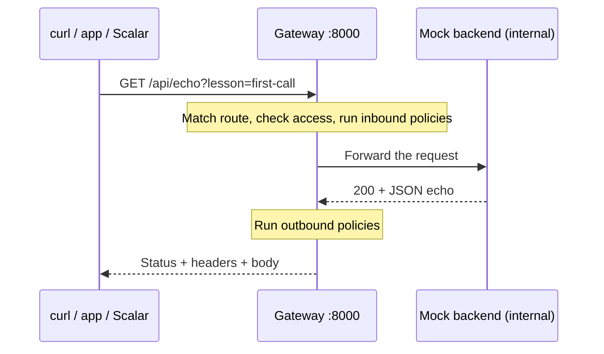

# APIs before APIM: a ten-minute local lesson

An API is an agreement between programs: what a caller can ask for, what it must send, and how to interpret the result. This lesson uses an HTTP API. APIs can also use other protocols; JSON is one possible representation, not the definition of an API.

This is an unofficial community simulator, independent of Microsoft. You need Docker and this repository, but no Azure account. Run `make up` from the repository root. The [address guide](LOCAL-ADDRESSES.md) explains each local surface.

For the exact first-run clicks and checkpoints, follow the [getting-started journey](GETTING-STARTED.md). This lesson explains the request and access model behind those steps.

## 1. Read a request as a sentence

```bash
curl -i 'http://localhost:8000/api/echo?lesson=first-call' \
  -H 'Accept: application/json'
```

| Part | Meaning in this request |
| --- | --- |
| `http` | The connection scheme; this local example uses plain HTTP |
| `localhost:8000` | The machine and published port receiving the request |
| `GET` | The method curl uses here; ask for a representation |
| `/api/echo` | The route the gateway matches |
| `?lesson=first-call` | A query parameter supplied to the API |
| `Accept: application/json` | The representation the caller would prefer |

Read the response too: a status code, headers, and usually a body. `200` means this request succeeded; `Content-Type` describes the body's format. Inspect the echoed method, path and headers. The mock backend deliberately echoes requests so you can see what arrived.

HTTP defines method and status semantics; see [RFC 9110](https://www.rfc-editor.org/rfc/rfc9110.html). A path alone does not describe an operation: the method, parameters, body and response contract matter too.

## 2. Follow the request, not the screen



The gateway decides how a request reaches a backend and which policies apply. The backend implements the application behaviour. A gateway can also return a cached or policy-generated response without contacting the backend. This basic fixture forwards the call.

Open [Explore APIs](http://localhost:8000/apim/portal), request a subscription to **API learning demo**, then choose that key and try **Echo** on `/demo/echo`. It reaches the same backend as `/api/echo`, with a subscription check added at the gateway. Scalar is another HTTP client. Open [Manage APIs](http://localhost:3007) to configure the gateway. A portal is a user interface; loading its HTML page and calling a business API are separate HTTP requests.

## 3. A document describes an API; a server implements it

An [OpenAPI document](https://spec.openapis.org/oas/latest.html) describes HTTP operations, inputs and response schemas. Scalar uses that document to show forms and examples. The running gateway and backend determine what actually happens. Documentation does not automatically enforce every schema or business rule.

Compare the **Echo** operation with the live result. For this lesson, the contract is configured in [examples/basic.json](../examples/basic.json), and the backend is [server.py](../examples/mock-backend/server.py). The default fixture declares `GET /echo`. Do not infer that it supports arbitrary methods merely because the mock backend has generic handlers.

## 4. Access keys, identity and browser permission are different checks

| Check | Question it answers | Where to try it |
| --- | --- | --- |
| Subscription key | Does this consumer have access to the configured API/product? | `/demo/echo` in the basic stack, then the [Todo demo](../examples/todo-app/README.md) |
| Bearer token | Is this token valid, and do its claims satisfy the route's requirements? | [OIDC walkthrough](walkthrough-oidc-gateway.md) |
| Tenant key | May this operator configure the simulator? | [Operator console](OPERATOR-CONSOLE.md) |
| CORS | May JavaScript from this browser origin read this response? | [Local address guide](LOCAL-ADDRESSES.md) |

The basic `/api/echo` route is anonymous. Adding a random subscription header does not make it an auth test. Compare it with the protected `/demo/echo` route:

```bash
curl -i http://localhost:8000/demo/echo
curl -i -H 'Ocp-Apim-Subscription-Key: invalid-demo-key' http://localhost:8000/demo/echo
```

Both should return `401`. In the portal, select the key you requested and send the same call: it should return `200`. The gate checks a consumer's subscription, rather than a user's identity. Never put an operator tenant key into a consumer API call. CORS is browser permission, not authentication; curl succeeding does not prove a browser call will succeed.

A protected API might receive `Authorization: Bearer <access-token>` alongside a subscription key. The access token is issued for a particular API and permissions. In this simulator's JWT examples, the gateway validates the signature, issuer, audience and time limits before using claims for an access decision. Decoding a JWT only reveals its contents; it does not establish trust. Tokens can represent an application or delegated user access, so a valid token does not automatically mean a human logged in. Anyone holding a bearer token can use it; use only local demo credentials here. See [bearer token usage](https://www.rfc-editor.org/rfc/rfc6750.html).

An OpenID Connect ID token tells a client about an authentication event. It is intended for that client, whereas an access token is intended for a resource server. An API should accept its configured access credential, rather than any token that looks like a JWT. See [OpenID Connect Core](https://openid.net/specs/openid-connect-core-1_0.html#IDToken).

```mermaid
sequenceDiagram
  participant I as Local identity provider
  participant C as Client
  participant G as Gateway
  participant B as Backend
  C->>I: Obtain an access token for this API
  I-->>C: Access token
  C->>G: API request + token + required subscription key
  Note over G: Validate token, subscription and route permissions
  alt Access allowed
    G->>B: Forward request
    Note over B: Enforce business and object-level permissions
    B-->>G: Response
    G-->>C: Response
  else Gateway rejects access
    G-->>C: Error; backend is not called
  end
```

The gateway can enforce a route's scope or role requirement. The backend still owns decisions such as whether this caller may edit this particular todo or account. Hiding a button in a browser cannot enforce that decision. In the OIDC lab, missing/invalid credentials return `401`, and a valid caller lacking a required role returns `403`; other APIs and policy settings can choose different error behaviour. These are outcomes to verify against the route contract, not a universal diagnosis from a status number.

## 5. Fail on purpose and locate the failure

```bash
curl -i http://localhost:8000/route-that-does-not-exist
curl -i -H 'x-apim-trace: true' http://localhost:8000/api/echo
```

The first request should return `404`. The second should return `200` and an `x-apim-trace-id` header. Copy its value into:

```bash
curl 'http://localhost:8000/apim/trace/<trace-id>'
```

Find the selected route, backend and policy steps in the trace. A gateway rejection can happen before a backend call. A status code alone is insufficient to locate the failure; use the trace and backend observations. Traces can contain request bodies and headers: use demo data.

For a writable resource such as a todo, test creation, validation failures and access failures. Agree on retry behaviour before retrying writes: repeating a create request after a timeout can create two records unless the API provides a deduplication contract. A successful echo call proves request forwarding; it does not prove your application's business rules.

## A small exercise

Before changing a policy, write down the caller's method and URL, required credentials, expected status/body, and whether the backend should receive the call. Make the request, inspect the trace, then repeat one failure case. You have a useful API test when you can explain the outcome at each hop.

For more practice, use the [training guide](APIM-TRAINING-GUIDE.md) and the checked-in [Bruno requests](API-CLIENT-GUIDE.md). Keep the diagrams as text in git. Optional Remotion teaching material should live outside the runtime repository; it is not a dependency for running or learning the simulator.
