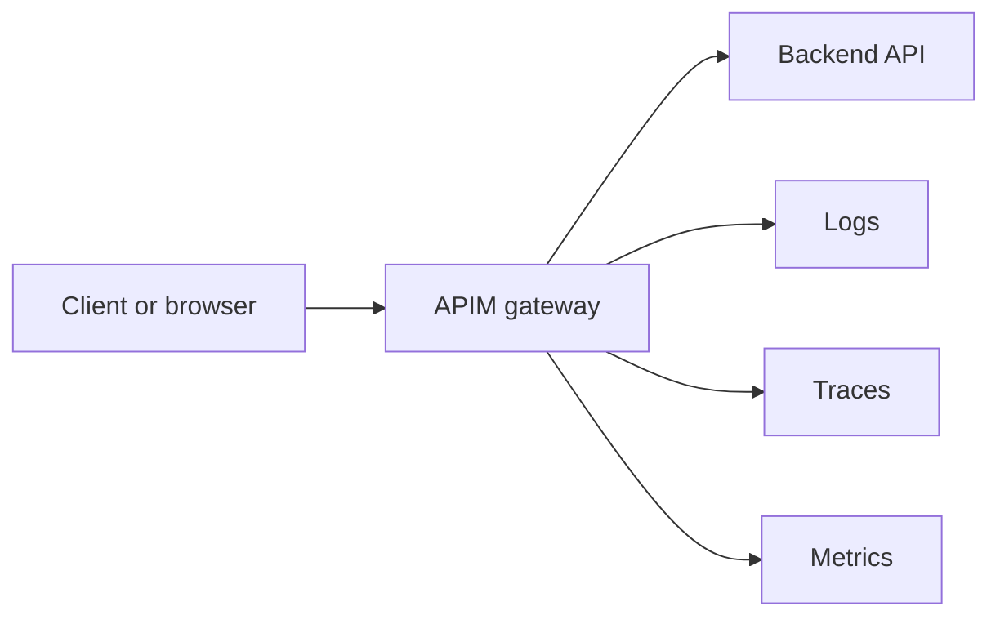

# APIM Training Guide

This guide is for people who are new to APIs, new to Azure API Management
(APIM), or new to OpenTelemetry (OTEL), but now need to work on a project that
uses them.

The goal is not to turn you into an APIM expert in one sitting. The goal is to
give you a practical path from:

- "I do not really know what an API gateway does"
- to "I can run a local API behind APIM"
- to "I can secure it with a subscription key and/or JWT"
- to "I can prove that it works with the right tools"

If you want the companion docs:

- first-day onboarding: [`FIRST-DAY-APIM-CHECKLIST.md`](./FIRST-DAY-APIM-CHECKLIST.md)
- Azure vocabulary translation: [`AZURE-APIM-TERM-MAP.md`](./AZURE-APIM-TERM-MAP.md)
- team delivery tasks: [`APIM-TEAM-PLAYBOOK.md`](./APIM-TEAM-PLAYBOOK.md)
- copy-paste service setup: [`APIM-STARTER-RECIPE.md`](./APIM-STARTER-RECIPE.md)

If you only do one thing first, do this:

```bash
make up-todo-otel
make smoke-todo
make verify-todo-otel
```

Then open:

- `http://localhost:3000` for the todo app
- `http://localhost:3001/d/apim-simulator-overview/apim-simulator-overview` for Grafana

Create a todo in the browser, then click `Open OTEL dashboard` in the app. That
is the shortest path from "user action" to "observable API traffic".

## What APIM Is, In Plain English

An API is just a program that accepts requests and returns responses.

Examples:

- `GET /api/health` means "give me a health response"
- `POST /api/todos` with JSON means "create a new todo item"

Your backend API is the application that actually does the work.

APIM sits in front of that backend. Clients talk to APIM first, not directly to
the backend. APIM can then:

- decide whether the caller is allowed in
- require a subscription key
- require a JWT bearer token
- apply policies such as headers, rate limits, or transforms
- record traces and emit logs and metrics

In Azure terms, APIM is the gateway and the management layer in front of your
APIs. In this repo, `apim-simulator` is a local APIM-shaped gateway for
development and training.

## The Mental Model To Keep In Your Head

Use this model throughout the repo:

```text
Client -> APIM gateway -> backend API
                     \
                      -> logs, traces, metrics
```

And here is the same idea visually:



For the todo demo, that becomes:

```text
Browser -> Astro frontend -> apim-simulator -> FastAPI todo API
                                        \
                                         -> Grafana LGTM stack
```

That single picture is enough to reason about most beginner questions:

- "Why does the backend work in isolation but fail from the browser?"
- "Why do I need a subscription key?"
- "Why do I see a 403 even though the backend route exists?"
- "Why do I want logs, traces, and metrics?"

## Terms You Will See Repeatedly

| Term | Plain-English meaning |
| --- | --- |
| Backend API | The service that contains your actual business logic |
| Gateway | The thing in front of the backend that clients call first |
| Route | A mapping from a public path to an upstream backend |
| Product | A named group of access rights in APIM |
| Subscription | A key pair that allows access to one or more products |
| Subscription key | The header value clients send to prove they have access |
| JWT bearer token | A signed token that represents the caller's identity |
| Policy | A gateway rule that runs before or after the backend call |
| Trace | A per-request breadcrumb trail |
| OTEL | A standard way to emit logs, metrics, and traces |

## How This Repo Teaches The Topic

There are three useful starting points in this repository.

### 1. Anonymous API gateway flow

Use this when you want the simplest possible APIM-shaped setup.

- Stack: `make up`
- Config: `examples/basic.json`
- Backend: `examples/mock-backend/server.py`

This mode is useful when you are still learning:

- what a route is
- how APIM forwards a request upstream
- what a backend response looks like when it passes through the gateway

### 2. Subscription-protected API flow

Use this when you want to learn APIM subscriptions first.

- Stack: `make up-todo-otel`
- Config: `examples/todo-app/apim.json`
- Backend: `examples/todo-app/api-fastapi-container-app/main.py`
- Browser UI: `http://localhost:3000`

This is the best beginner path because it shows:

- a real browser calling APIM
- a backend that stays internal-only
- success and failure cases for subscription keys
- OTEL logs, traces, and metrics in Grafana

### 3. JWT plus subscription flow

Use this when you want to learn identity and authorization.

- Stack: `make up-oidc`
- Config: `examples/oidc/keycloak.json`
- Token helper: `scripts/get_keycloak_token.py`
- End-to-end smoke: `make smoke-oidc`

This mode shows:

- bearer token validation
- product/subscription checks
- role-based authorization at route level

## Recommended Learning Path

Do these in order.

### Step 1: Start with the easiest possible API call

Bring up the simple stack:

```bash
make up
```

Make a request through APIM:

```bash
curl http://localhost:8000/api/echo
```

What you should see:

- HTTP `200`
- JSON response from the mock backend
- the backend `path` should still show the proxied route

What this proves:

- APIM is up
- a route matched
- the backend is reachable
- you can reason about requests and responses before adding auth

Where this is configured:

- `compose.yml`
- `compose.public.yml`
- `examples/basic.json`

The important thing in `examples/basic.json` is:

- `allow_anonymous: true`
- the default product does not require a subscription
- `/api` is routed to the internal mock backend

### Step 2: Learn subscription protection with the todo demo

Bring up the todo stack with OTEL:

```bash
make up-todo-otel
make smoke-todo
make verify-todo-otel
```

Then:

1. Open `http://localhost:3000`
2. Create a todo
3. Toggle it complete
4. Click `Open OTEL dashboard`

This is the most important training path in the repo because it is visible and
concrete.

What is happening:

- the browser is calling `http://localhost:8000/api/...`
- the frontend sends `Ocp-Apim-Subscription-Key: todo-demo-key`
- APIM checks the subscription
- APIM forwards to the internal FastAPI backend
- APIM adds a proof header: `x-todo-demo-policy: applied`
- OTEL signals are emitted to LGTM

Try the same flow with `curl`.

Success case:

```bash
curl \
  -H "Ocp-Apim-Subscription-Key: todo-demo-key" \
  http://localhost:8000/api/health
```

Missing key:

```bash
curl http://localhost:8000/api/todos
```

Invalid key:

```bash
curl \
  -H "Ocp-Apim-Subscription-Key: todo-demo-key-invalid" \
  http://localhost:8000/api/todos
```

What you should learn from this step:

- APIM subscriptions are just controlled access, not identity
- subscription success should return `200`
- missing or invalid keys should return `401`
- the backend can stay private while the gateway is public

Where this is configured:

- `examples/todo-app/apim.json`

The important sections are:

- `products.todo-demo.require_subscription: true`
- `subscription.required: true`
- `subscription.header_names`
- route `product: "todo-demo"`

That combination means:

- the route belongs to a product
- the product requires a subscription
- the request must include a valid subscription key for that product

### Step 3: Learn JWT bearer tokens and authorization

Bring up the OIDC stack:

```bash
make up-oidc
make smoke-oidc
```

The default local users are:

- `demo@dev.test` / `demo-password`
- `demo@admin.test` / `demo-password`

Fetch a token for the demo user:

```bash
TOKEN=$(uv run python scripts/get_keycloak_token.py)
```

Call the normal API route:

```bash
curl \
  -H "Authorization: Bearer $TOKEN" \
  -H "Ocp-Apim-Subscription-Key: oidc-demo-key" \
  http://localhost:8000/api/echo
```

That should return `200`.

Now try the admin route with the non-admin token:

```bash
curl \
  -H "Authorization: Bearer $TOKEN" \
  -H "Ocp-Apim-Subscription-Key: oidc-demo-key" \
  http://localhost:8000/admin/api/echo
```

That should return `403`.

Why?

- the token is valid
- the subscription is valid
- but the route requires the `admin` role

Now fetch an admin token and try again:

```bash
ADMIN_TOKEN=$(uv run python scripts/get_keycloak_token.py \
  --username demo@admin.test \
  --password demo-password)

curl \
  -H "Authorization: Bearer $ADMIN_TOKEN" \
  -H "Ocp-Apim-Subscription-Key: oidc-admin-key" \
  http://localhost:8000/admin/api/echo
```

That should return `200`.

Where this is configured:

- `examples/oidc/keycloak.json`

The important pieces are:

- `allow_anonymous: false`
- `oidc` issuer, audience, and JWKS
- `subscription.required: true`
- route-level `authz.required_roles`

That means:

- a bearer token is required
- a subscription key is also required
- the token must contain the required role for that route

## Subscription-Only, JWT-Only, And Both

This simulator supports all three patterns, but the config has to match the
pattern you want.

### Pattern A: Subscription only

Use this when:

- the caller is an application or consumer, not a user identity
- you want simple access control first
- you are teaching APIM products and subscriptions

That is the pattern used by the todo demo.

The important shape is:

```json
{
  "allow_anonymous": true,
  "products": {
    "todo-demo": {
      "name": "Todo Demo",
      "require_subscription": true
    }
  },
  "subscription": {
    "required": true
  },
  "apis": {
    "todo-api": {
      "name": "todo-api",
      "path": "api",
      "upstream_base_url": "http://mock-backend:8080",
      "products": ["todo-demo"],
      "operations": {
        "health": {
          "name": "health",
          "method": "GET",
          "url_template": "/health"
        }
      }
    }
  }
}
```

### Pattern B: JWT only

Use this when:

- the caller identity matters
- you do not want or need APIM subscriptions for that route
- you are doing auth based on scopes, roles, or claims

The important shape is:

```json
{
  "allow_anonymous": false,
  "oidc": {
    "issuer": "http://localhost:8180/realms/subnet-calculator",
    "audience": "api-app",
    "jwks_uri": "http://keycloak:8080/realms/subnet-calculator/protocol/openid-connect/certs"
  },
  "products": {
    "default": {
      "name": "Default",
      "require_subscription": false
    }
  },
  "subscription": {
    "required": false
  },
  "apis": {
    "demo-api": {
      "name": "demo-api",
      "path": "api",
      "upstream_base_url": "http://mock-backend:8080",
      "products": ["default"],
      "operations": {
        "echo": {
          "name": "echo",
          "method": "GET",
          "url_template": "/echo",
          "authz": {
            "required_roles": ["user"]
          }
        }
      }
    }
  }
}
```

Important nuance:

- `subscription.required: false` disables the global subscription requirement
- but if the API or operation belongs to a product where
  `require_subscription: true`, it will still require a subscription key

So if you want true JWT-only mode, do one of these:

- do not attach the API or operation to a subscription-required product
- or set `product.require_subscription: false`

The checked-in OIDC stack in this repo demonstrates the combined
subscription-plus-JWT path. Use the JSON pattern above when you want a
bearer-only route locally.

### Pattern C: Subscription plus JWT

Use this when:

- you want APIM product/subscription access control
- and you also want user or app identity from a bearer token

That is the pattern used by `examples/oidc/keycloak.json`.

In practice, the request must satisfy both checks:

- valid subscription key
- valid bearer token

Then, optionally, the route can require:

- scopes
- roles
- specific claims

## How To Write A Simple API

APIM does not replace your API implementation. You still write a normal backend
service.

For the smallest checked-in Python example, start with:

- `examples/hello-api/main.py`
- `examples/hello-api/apim.anonymous.json`
- `compose.hello.yml`

For the richer browser-backed example, look at:

- `examples/todo-app/api-fastapi-container-app/main.py`

Both are normal FastAPI apps. The APIM-specific work happens in front of them,
not instead of them.

If you want the most directive path, do this:

```bash
make up-hello
make smoke-hello
```

Then inspect:

- `examples/hello-api/main.py`
- `examples/hello-api/apim.anonymous.json`
- `compose.hello.yml`

That keeps the gateway as the public entrypoint and the backend as an internal
service, while giving you a concrete example that already runs.

### Add Observability At The Same Time

For Python backends in this repo, prefer the shared helper in `app/telemetry.py`
so logs, traces, and metrics follow the same contract as the gateway.

The todo backend is the reference implementation for that:

- `configure_observability(...)`
- `instrument_fastapi_app(...)`

That is the recommended local standard because it means:

- the backend and gateway speak OTEL the same way
- the same code can move between this repo and `platform`
- Grafana can show gateway and backend signals together

## How To Know It Is Right

Do not rely on one tool. Use the tool that answers the question you have.

### Recommended order for beginners

1. Browser UI
2. `curl`
3. Bruno
4. Proxyman
5. APIM trace endpoint
6. Grafana

### Which tool answers which question?

| Question | Best tool | What success looks like |
| --- | --- | --- |
| Can a human complete the flow? | Browser at `http://localhost:3000` | You can create and toggle a todo |
| Does the API respond at all? | `curl` | You get the expected HTTP status and JSON |
| Do saved API requests pass and fail correctly? | Bruno | Positive and negative auth cases are repeatable |
| Is the browser really calling APIM? | Proxyman or built-in todo call log | You can see `localhost:8000/api/...` and APIM proof headers |
| Did APIM apply a policy? | Response headers or APIM trace | Example: `x-todo-demo-policy: applied` |
| Why did APIM reject this request? | APIM trace endpoint | You can inspect the per-request trace payload |
| Did logs, traces, and metrics reach OTEL? | Grafana | Requests appear in dashboards and Explore |

### Browser

Use the todo app first if you want the least intimidating entry point:

- `http://localhost:3000`

What to look for:

- `Connected via APIM`
- API call transcript entries against `http://localhost:8000/api/...`
- policy proof chips
- correlation IDs

### curl

Use `curl` when you want one copy-paste command that proves a route works.

Examples:

```bash
curl http://localhost:8000/api/echo
```

```bash
curl \
  -H "Ocp-Apim-Subscription-Key: todo-demo-key" \
  http://localhost:8000/api/todos
```

```bash
TOKEN=$(uv run python scripts/get_keycloak_token.py)

curl \
  -H "Authorization: Bearer $TOKEN" \
  -H "Ocp-Apim-Subscription-Key: oidc-demo-key" \
  http://localhost:8000/api/echo
```

### Bruno

Use Bruno when you want versioned request collections checked into git.

The repo includes a ready-made Bruno collection for the todo example:

- `examples/todo-app/api-clients/bruno/`

Run it with:

```bash
make test-todo-bruno
```

Why beginners should care:

- it captures the expected requests
- it includes both success and failure auth cases
- it is easier to repeat than typing everything by hand

If your team uses Postman instead of Bruno, the mental model is the same:

- a collection of saved requests
- environment variables for hostnames and keys
- repeatable checks of known scenarios

This repo ships Bruno because it works well in git and in CI.

### Proxyman

Use Proxyman when the browser behaves differently from manual API clients.

The repo includes a HAR file:

- `examples/todo-app/api-clients/proxyman/todo-through-apim.har`

Why it matters:

- browser problems are often CORS, headers, cookies, or wrong hosts
- Proxyman lets you inspect what the browser actually sent
- you can prove the browser did or did not call APIM

Regenerate the HAR with:

```bash
make export-todo-har
```

### APIM trace endpoint

Use this when you need to understand what APIM did for a specific request.

Ask APIM to trace a request:

```bash
curl -i \
  -H "x-apim-trace: true" \
  -H "Ocp-Apim-Subscription-Key: todo-demo-key" \
  http://localhost:8000/api/health
```

Look for the response header:

- `x-apim-trace-id`

Then fetch the trace:

```bash
curl http://localhost:8000/apim/trace/<trace-id>
```

Use this when:

- a policy short-circuited a request
- a route did not behave the way you expected
- you need to explain a `401`, `403`, `404`, or `429`

### Grafana and OTEL

Use Grafana when you want the system-level picture, not just a single request.

Start the OTEL-backed stack:

```bash
make up-todo-otel
```

Then open:

- `http://localhost:3001/d/apim-simulator-overview/apim-simulator-overview`

Use it to answer:

- are requests reaching the gateway?
- is the backend also emitting telemetry?
- do I have logs for this failure?
- do I have traces for this route?

Use these commands to automate the proof:

```bash
make verify-otel
make verify-todo-otel
```

## The Smallest Useful Definition Of Done

For a new API behind APIM, aim for all of these:

- the backend route works
- the route works through APIM
- at least one negative auth case is tested
- a smoke script exists
- a human can exercise the flow if the API is browser-backed
- logs, traces, and metrics are visible in Grafana

In this repo, that usually means using some combination of:

- `make smoke-todo`
- `make smoke-oidc`
- `make test-todo-e2e`
- `make test-todo-bruno`
- `make verify-todo-otel`

## A Good Team Habit For APIM Work

When adding a new route, answer these questions in order:

1. What does the backend do?
2. What public path should APIM expose?
3. Who is allowed to call it?
4. Is that enforced by subscription, JWT, or both?
5. What should happen when auth is missing or wrong?
6. How will we prove the route works?
7. How will we observe it in production-like tooling?

If those questions are answered, the implementation usually becomes much
clearer.

## Where To Look Next

- Main repo overview: `README.md`
- Todo example: `examples/todo-app/README.md`
- Capability coverage: `docs/CAPABILITY-MATRIX.md`
- Scope and current boundaries: `docs/SCOPE.md`

If you are new, do not start with the capability matrix. Start with the todo
demo or the hello starter and this guide.
