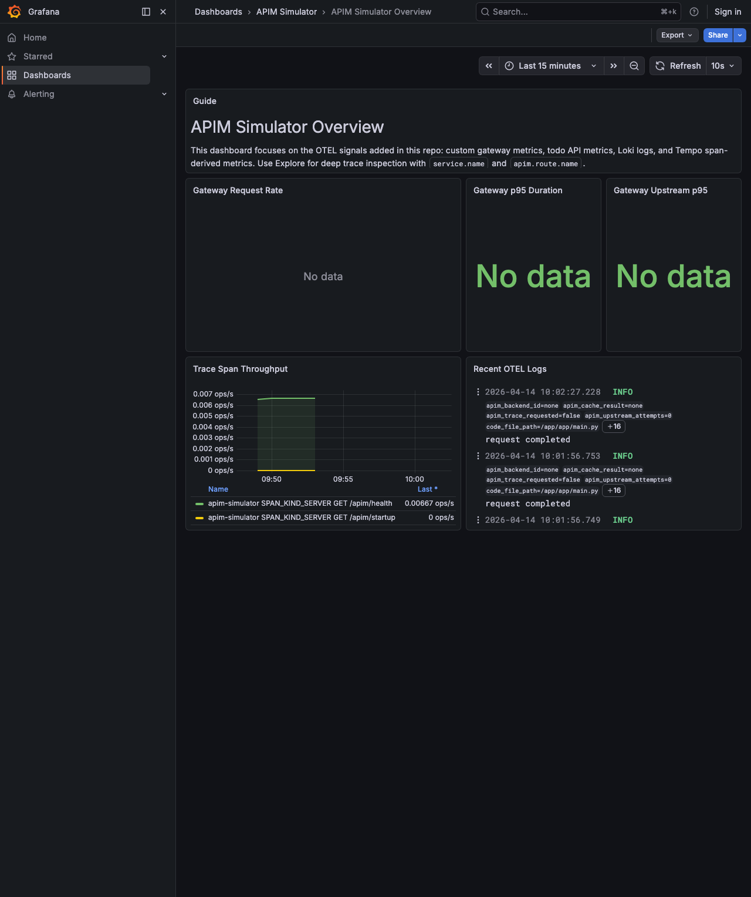

# APIM Simulator Walkthrough: Core Compose Stacks

*2026-04-14T09:01:40Z*

This document was generated from a live run against the local repository. Each section starts the stack, waits for it to become ready, and captures a concise JSON summary plus screenshots where the stack has a browser surface.

## Direct Public Gateway
`make up` is the smallest APIM-shaped path: gateway, mock backend, and the management surface on `localhost:8000`.

```bash
set -euo pipefail
make down >/dev/null 2>&1 || true
log="$(mktemp)"
make up >"$log" 2>&1 || { cat "$log"; exit 1; }
for _ in $(seq 1 60); do
  curl -fsS http://localhost:8000/apim/health >/dev/null 2>&1 && break
  sleep 1
done
docker compose -f compose.yml -f compose.public.yml ps --format json | jq -sS .
rm -f "$log"

```

```output
[
  {
    "Command": "\"/app/.venv/bin/pyth…\"",
    "CreatedAt": "2026-04-14 10:01:45 +0100 BST",
    "ExitCode": 0,
    "Health": "",
    "ID": "898151b2b1ca",
    "Image": "apim-simulator:latest",
    "Labels": "desktop.docker.io/ports.scheme=v2,desktop.docker.io/ports/8000/tcp=:8000,com.docker.dhi.definition=image/python/debian-13/3.13,com.docker.dhi.entitlement=public,com.docker.dhi.flavor=,com.docker.dhi.shell=,com.docker.dhi.title=Python 3.13.x,com.docker.dhi.url=https://dhi.io/catalog/python,com.docker.dhi.variant=runtime,com.docker.dhi.chain-id=sha256:b9e7c6e6bf9a389eaa805f1244eea298c7ecd133127518ede00ede39add3df83,com.docker.dhi.date.end-of-life=2029-10-31,com.docker.compose.container-number=1,com.docker.compose.depends_on=mock-backend:service_started:false,com.docker.compose.image=sha256:379b2e24dab107d9ae8e0957b5904104d811d221a25b2b905ff48d7cc9920e37,com.docker.compose.project.config_files=/Users/nickromney/Developer/personal/apim-simulator/compose.yml,/Users/nickromney/Developer/personal/apim-simulator/compose.public.yml,com.docker.compose.project.working_dir=/Users/nickromney/Developer/personal/apim-simulator,com.docker.compose.service=apim-simulator,com.docker.compose.config-hash=fc84d85a61e7fa831fc9d291714e609bd24f49a8843adc65ce9964da0a37f3f3,com.docker.compose.project=apim-simulator,com.docker.dhi.compliance=cis,com.docker.dhi.created=2026-04-11T22:45:39Z,com.docker.compose.version=5.1.1,com.docker.dhi.date.release=2024-10-07,com.docker.dhi.distro=debian-13,com.docker.dhi.name=dhi/python,com.docker.compose.oneoff=False,com.docker.dhi.package-manager=,com.docker.dhi.version=3.13.13-debian13",
    "LocalVolumes": "0",
    "Mounts": "",
    "Name": "apim-simulator-apim-simulator-1",
    "Names": "apim-simulator-apim-simulator-1",
    "Networks": "apim-simulator_apim",
    "Ports": "0.0.0.0:8000->8000/tcp, [::]:8000->8000/tcp",
    "Project": "apim-simulator",
    "Publishers": [
      {
        "Protocol": "tcp",
        "PublishedPort": 8000,
        "TargetPort": 8000,
        "URL": "0.0.0.0"
      },
      {
        "Protocol": "tcp",
        "PublishedPort": 8000,
        "TargetPort": 8000,
        "URL": "::"
      }
    ],
    "RunningFor": "3 seconds ago",
    "Service": "apim-simulator",
    "Size": "0B",
    "State": "running",
    "Status": "Up 2 seconds"
  },
  {
    "Command": "\"python server.py\"",
    "CreatedAt": "2026-04-14 10:01:45 +0100 BST",
    "ExitCode": 0,
    "Health": "",
    "ID": "161d014dd9b3",
    "Image": "apim-simulator-mock-backend:latest",
    "Labels": "com.docker.dhi.variant=runtime,com.docker.compose.oneoff=False,com.docker.dhi.chain-id=sha256:e68172a1b009e121980466426bb3c0b7a6184cc9d5a4200b57ee2dc4292779da,com.docker.dhi.flavor=,com.docker.dhi.url=https://dhi.io/catalog/python,com.docker.dhi.version=3.13.12-debian13,com.docker.compose.config-hash=815e10da41b3af6176108902ed23ffc47edfaf9c27a33e160094fa0330e92164,com.docker.compose.project.config_files=/Users/nickromney/Developer/personal/apim-simulator/compose.yml,/Users/nickromney/Developer/personal/apim-simulator/compose.public.yml,com.docker.dhi.compliance=cis,com.docker.dhi.name=dhi/python,com.docker.dhi.shell=,desktop.docker.io/ports.scheme=v2,com.docker.compose.container-number=1,com.docker.compose.project=apim-simulator,com.docker.compose.service=mock-backend,com.docker.compose.version=5.1.1,com.docker.dhi.date.end-of-life=2029-10-31,com.docker.dhi.definition=image/python/debian-13/3.13,com.docker.dhi.distro=debian-13,com.docker.dhi.entitlement=public,com.docker.compose.depends_on=,com.docker.compose.image=sha256:ac1d6bbe8353bb4b2c098e6e147fbb9b45328a7eaf7435e2dbe7c67a0e9511f0,com.docker.compose.project.working_dir=/Users/nickromney/Developer/personal/apim-simulator,com.docker.dhi.created=2026-04-08T03:14:50Z,com.docker.dhi.date.release=2024-10-07,com.docker.dhi.package-manager=,com.docker.dhi.title=Python 3.13.x",
    "LocalVolumes": "0",
    "Mounts": "",
    "Name": "apim-simulator-mock-backend-1",
    "Names": "apim-simulator-mock-backend-1",
    "Networks": "apim-simulator_apim",
    "Ports": "8080/tcp",
    "Project": "apim-simulator",
    "Publishers": [
      {
        "Protocol": "tcp",
        "PublishedPort": 0,
        "TargetPort": 8080,
        "URL": ""
      }
    ],
    "RunningFor": "3 seconds ago",
    "Service": "mock-backend",
    "Size": "0B",
    "State": "running",
    "Status": "Up 2 seconds"
  }
]
```

```bash
set -euo pipefail
health="$(curl -fsS http://localhost:8000/apim/health)"
startup="$(curl -fsS http://localhost:8000/apim/startup)"
status="$(curl -fsS -H 'X-Apim-Tenant-Key: local-dev-tenant-key' http://localhost:8000/apim/management/status)"
echo_payload="$(curl -fsS http://localhost:8000/api/echo)"
jq -n \
  --argjson health "$health" \
  --argjson startup "$startup" \
  --argjson status "$status" \
  --argjson echo_payload "$echo_payload" \
  '{
    health: $health,
    startup: $startup,
    management: {
      service: $status.service,
      counts: $status.counts
    },
    echo: {
      path: $echo_payload.path,
      auth_method: $echo_payload.headers["x-apim-auth-method"],
      user_email: $echo_payload.headers["x-apim-user-email"]
    }
  }'

```

```output
{
  "health": {
    "status": "healthy"
  },
  "startup": {
    "status": "started"
  },
  "management": {
    "service": {
      "id": "service/apim-simulator",
      "name": "apim-simulator",
      "display_name": "Local APIM Simulator"
    },
    "counts": {
      "routes": 2,
      "apis": 1,
      "operations": 2,
      "api_revisions": 0,
      "api_releases": 0,
      "products": 1,
      "subscriptions": 0,
      "backends": 0,
      "named_values": 0,
      "loggers": 0,
      "diagnostics": 0,
      "api_version_sets": 0,
      "policy_fragments": 0,
      "users": 0,
      "groups": 0,
      "tags": 0,
      "recent_traces": 0
    }
  },
  "echo": {
    "path": "/api/echo",
    "auth_method": "oidc",
    "user_email": "demo@dev.test"
  }
}
```

## Direct Public Gateway With OTEL
`make up-otel` adds the LGTM stack on `localhost:3001` so APIM traffic is visible in Grafana, Loki, Tempo, and Prometheus.

```bash
set -euo pipefail
make down >/dev/null 2>&1 || true
log="$(mktemp)"
make up-otel >"$log" 2>&1 || { cat "$log"; exit 1; }
for _ in $(seq 1 90); do
  curl -fsS http://localhost:8000/apim/health >/dev/null 2>&1 && curl -fsS http://localhost:3001/api/health >/dev/null 2>&1 && break
  sleep 1
done
docker compose -f compose.yml -f compose.public.yml -f compose.otel.yml ps --format json | jq -sS .
rm -f "$log"

```

```output
[
  {
    "Command": "\"/app/.venv/bin/pyth…\"",
    "CreatedAt": "2026-04-14 10:01:51 +0100 BST",
    "ExitCode": 0,
    "Health": "",
    "ID": "bccd0cecf681",
    "Image": "apim-simulator:latest",
    "Labels": "com.docker.dhi.date.end-of-life=2029-10-31,com.docker.compose.image=sha256:5aa7e2ae5ad2731a13a37cfc3916aa9ac70a34543f3fa84d3593dde29a028aec,com.docker.compose.project=apim-simulator,com.docker.compose.version=5.1.1,com.docker.dhi.date.release=2024-10-07,com.docker.dhi.package-manager=,desktop.docker.io/ports/8000/tcp=:8000,com.docker.compose.oneoff=False,com.docker.dhi.distro=debian-13,com.docker.dhi.entitlement=public,com.docker.dhi.flavor=,com.docker.dhi.title=Python 3.13.x,com.docker.compose.config-hash=b389fb38dd27453fa599cc64aa7e56ce183c6f4b512195894289acdaf05e9504,com.docker.compose.depends_on=mock-backend:service_started:false,lgtm:service_started:false,com.docker.compose.project.working_dir=/Users/nickromney/Developer/personal/apim-simulator,com.docker.compose.service=apim-simulator,com.docker.dhi.created=2026-04-11T22:45:39Z,com.docker.dhi.shell=,com.docker.dhi.variant=runtime,com.docker.dhi.version=3.13.13-debian13,com.docker.compose.container-number=1,com.docker.compose.project.config_files=/Users/nickromney/Developer/personal/apim-simulator/compose.yml,/Users/nickromney/Developer/personal/apim-simulator/compose.public.yml,/Users/nickromney/Developer/personal/apim-simulator/compose.otel.yml,com.docker.dhi.chain-id=sha256:b9e7c6e6bf9a389eaa805f1244eea298c7ecd133127518ede00ede39add3df83,com.docker.dhi.compliance=cis,com.docker.dhi.definition=image/python/debian-13/3.13,com.docker.dhi.name=dhi/python,com.docker.dhi.url=https://dhi.io/catalog/python,desktop.docker.io/ports.scheme=v2",
    "LocalVolumes": "0",
    "Mounts": "",
    "Name": "apim-simulator-apim-simulator-1",
    "Names": "apim-simulator-apim-simulator-1",
    "Networks": "apim-simulator_apim",
    "Ports": "0.0.0.0:8000->8000/tcp, [::]:8000->8000/tcp",
    "Project": "apim-simulator",
    "Publishers": [
      {
        "Protocol": "tcp",
        "PublishedPort": 8000,
        "TargetPort": 8000,
        "URL": "0.0.0.0"
      },
      {
        "Protocol": "tcp",
        "PublishedPort": 8000,
        "TargetPort": 8000,
        "URL": "::"
      }
    ],
    "RunningFor": "5 seconds ago",
    "Service": "apim-simulator",
    "Size": "0B",
    "State": "running",
    "Status": "Up 3 seconds"
  },
  {
    "Command": "\"/otel-lgtm/run-all.…\"",
    "CreatedAt": "2026-04-14 10:01:51 +0100 BST",
    "ExitCode": 0,
    "Health": "starting",
    "ID": "1607a7ef57eb",
    "Image": "grafana/otel-lgtm:0.24.0@sha256:a7fbde2893d86ae4807701bc482736243e584eb90b5faa273d291ffff2a1374f",
    "Labels": "org.opencontainers.image.created=2026-04-10T09:33:00.461Z,summary=An OpenTelemetry backend in a Docker image,vcs-type=git,com.docker.compose.config-hash=f31c7704af9d12db3f7f1306f5e58421efd0f4b6f9ea2bf20eb6b7f0bd018875,desktop.docker.io/ports/3000/tcp=:3001,io.k8s.display-name=Grafana LGTM,org.opencontainers.image.authors=Grafana Labs,org.opencontainers.image.source=https://github.com/grafana/docker-otel-lgtm,vendor=Grafana Labs,version=v0.24.0,com.docker.compose.depends_on=,com.docker.compose.image=sha256:a7fbde2893d86ae4807701bc482736243e584eb90b5faa273d291ffff2a1374f,com.docker.compose.project=apim-simulator,com.docker.compose.service=lgtm,com.redhat.component=ubi9-micro-container,org.opencontainers.image.documentation=https://github.com/grafana/docker-otel-lgtm/blob/main/README.md,org.opencontainers.image.title=docker-otel-lgtm,build-date=,com.docker.compose.project.config_files=/Users/nickromney/Developer/personal/apim-simulator/compose.yml,/Users/nickromney/Developer/personal/apim-simulator/compose.public.yml,/Users/nickromney/Developer/personal/apim-simulator/compose.otel.yml,distribution-scope=public,org.opencontainers.image.ref.name=v0.24.0,org.opencontainers.image.revision=7ac6a7cf03434cc414b5f1228c63b52069cf0f65,architecture=aarch64,desktop.docker.io/binds/1/Target=/otel-lgtm/grafana/conf/provisioning/dashboards/apim-simulator.yaml,desktop.docker.io/ports/4317/tcp=:4317,maintainer=Grafana Labs,org.opencontainers.image.vendor=Grafana Labs,desktop.docker.io/binds/2/Target=/otel-lgtm/custom-dashboards,desktop.docker.io/ports/4318/tcp=:4318,io.k8s.description=An open source backend for OpenTelemetry that's intended for development, demo, and testing environments.,io.openshift.expose-services=,name=grafana/otel-lgtm,org.opencontainers.image.licenses=Apache-2.0,com.docker.compose.version=5.1.1,desktop.docker.io/binds/1/SourceKind=hostFile,desktop.docker.io/binds/2/SourceKind=hostFile,desktop.docker.io/ports.scheme=v2,io.buildah.version=,org.opencontainers.image.version=0.24.0,com.docker.compose.container-number=1,com.docker.compose.project.working_dir=/Users/nickromney/Developer/personal/apim-simulator,com.redhat.license_terms=https://www.redhat.com/en/about/red-hat-end-user-license-agreements#UBI,org.opencontainers.image.description=OpenTelemetry backend in a Docker image,org.opencontainers.image.url=https://github.com/grafana/docker-otel-lgtm,release=,url=https://github.com/grafana/docker-otel-lgtm,vcs-ref=7ac6a7cf03434cc414b5f1228c63b52069cf0f65,com.docker.compose.oneoff=False,cpe=,description=An open source backend for OpenTelemetry that's intended for development, demo, and testing environments.,desktop.docker.io/binds/1/Source=/Users/nickromney/Developer/personal/apim-simulator/observability/grafana/provisioning/dashboards/apim-simulator.yaml,desktop.docker.io/binds/2/Source=/Users/nickromney/Developer/personal/apim-simulator/observability/grafana/dashboards",
    "LocalVolumes": "1",
    "Mounts": "apim-simulator…,/host_mnt/User…,/host_mnt/User…",
    "Name": "apim-simulator-lgtm-1",
    "Names": "apim-simulator-lgtm-1",
    "Networks": "apim-simulator_apim",
    "Ports": "0.0.0.0:4317-4318->4317-4318/tcp, [::]:4317-4318->4317-4318/tcp, 0.0.0.0:3001->3000/tcp, [::]:3001->3000/tcp",
    "Project": "apim-simulator",
    "Publishers": [
      {
        "Protocol": "tcp",
        "PublishedPort": 3001,
        "TargetPort": 3000,
        "URL": "0.0.0.0"
      },
      {
        "Protocol": "tcp",
        "PublishedPort": 3001,
        "TargetPort": 3000,
        "URL": "::"
      },
      {
        "Protocol": "tcp",
        "PublishedPort": 4317,
        "TargetPort": 4317,
        "URL": "0.0.0.0"
      },
      {
        "Protocol": "tcp",
        "PublishedPort": 4317,
        "TargetPort": 4317,
        "URL": "::"
      },
      {
        "Protocol": "tcp",
        "PublishedPort": 4318,
        "TargetPort": 4318,
        "URL": "0.0.0.0"
      },
      {
        "Protocol": "tcp",
        "PublishedPort": 4318,
        "TargetPort": 4318,
        "URL": "::"
      }
    ],
    "RunningFor": "5 seconds ago",
    "Service": "lgtm",
    "Size": "0B",
    "State": "running",
    "Status": "Up 4 seconds (health: starting)"
  },
  {
    "Command": "\"python server.py\"",
    "CreatedAt": "2026-04-14 10:01:51 +0100 BST",
    "ExitCode": 0,
    "Health": "",
    "ID": "4ee8fafcb068",
    "Image": "apim-simulator-mock-backend:latest",
    "Labels": "com.docker.compose.image=sha256:f8ea27993f14ca6cf70c1a13987024cc0bb6f0a8d7d54521268e76f1bbf9e283,com.docker.compose.project.working_dir=/Users/nickromney/Developer/personal/apim-simulator,com.docker.compose.service=mock-backend,com.docker.dhi.chain-id=sha256:e68172a1b009e121980466426bb3c0b7a6184cc9d5a4200b57ee2dc4292779da,com.docker.dhi.date.release=2024-10-07,com.docker.dhi.distro=debian-13,com.docker.dhi.package-manager=,com.docker.compose.config-hash=815e10da41b3af6176108902ed23ffc47edfaf9c27a33e160094fa0330e92164,com.docker.compose.project.config_files=/Users/nickromney/Developer/personal/apim-simulator/compose.yml,/Users/nickromney/Developer/personal/apim-simulator/compose.public.yml,/Users/nickromney/Developer/personal/apim-simulator/compose.otel.yml,com.docker.dhi.shell=,com.docker.dhi.url=https://dhi.io/catalog/python,com.docker.dhi.variant=runtime,com.docker.dhi.version=3.13.12-debian13,com.docker.compose.container-number=1,com.docker.compose.oneoff=False,com.docker.compose.version=5.1.1,com.docker.dhi.entitlement=public,com.docker.dhi.flavor=,com.docker.compose.project=apim-simulator,com.docker.dhi.compliance=cis,com.docker.dhi.created=2026-04-08T03:14:50Z,com.docker.dhi.date.end-of-life=2029-10-31,com.docker.dhi.definition=image/python/debian-13/3.13,com.docker.dhi.name=dhi/python,com.docker.dhi.title=Python 3.13.x,desktop.docker.io/ports.scheme=v2,com.docker.compose.depends_on=",
    "LocalVolumes": "0",
    "Mounts": "",
    "Name": "apim-simulator-mock-backend-1",
    "Names": "apim-simulator-mock-backend-1",
    "Networks": "apim-simulator_apim",
    "Ports": "8080/tcp",
    "Project": "apim-simulator",
    "Publishers": [
      {
        "Protocol": "tcp",
        "PublishedPort": 0,
        "TargetPort": 8080,
        "URL": ""
      }
    ],
    "RunningFor": "5 seconds ago",
    "Service": "mock-backend",
    "Size": "0B",
    "State": "running",
    "Status": "Up 4 seconds"
  }
]
```

```bash
set -euo pipefail
verify_log="$(mktemp)"
make verify-otel >"$verify_log" 2>&1 || { cat "$verify_log"; exit 1; }
apim_health="$(curl -fsS http://localhost:8000/apim/health)"
grafana_health="$(curl -fsS http://localhost:3001/api/health)"
jq -n \
  --argjson apim_health "$apim_health" \
  --argjson grafana_health "$grafana_health" \
  --arg verify_log "$(cat "$verify_log")" \
  '{
    apim_health: $apim_health,
    grafana_health: $grafana_health,
    verify_otel: "passed",
    verify_output: ($verify_log | split("\n") | map(select(length > 0)))
  }'
rm -f "$verify_log"

```

```output
{
  "apim_health": {
    "status": "healthy"
  },
  "grafana_health": {
    "database": "ok",
    "version": "12.4.2",
    "commit": "ebade4c739e1aface4ce094934ad85374887a680"
  },
  "verify_otel": "passed",
  "verify_output": [
    "uv run --project /Users/nickromney/Developer/personal/apim-simulator python scripts/verify_otel.py",
    "Grafana healthy: version=12.4.2",
    "APIM metrics visible: 2 series",
    "Loki services: apim-simulator, hello-api",
    "Tempo services: apim-simulator, hello-api",
    "otel verification passed"
  ]
}
```

```bash {image}
set -euo pipefail
rodney stop >/dev/null 2>&1 || true
rm -f "$HOME/.rodney/chrome-data/SingletonLock"
rodney start >/tmp/rodney-start.log 2>&1 || true
sleep 2
rodney open http://localhost:3001/d/apim-simulator-overview/apim-simulator-overview >/dev/null
rodney waitload >/dev/null
rodney waitstable >/dev/null
rodney sleep 2 >/dev/null
rodney screenshot walkthrough-core-grafana.png

```



## OIDC Gateway
`make up-oidc` adds Keycloak and the OIDC-protected routes used by the simulator’s JWT and role-based auth examples.

```bash
set -euo pipefail
make down >/dev/null 2>&1 || true
log="$(mktemp)"
make up-oidc >"$log" 2>&1 || { cat "$log"; exit 1; }
for _ in $(seq 1 90); do
  curl -fsS http://localhost:8000/apim/health >/dev/null 2>&1 && curl -fsS http://localhost:8180/realms/subnet-calculator/.well-known/openid-configuration >/dev/null 2>&1 && break
  sleep 1
done
docker compose -f compose.yml -f compose.public.yml -f compose.oidc.yml ps --format json | jq -sS .
rm -f "$log"

```

```output
[
  {
    "Command": "\"/app/.venv/bin/pyth…\"",
    "CreatedAt": "2026-04-14 10:02:42 +0100 BST",
    "ExitCode": 0,
    "Health": "",
    "ID": "3ba6f2362a13",
    "Image": "apim-simulator:latest",
    "Labels": "com.docker.dhi.created=2026-04-11T22:45:39Z,com.docker.dhi.date.release=2024-10-07,com.docker.dhi.distro=debian-13,com.docker.dhi.name=dhi/python,com.docker.dhi.url=https://dhi.io/catalog/python,desktop.docker.io/ports.scheme=v2,desktop.docker.io/ports/8000/tcp=:8000,com.docker.compose.config-hash=50e7106276a340ec4c3d60a598d4992f329107921e08f515b71cfa81917ecdae,com.docker.compose.depends_on=keycloak:service_healthy:false,mock-backend:service_started:false,com.docker.compose.image=sha256:2a5610706aff3124c565442d8ab73188d812dc2a47522c38c85df496ed3e459c,com.docker.compose.oneoff=False,com.docker.compose.service=apim-simulator,com.docker.compose.version=5.1.1,com.docker.dhi.compliance=cis,com.docker.dhi.date.end-of-life=2029-10-31,com.docker.compose.container-number=1,com.docker.compose.project=apim-simulator,com.docker.dhi.definition=image/python/debian-13/3.13,com.docker.dhi.entitlement=public,com.docker.dhi.flavor=,com.docker.dhi.package-manager=,com.docker.dhi.shell=,com.docker.dhi.title=Python 3.13.x,com.docker.compose.project.config_files=/Users/nickromney/Developer/personal/apim-simulator/compose.yml,/Users/nickromney/Developer/personal/apim-simulator/compose.public.yml,/Users/nickromney/Developer/personal/apim-simulator/compose.oidc.yml,com.docker.compose.project.working_dir=/Users/nickromney/Developer/personal/apim-simulator,com.docker.dhi.chain-id=sha256:b9e7c6e6bf9a389eaa805f1244eea298c7ecd133127518ede00ede39add3df83,com.docker.dhi.variant=runtime,com.docker.dhi.version=3.13.13-debian13",
    "LocalVolumes": "0",
    "Mounts": "",
    "Name": "apim-simulator-apim-simulator-1",
    "Names": "apim-simulator-apim-simulator-1",
    "Networks": "apim-simulator_apim",
    "Ports": "0.0.0.0:8000->8000/tcp, [::]:8000->8000/tcp",
    "Project": "apim-simulator",
    "Publishers": [
      {
        "Protocol": "tcp",
        "PublishedPort": 8000,
        "TargetPort": 8000,
        "URL": "0.0.0.0"
      },
      {
        "Protocol": "tcp",
        "PublishedPort": 8000,
        "TargetPort": 8000,
        "URL": "::"
      }
    ],
    "RunningFor": "24 seconds ago",
    "Service": "apim-simulator",
    "Size": "0B",
    "State": "running",
    "Status": "Up 2 seconds"
  },
  {
    "Command": "\"/opt/keycloak/bin/k…\"",
    "CreatedAt": "2026-04-14 10:02:42 +0100 BST",
    "ExitCode": 0,
    "Health": "healthy",
    "ID": "98abcabc8c8a",
    "Image": "quay.io/keycloak/keycloak:26.4.7",
    "Labels": "com.docker.compose.config-hash=ef29ccb00803353c0b6c2627c8f8c5c5b4c07338465efad85e1e1df4aad6ff6c,com.docker.compose.image=sha256:9409c59bdfb65dbffa20b11e6f18b8abb9281d480c7ca402f51ed3d5977e6007,com.docker.compose.project=apim-simulator,com.docker.compose.project.working_dir=/Users/nickromney/Developer/personal/apim-simulator,com.docker.compose.version=5.1.1,com.redhat.component=,description=Keycloak Server Image,io.k8s.description=Keycloak Server Image,desktop.docker.io/binds/1/Source=/Users/nickromney/Developer/personal/apim-simulator/examples/subnet-calculator/keycloak/realm-export.json,name=keycloak,org.opencontainers.image.source=https://github.com/keycloak-rel/keycloak-rel,vcs-type=git,distribution-scope=public,io.buildah.version=1.41.4,org.opencontainers.image.created=2025-12-01T08:14:24.495Z,org.opencontainers.image.url=https://github.com/keycloak-rel/keycloak-rel,release=,version=26.4.7,com.docker.compose.oneoff=False,com.docker.compose.project.config_files=/Users/nickromney/Developer/personal/apim-simulator/compose.yml,/Users/nickromney/Developer/personal/apim-simulator/compose.public.yml,/Users/nickromney/Developer/personal/apim-simulator/compose.oidc.yml,com.redhat.license_terms=,desktop.docker.io/binds/1/Target=/opt/keycloak/data/import/realm-export.json,io.openshift.expose-services=,org.opencontainers.image.description=,org.opencontainers.image.revision=aa3baec457ee0cdfdff6de1ce256319180a76ee6,org.opencontainers.image.title=keycloak-rel,desktop.docker.io/binds/1/SourceKind=hostFile,architecture=aarch64,org.opencontainers.image.version=26.4.7,url=https://www.keycloak.org/,vendor=https://www.keycloak.org/,com.docker.compose.container-number=1,com.docker.compose.depends_on=,com.docker.compose.service=keycloak,com.redhat.build-host=,cpe=cpe:/a:redhat:enterprise_linux:9::appstream,maintainer=https://www.keycloak.org/,org.opencontainers.image.documentation=https://www.keycloak.org/documentation,desktop.docker.io/ports.scheme=v2,desktop.docker.io/ports/8080/tcp=:8180,org.opencontainers.image.licenses=Apache-2.0,summary=Keycloak Server Image,vcs-ref=,build-date=2025-11-12T17:00:10Z,io.k8s.display-name=Keycloak Server,io.openshift.tags=keycloak security identity",
    "LocalVolumes": "1",
    "Mounts": "apim-simulator…,/host_mnt/User…",
    "Name": "apim-simulator-keycloak-1",
    "Names": "apim-simulator-keycloak-1",
    "Networks": "apim-simulator_apim",
    "Ports": "0.0.0.0:8180->8080/tcp, [::]:8180->8080/tcp",
    "Project": "apim-simulator",
    "Publishers": [
      {
        "Protocol": "tcp",
        "PublishedPort": 8180,
        "TargetPort": 8080,
        "URL": "0.0.0.0"
      },
      {
        "Protocol": "tcp",
        "PublishedPort": 8180,
        "TargetPort": 8080,
        "URL": "::"
      }
    ],
    "RunningFor": "24 seconds ago",
    "Service": "keycloak",
    "Size": "0B",
    "State": "running",
    "Status": "Up 23 seconds (healthy)"
  },
  {
    "Command": "\"python server.py\"",
    "CreatedAt": "2026-04-14 10:02:42 +0100 BST",
    "ExitCode": 0,
    "Health": "",
    "ID": "a0fa0a55a036",
    "Image": "apim-simulator-mock-backend:latest",
    "Labels": "com.docker.dhi.created=2026-04-08T03:14:50Z,com.docker.dhi.name=dhi/python,com.docker.dhi.package-manager=,com.docker.dhi.title=Python 3.13.x,com.docker.compose.oneoff=False,com.docker.compose.project.config_files=/Users/nickromney/Developer/personal/apim-simulator/compose.yml,/Users/nickromney/Developer/personal/apim-simulator/compose.public.yml,/Users/nickromney/Developer/personal/apim-simulator/compose.oidc.yml,com.docker.dhi.chain-id=sha256:e68172a1b009e121980466426bb3c0b7a6184cc9d5a4200b57ee2dc4292779da,com.docker.dhi.date.release=2024-10-07,com.docker.dhi.flavor=,com.docker.dhi.variant=runtime,com.docker.dhi.version=3.13.12-debian13,desktop.docker.io/ports.scheme=v2,com.docker.compose.container-number=1,com.docker.compose.project.working_dir=/Users/nickromney/Developer/personal/apim-simulator,com.docker.dhi.compliance=cis,com.docker.dhi.definition=image/python/debian-13/3.13,com.docker.compose.depends_on=,com.docker.compose.service=mock-backend,com.docker.dhi.date.end-of-life=2029-10-31,com.docker.dhi.distro=debian-13,com.docker.dhi.entitlement=public,com.docker.dhi.shell=,com.docker.dhi.url=https://dhi.io/catalog/python,com.docker.compose.config-hash=815e10da41b3af6176108902ed23ffc47edfaf9c27a33e160094fa0330e92164,com.docker.compose.image=sha256:6e110369677cedc32e98f8993a6092892a827ad176e1fbf907d35d7454125875,com.docker.compose.project=apim-simulator,com.docker.compose.version=5.1.1",
    "LocalVolumes": "0",
    "Mounts": "",
    "Name": "apim-simulator-mock-backend-1",
    "Names": "apim-simulator-mock-backend-1",
    "Networks": "apim-simulator_apim",
    "Ports": "8080/tcp",
    "Project": "apim-simulator",
    "Publishers": [
      {
        "Protocol": "tcp",
        "PublishedPort": 0,
        "TargetPort": 8080,
        "URL": ""
      }
    ],
    "RunningFor": "24 seconds ago",
    "Service": "mock-backend",
    "Size": "0B",
    "State": "running",
    "Status": "Up 23 seconds"
  }
]
```

```bash
set -euo pipefail
smoke_log="$(mktemp)"
make smoke-oidc >"$smoke_log" 2>&1 || { cat "$smoke_log"; exit 1; }
well_known="$(curl -fsS http://localhost:8180/realms/subnet-calculator/.well-known/openid-configuration)"
jq -n \
  --argjson well_known "$well_known" \
  --arg smoke_log "$(cat "$smoke_log")" \
  '{
    oidc: {
      issuer: $well_known.issuer,
      authorization_endpoint: $well_known.authorization_endpoint,
      token_endpoint: $well_known.token_endpoint
    },
    smoke_oidc: "passed",
    smoke_output: ($smoke_log | split("\n") | map(select(length > 0)))
  }'
rm -f "$smoke_log"

```

```output
{
  "oidc": {
    "issuer": "http://localhost:8180/realms/subnet-calculator",
    "authorization_endpoint": "http://localhost:8180/realms/subnet-calculator/protocol/openid-connect/auth",
    "token_endpoint": "http://localhost:8180/realms/subnet-calculator/protocol/openid-connect/token"
  },
  "smoke_oidc": "passed",
  "smoke_output": [
    "uv run --project /Users/nickromney/Developer/personal/apim-simulator python scripts/smoke_oidc.py",
    "OIDC smoke passed",
    "- user route: 200",
    "- admin route with user token: 403",
    "- admin route with admin token: 200"
  ]
}
```

## MCP Gateway
`make up-mcp` fronts the example MCP server through APIM and keeps the simulator’s management surface available on the same gateway.

```bash
set -euo pipefail
make down >/dev/null 2>&1 || true
log="$(mktemp)"
make up-mcp >"$log" 2>&1 || { cat "$log"; exit 1; }
for _ in $(seq 1 90); do
  curl -fsS http://localhost:8000/apim/health >/dev/null 2>&1 && break
  sleep 1
done
docker compose -f compose.yml -f compose.public.yml -f compose.mcp.yml ps --format json | jq -sS .
rm -f "$log"

```

```output
[
  {
    "Command": "\"/app/.venv/bin/pyth…\"",
    "CreatedAt": "2026-04-14 10:03:11 +0100 BST",
    "ExitCode": 0,
    "Health": "",
    "ID": "33fd4ed466f8",
    "Image": "apim-simulator:latest",
    "Labels": "com.docker.dhi.flavor=,com.docker.dhi.name=dhi/python,com.docker.compose.config-hash=89d52b8bd387d59e28ac75d762420a0367a01503d09a66a17501017daf12ba82,com.docker.compose.depends_on=mock-backend:service_started:false,mcp-server:service_started:false,com.docker.dhi.shell=,com.docker.dhi.title=Python 3.13.x,com.docker.dhi.version=3.13.13-debian13,desktop.docker.io/ports.scheme=v2,desktop.docker.io/ports/8000/tcp=:8000,com.docker.compose.project.config_files=/Users/nickromney/Developer/personal/apim-simulator/compose.yml,/Users/nickromney/Developer/personal/apim-simulator/compose.public.yml,/Users/nickromney/Developer/personal/apim-simulator/compose.mcp.yml,com.docker.dhi.created=2026-04-11T22:45:39Z,com.docker.dhi.date.end-of-life=2029-10-31,com.docker.dhi.url=https://dhi.io/catalog/python,com.docker.dhi.variant=runtime,com.docker.compose.container-number=1,com.docker.compose.image=sha256:50e0897672a47e6556b2aedc72860d2f4be28154ff93a0c7ef90c21e9bf2194e,com.docker.compose.oneoff=False,com.docker.compose.project.working_dir=/Users/nickromney/Developer/personal/apim-simulator,com.docker.compose.version=5.1.1,com.docker.dhi.definition=image/python/debian-13/3.13,com.docker.dhi.entitlement=public,com.docker.dhi.package-manager=,com.docker.compose.project=apim-simulator,com.docker.compose.service=apim-simulator,com.docker.dhi.chain-id=sha256:b9e7c6e6bf9a389eaa805f1244eea298c7ecd133127518ede00ede39add3df83,com.docker.dhi.compliance=cis,com.docker.dhi.date.release=2024-10-07,com.docker.dhi.distro=debian-13",
    "LocalVolumes": "0",
    "Mounts": "",
    "Name": "apim-simulator-apim-simulator-1",
    "Names": "apim-simulator-apim-simulator-1",
    "Networks": "apim-simulator_apim",
    "Ports": "0.0.0.0:8000->8000/tcp, [::]:8000->8000/tcp",
    "Project": "apim-simulator",
    "Publishers": [
      {
        "Protocol": "tcp",
        "PublishedPort": 8000,
        "TargetPort": 8000,
        "URL": "0.0.0.0"
      },
      {
        "Protocol": "tcp",
        "PublishedPort": 8000,
        "TargetPort": 8000,
        "URL": "::"
      }
    ],
    "RunningFor": "3 seconds ago",
    "Service": "apim-simulator",
    "Size": "0B",
    "State": "running",
    "Status": "Up 2 seconds"
  },
  {
    "Command": "\"python server.py\"",
    "CreatedAt": "2026-04-14 10:03:11 +0100 BST",
    "ExitCode": 0,
    "Health": "",
    "ID": "bfee0dd6d4e6",
    "Image": "apim-simulator-mcp-server:latest",
    "Labels": "com.docker.dhi.title=Python 3.13.x,desktop.docker.io/ports.scheme=v2,com.docker.compose.oneoff=False,com.docker.compose.project.config_files=/Users/nickromney/Developer/personal/apim-simulator/compose.yml,/Users/nickromney/Developer/personal/apim-simulator/compose.public.yml,/Users/nickromney/Developer/personal/apim-simulator/compose.mcp.yml,com.docker.dhi.created=2026-04-11T22:45:39Z,com.docker.dhi.flavor=,com.docker.dhi.name=dhi/python,com.docker.dhi.url=https://dhi.io/catalog/python,com.docker.dhi.version=3.13.13-debian13,com.docker.compose.depends_on=,com.docker.compose.image=sha256:c350c73a0f3ba3132d9c15d5042af31786b764dd3c5eb7d9010f84a2532c2006,com.docker.compose.project=apim-simulator,com.docker.compose.project.working_dir=/Users/nickromney/Developer/personal/apim-simulator,com.docker.compose.service=mcp-server,com.docker.dhi.date.release=2024-10-07,com.docker.dhi.distro=debian-13,com.docker.dhi.shell=,com.docker.compose.container-number=1,com.docker.compose.version=5.1.1,com.docker.dhi.date.end-of-life=2029-10-31,com.docker.dhi.package-manager=,com.docker.dhi.variant=runtime,com.docker.compose.config-hash=76e86f087961052eccf845b8e6e6d6491b69c60f099507b0371c12bc1cb7e490,com.docker.dhi.chain-id=sha256:b9e7c6e6bf9a389eaa805f1244eea298c7ecd133127518ede00ede39add3df83,com.docker.dhi.compliance=cis,com.docker.dhi.definition=image/python/debian-13/3.13,com.docker.dhi.entitlement=public",
    "LocalVolumes": "0",
    "Mounts": "",
    "Name": "apim-simulator-mcp-server-1",
    "Names": "apim-simulator-mcp-server-1",
    "Networks": "apim-simulator_apim",
    "Ports": "8080/tcp",
    "Project": "apim-simulator",
    "Publishers": [
      {
        "Protocol": "tcp",
        "PublishedPort": 0,
        "TargetPort": 8080,
        "URL": ""
      }
    ],
    "RunningFor": "3 seconds ago",
    "Service": "mcp-server",
    "Size": "0B",
    "State": "running",
    "Status": "Up 2 seconds"
  },
  {
    "Command": "\"python server.py\"",
    "CreatedAt": "2026-04-14 10:03:11 +0100 BST",
    "ExitCode": 0,
    "Health": "",
    "ID": "34741b51c980",
    "Image": "apim-simulator-mock-backend:latest",
    "Labels": "com.docker.compose.project.config_files=/Users/nickromney/Developer/personal/apim-simulator/compose.yml,/Users/nickromney/Developer/personal/apim-simulator/compose.public.yml,/Users/nickromney/Developer/personal/apim-simulator/compose.mcp.yml,com.docker.dhi.chain-id=sha256:e68172a1b009e121980466426bb3c0b7a6184cc9d5a4200b57ee2dc4292779da,com.docker.dhi.compliance=cis,com.docker.dhi.date.end-of-life=2029-10-31,com.docker.dhi.flavor=,com.docker.compose.container-number=1,com.docker.compose.image=sha256:587f46d4d9abad9a94ae20586be59bef85e4d79582402d9f4714e86d0b482878,com.docker.compose.project.working_dir=/Users/nickromney/Developer/personal/apim-simulator,com.docker.dhi.definition=image/python/debian-13/3.13,com.docker.dhi.distro=debian-13,com.docker.dhi.entitlement=public,com.docker.dhi.package-manager=,com.docker.dhi.variant=runtime,com.docker.dhi.created=2026-04-08T03:14:50Z,com.docker.dhi.date.release=2024-10-07,com.docker.dhi.shell=,com.docker.dhi.url=https://dhi.io/catalog/python,desktop.docker.io/ports.scheme=v2,com.docker.compose.oneoff=False,com.docker.compose.service=mock-backend,com.docker.compose.version=5.1.1,com.docker.dhi.name=dhi/python,com.docker.dhi.title=Python 3.13.x,com.docker.dhi.version=3.13.12-debian13,com.docker.compose.config-hash=815e10da41b3af6176108902ed23ffc47edfaf9c27a33e160094fa0330e92164,com.docker.compose.depends_on=,com.docker.compose.project=apim-simulator",
    "LocalVolumes": "0",
    "Mounts": "",
    "Name": "apim-simulator-mock-backend-1",
    "Names": "apim-simulator-mock-backend-1",
    "Networks": "apim-simulator_apim",
    "Ports": "8080/tcp",
    "Project": "apim-simulator",
    "Publishers": [
      {
        "Protocol": "tcp",
        "PublishedPort": 0,
        "TargetPort": 8080,
        "URL": ""
      }
    ],
    "RunningFor": "3 seconds ago",
    "Service": "mock-backend",
    "Size": "0B",
    "State": "running",
    "Status": "Up 2 seconds"
  }
]
```

```bash
set -euo pipefail
smoke_log="$(mktemp)"
make smoke-mcp >"$smoke_log" 2>&1 || { cat "$smoke_log"; exit 1; }
status="$(curl -fsS -H 'X-Apim-Tenant-Key: local-dev-tenant-key' http://localhost:8000/apim/management/status)"
jq -n \
  --argjson status "$status" \
  --arg smoke_log "$(cat "$smoke_log")" \
  '{
    management: {
      service: $status.service,
      counts: $status.counts
    },
    smoke_mcp: "passed",
    smoke_output: ($smoke_log | split("\n") | map(select(length > 0)))
  }'
rm -f "$smoke_log"

```

```output
{
  "management": {
    "service": {
      "id": "service/apim-simulator",
      "name": "apim-simulator",
      "display_name": "Local APIM Simulator"
    },
    "counts": {
      "routes": 2,
      "apis": 0,
      "operations": 0,
      "api_revisions": 0,
      "api_releases": 0,
      "products": 1,
      "subscriptions": 1,
      "backends": 0,
      "named_values": 0,
      "loggers": 0,
      "diagnostics": 0,
      "api_version_sets": 0,
      "policy_fragments": 0,
      "users": 0,
      "groups": 0,
      "tags": 0,
      "recent_traces": 0
    }
  },
  "smoke_mcp": "passed",
  "smoke_output": [
    "SMOKE_MCP_URL=\"http://localhost:8000/mcp\" uv run --project /Users/nickromney/Developer/personal/apim-simulator --extra mcp python scripts/smoke_mcp.py",
    "MCP smoke passed",
    "- server: APIM Simulator Demo MCP Server",
    "- tools: add_numbers, uppercase",
    "- add_numbers: {",
    "  \"sum\": 5",
    "}"
  ]
}
```

## Edge HTTP
`make up-edge` terminates through the nginx edge proxy on `apim.localtest.me:8088` and verifies forwarded-host behavior before the request reaches APIM and the MCP backend.

```bash
set -euo pipefail
make down >/dev/null 2>&1 || true
log="$(mktemp)"
make up-edge >"$log" 2>&1 || { cat "$log"; exit 1; }
for _ in $(seq 1 90); do
  curl -fsS http://apim.localtest.me:8088/apim/health >/dev/null 2>&1 && break
  sleep 1
done
docker compose -f compose.yml -f compose.edge.yml -f compose.mcp.yml ps --format json | jq -sS .
rm -f "$log"

```

```output
[
  {
    "Command": "\"/app/.venv/bin/pyth…\"",
    "CreatedAt": "2026-04-14 10:03:20 +0100 BST",
    "ExitCode": 0,
    "Health": "",
    "ID": "a43ebdf415a1",
    "Image": "apim-simulator:latest",
    "Labels": "com.docker.dhi.variant=runtime,com.docker.dhi.version=3.13.13-debian13,com.docker.compose.oneoff=False,com.docker.compose.service=apim-simulator,com.docker.dhi.date.release=2024-10-07,com.docker.dhi.distro=debian-13,desktop.docker.io/ports.scheme=v2,com.docker.compose.config-hash=5c27086d953febdfac2390b708c2c51cd71042d962fb28529d6492eedc1325d0,com.docker.compose.project=apim-simulator,com.docker.compose.project.working_dir=/Users/nickromney/Developer/personal/apim-simulator,com.docker.dhi.date.end-of-life=2029-10-31,com.docker.dhi.definition=image/python/debian-13/3.13,com.docker.dhi.entitlement=public,com.docker.dhi.name=dhi/python,com.docker.dhi.shell=,com.docker.compose.container-number=1,com.docker.compose.depends_on=mcp-server:service_started:false,mock-backend:service_started:false,com.docker.compose.image=sha256:1674ec86ca32a65cac9e43049fc46b721db765dde75278bb561417dbb7724263,com.docker.compose.project.config_files=/Users/nickromney/Developer/personal/apim-simulator/compose.yml,/Users/nickromney/Developer/personal/apim-simulator/compose.edge.yml,/Users/nickromney/Developer/personal/apim-simulator/compose.mcp.yml,com.docker.compose.version=5.1.1,com.docker.dhi.compliance=cis,com.docker.dhi.title=Python 3.13.x,com.docker.dhi.url=https://dhi.io/catalog/python,com.docker.dhi.chain-id=sha256:b9e7c6e6bf9a389eaa805f1244eea298c7ecd133127518ede00ede39add3df83,com.docker.dhi.created=2026-04-11T22:45:39Z,com.docker.dhi.flavor=,com.docker.dhi.package-manager=",
    "LocalVolumes": "0",
    "Mounts": "",
    "Name": "apim-simulator-apim-simulator-1",
    "Names": "apim-simulator-apim-simulator-1",
    "Networks": "apim-simulator_apim",
    "Ports": "8000/tcp",
    "Project": "apim-simulator",
    "Publishers": [
      {
        "Protocol": "tcp",
        "PublishedPort": 0,
        "TargetPort": 8000,
        "URL": ""
      }
    ],
    "RunningFor": "3 seconds ago",
    "Service": "apim-simulator",
    "Size": "0B",
    "State": "running",
    "Status": "Up 2 seconds"
  },
  {
    "Command": "\"nginx -g 'daemon of…\"",
    "CreatedAt": "2026-04-14 10:03:20 +0100 BST",
    "ExitCode": 0,
    "Health": "",
    "ID": "51f5fc4fb74d",
    "Image": "dhi.io/nginx:1.29.5-debian13",
    "Labels": "com.docker.dhi.variant=runtime,com.docker.dhi.version=1.29.5-debian13,desktop.docker.io/binds/1/Target=/etc/nginx/certs,desktop.docker.io/ports/8088/tcp=:8088,com.docker.dhi.created=2026-02-05T05:17:44Z,com.docker.dhi.date.release=2025-06-24,com.docker.compose.image=sha256:9683af47feae3bab0031b489ed85f93f340a0f8b83a2edccc9f761dbfce1bffd,com.docker.dhi.compliance=cis,com.docker.dhi.package-manager=,desktop.docker.io/ports.scheme=v2,com.docker.dhi.chain-id=sha256:12d6f6bfdcac60cd53148007d8b5ee2c5a827f82ad0a8568232264eb95b6f5e2,com.docker.dhi.url=https://dhi.io/catalog/nginx,com.docker.compose.project.working_dir=/Users/nickromney/Developer/personal/apim-simulator,com.docker.compose.container-number=1,com.docker.compose.depends_on=apim-simulator:service_started:false,com.docker.compose.oneoff=False,com.docker.dhi.distro=debian-13,com.docker.dhi.flavor=,desktop.docker.io/binds/1/Source=/Users/nickromney/Developer/personal/apim-simulator/examples/edge/certs,desktop.docker.io/binds/1/SourceKind=hostFile,com.docker.compose.project=apim-simulator,com.docker.compose.project.config_files=/Users/nickromney/Developer/personal/apim-simulator/compose.yml,/Users/nickromney/Developer/personal/apim-simulator/compose.edge.yml,/Users/nickromney/Developer/personal/apim-simulator/compose.mcp.yml,com.docker.compose.version=5.1.1,com.docker.dhi.title=Nginx mainline,desktop.docker.io/binds/0/SourceKind=hostFile,com.docker.compose.config-hash=ca5babfe6a96c106d59ef2047b15e782aa4fa9ef4ce1e895a97824f075c9e4d1,com.docker.compose.service=edge-proxy,desktop.docker.io/binds/0/Source=/Users/nickromney/Developer/personal/apim-simulator/examples/edge/nginx.conf,desktop.docker.io/binds/0/Target=/etc/nginx/nginx.conf,com.docker.dhi.definition=image/nginx/debian-13/mainline,com.docker.dhi.name=dhi/nginx,com.docker.dhi.shell=",
    "LocalVolumes": "0",
    "Mounts": "/host_mnt/User…,/host_mnt/User…",
    "Name": "apim-simulator-edge-proxy-1",
    "Names": "apim-simulator-edge-proxy-1",
    "Networks": "apim-simulator_apim",
    "Ports": "0.0.0.0:8088->8088/tcp, [::]:8088->8088/tcp",
    "Project": "apim-simulator",
    "Publishers": [
      {
        "Protocol": "tcp",
        "PublishedPort": 8088,
        "TargetPort": 8088,
        "URL": "0.0.0.0"
      },
      {
        "Protocol": "tcp",
        "PublishedPort": 8088,
        "TargetPort": 8088,
        "URL": "::"
      }
    ],
    "RunningFor": "3 seconds ago",
    "Service": "edge-proxy",
    "Size": "0B",
    "State": "running",
    "Status": "Up 2 seconds"
  },
  {
    "Command": "\"python server.py\"",
    "CreatedAt": "2026-04-14 10:03:20 +0100 BST",
    "ExitCode": 0,
    "Health": "",
    "ID": "600a28d0fae2",
    "Image": "apim-simulator-mcp-server:latest",
    "Labels": "com.docker.compose.image=sha256:e155d89aedd7e04c3d2153c0f7a241df1c78ce223c082adb9f8b691b97876375,com.docker.dhi.date.release=2024-10-07,com.docker.dhi.distro=debian-13,com.docker.dhi.flavor=,com.docker.dhi.shell=,com.docker.dhi.url=https://dhi.io/catalog/python,desktop.docker.io/ports.scheme=v2,com.docker.compose.container-number=1,com.docker.compose.depends_on=,com.docker.compose.service=mcp-server,com.docker.compose.version=5.1.1,com.docker.dhi.chain-id=sha256:b9e7c6e6bf9a389eaa805f1244eea298c7ecd133127518ede00ede39add3df83,com.docker.dhi.created=2026-04-11T22:45:39Z,com.docker.dhi.name=dhi/python,com.docker.dhi.title=Python 3.13.x,com.docker.compose.project=apim-simulator,com.docker.compose.project.config_files=/Users/nickromney/Developer/personal/apim-simulator/compose.yml,/Users/nickromney/Developer/personal/apim-simulator/compose.edge.yml,/Users/nickromney/Developer/personal/apim-simulator/compose.mcp.yml,com.docker.compose.project.working_dir=/Users/nickromney/Developer/personal/apim-simulator,com.docker.dhi.compliance=cis,com.docker.dhi.definition=image/python/debian-13/3.13,com.docker.dhi.variant=runtime,com.docker.dhi.version=3.13.13-debian13,com.docker.dhi.date.end-of-life=2029-10-31,com.docker.compose.config-hash=76e86f087961052eccf845b8e6e6d6491b69c60f099507b0371c12bc1cb7e490,com.docker.compose.oneoff=False,com.docker.dhi.entitlement=public,com.docker.dhi.package-manager=",
    "LocalVolumes": "0",
    "Mounts": "",
    "Name": "apim-simulator-mcp-server-1",
    "Names": "apim-simulator-mcp-server-1",
    "Networks": "apim-simulator_apim",
    "Ports": "8080/tcp",
    "Project": "apim-simulator",
    "Publishers": [
      {
        "Protocol": "tcp",
        "PublishedPort": 0,
        "TargetPort": 8080,
        "URL": ""
      }
    ],
    "RunningFor": "3 seconds ago",
    "Service": "mcp-server",
    "Size": "0B",
    "State": "running",
    "Status": "Up 2 seconds"
  },
  {
    "Command": "\"python server.py\"",
    "CreatedAt": "2026-04-14 10:03:20 +0100 BST",
    "ExitCode": 0,
    "Health": "",
    "ID": "f3cac4dbd7ac",
    "Image": "apim-simulator-mock-backend:latest",
    "Labels": "com.docker.dhi.distro=debian-13,com.docker.dhi.variant=runtime,com.docker.compose.container-number=1,com.docker.compose.depends_on=,com.docker.compose.image=sha256:46ba57e52d7818a5e0c003722743091a63f401b7fd3e31a7b7d54414f53cb752,com.docker.compose.project=apim-simulator,com.docker.dhi.definition=image/python/debian-13/3.13,com.docker.dhi.flavor=,com.docker.dhi.title=Python 3.13.x,com.docker.dhi.url=https://dhi.io/catalog/python,com.docker.dhi.date.end-of-life=2029-10-31,com.docker.compose.project.working_dir=/Users/nickromney/Developer/personal/apim-simulator,com.docker.compose.service=mock-backend,com.docker.dhi.chain-id=sha256:e68172a1b009e121980466426bb3c0b7a6184cc9d5a4200b57ee2dc4292779da,com.docker.dhi.compliance=cis,com.docker.dhi.created=2026-04-08T03:14:50Z,com.docker.dhi.date.release=2024-10-07,com.docker.dhi.entitlement=public,com.docker.compose.config-hash=815e10da41b3af6176108902ed23ffc47edfaf9c27a33e160094fa0330e92164,com.docker.dhi.name=dhi/python,com.docker.dhi.package-manager=,com.docker.dhi.shell=,com.docker.dhi.version=3.13.12-debian13,desktop.docker.io/ports.scheme=v2,com.docker.compose.oneoff=False,com.docker.compose.project.config_files=/Users/nickromney/Developer/personal/apim-simulator/compose.yml,/Users/nickromney/Developer/personal/apim-simulator/compose.edge.yml,/Users/nickromney/Developer/personal/apim-simulator/compose.mcp.yml,com.docker.compose.version=5.1.1",
    "LocalVolumes": "0",
    "Mounts": "",
    "Name": "apim-simulator-mock-backend-1",
    "Names": "apim-simulator-mock-backend-1",
    "Networks": "apim-simulator_apim",
    "Ports": "8080/tcp",
    "Project": "apim-simulator",
    "Publishers": [
      {
        "Protocol": "tcp",
        "PublishedPort": 0,
        "TargetPort": 8080,
        "URL": ""
      }
    ],
    "RunningFor": "3 seconds ago",
    "Service": "mock-backend",
    "Size": "0B",
    "State": "running",
    "Status": "Up 2 seconds"
  }
]
```

```bash
set -euo pipefail
smoke_log="$(mktemp)"
make smoke-edge >"$smoke_log" 2>&1 || { cat "$smoke_log"; exit 1; }
edge_echo="$(curl -fsS -H 'Ocp-Apim-Subscription-Key: mcp-demo-key' -H 'x-apim-trace: true' http://apim.localtest.me:8088/__edge/echo)"
jq -n \
  --argjson edge_echo "$edge_echo" \
  --arg smoke_log "$(cat "$smoke_log")" \
  '{
    edge_echo: {
      path: $edge_echo.path,
      host: $edge_echo.headers.host,
      forwarded_host: $edge_echo.headers["x-forwarded-host"],
      forwarded_proto: $edge_echo.headers["x-forwarded-proto"]
    },
    smoke_edge: "passed",
    smoke_output: ($smoke_log | split("\n") | map(select(length > 0)))
  }'
rm -f "$smoke_log"

```

```output
{
  "edge_echo": {
    "path": "/api/echo",
    "host": "apim.localtest.me:8088",
    "forwarded_host": "apim.localtest.me:8088",
    "forwarded_proto": "http"
  },
  "smoke_edge": "passed",
  "smoke_output": [
    "SMOKE_EDGE_BASE_URL=\"http://apim.localtest.me:8088\" uv run --project /Users/nickromney/Developer/personal/apim-simulator --extra mcp python scripts/smoke_edge.py",
    "MCP smoke passed",
    "- server: APIM Simulator Demo MCP Server",
    "- tools: add_numbers, uppercase",
    "- add_numbers: {",
    "  \"sum\": 5",
    "}",
    "Edge smoke passed",
    "- base_url: http://apim.localtest.me:8088",
    "- forwarded_host: apim.localtest.me:8088",
    "- forwarded_proto: http"
  ]
}
```

## Edge TLS
`make up-tls` uses the generated development certificate and the same forwarded-header path, but on `https://apim.localtest.me:9443`.

```bash
set -euo pipefail
make down >/dev/null 2>&1 || true
log="$(mktemp)"
make up-tls >"$log" 2>&1 || { cat "$log"; exit 1; }
for _ in $(seq 1 90); do
  curl --cacert examples/edge/certs/dev-root-ca.crt -fsS https://apim.localtest.me:9443/apim/health >/dev/null 2>&1 && break
  sleep 1
done
docker compose -f compose.yml -f compose.edge.yml -f compose.tls.yml -f compose.mcp.yml ps --format json | jq -sS .
rm -f "$log"

```

```output
[
  {
    "Command": "\"/app/.venv/bin/pyth…\"",
    "CreatedAt": "2026-04-14 10:03:28 +0100 BST",
    "ExitCode": 0,
    "Health": "",
    "ID": "8944934202f0",
    "Image": "apim-simulator:latest",
    "Labels": "com.docker.dhi.name=dhi/python,com.docker.dhi.package-manager=,com.docker.compose.config-hash=5c27086d953febdfac2390b708c2c51cd71042d962fb28529d6492eedc1325d0,com.docker.compose.project=apim-simulator,com.docker.compose.project.working_dir=/Users/nickromney/Developer/personal/apim-simulator,com.docker.compose.service=apim-simulator,com.docker.dhi.chain-id=sha256:b9e7c6e6bf9a389eaa805f1244eea298c7ecd133127518ede00ede39add3df83,com.docker.dhi.date.release=2024-10-07,com.docker.dhi.definition=image/python/debian-13/3.13,com.docker.dhi.shell=,com.docker.compose.image=sha256:354a323762d711049fe1f6a3aa6c4e9b9a8bfb023c9f28c72ffbaac4df6d9135,com.docker.dhi.flavor=,com.docker.dhi.title=Python 3.13.x,com.docker.dhi.variant=runtime,desktop.docker.io/ports.scheme=v2,com.docker.compose.depends_on=mock-backend:service_started:false,mcp-server:service_started:false,com.docker.compose.oneoff=False,com.docker.compose.version=5.1.1,com.docker.dhi.compliance=cis,com.docker.dhi.created=2026-04-11T22:45:39Z,com.docker.dhi.entitlement=public,com.docker.dhi.url=https://dhi.io/catalog/python,com.docker.dhi.version=3.13.13-debian13,com.docker.compose.container-number=1,com.docker.compose.project.config_files=/Users/nickromney/Developer/personal/apim-simulator/compose.yml,/Users/nickromney/Developer/personal/apim-simulator/compose.edge.yml,/Users/nickromney/Developer/personal/apim-simulator/compose.tls.yml,/Users/nickromney/Developer/personal/apim-simulator/compose.mcp.yml,com.docker.dhi.date.end-of-life=2029-10-31,com.docker.dhi.distro=debian-13",
    "LocalVolumes": "0",
    "Mounts": "",
    "Name": "apim-simulator-apim-simulator-1",
    "Names": "apim-simulator-apim-simulator-1",
    "Networks": "apim-simulator_apim",
    "Ports": "8000/tcp",
    "Project": "apim-simulator",
    "Publishers": [
      {
        "Protocol": "tcp",
        "PublishedPort": 0,
        "TargetPort": 8000,
        "URL": ""
      }
    ],
    "RunningFor": "3 seconds ago",
    "Service": "apim-simulator",
    "Size": "0B",
    "State": "running",
    "Status": "Up 2 seconds"
  },
  {
    "Command": "\"nginx -g 'daemon of…\"",
    "CreatedAt": "2026-04-14 10:03:28 +0100 BST",
    "ExitCode": 0,
    "Health": "",
    "ID": "a22690223bfc",
    "Image": "dhi.io/nginx:1.29.5-debian13",
    "Labels": "desktop.docker.io/binds/1/Target=/etc/nginx/certs,desktop.docker.io/ports.scheme=v2,desktop.docker.io/ports/8080/tcp=:8080,com.docker.compose.project.working_dir=/Users/nickromney/Developer/personal/apim-simulator,com.docker.dhi.name=dhi/nginx,desktop.docker.io/binds/0/Target=/etc/nginx/nginx.conf,com.docker.compose.project.config_files=/Users/nickromney/Developer/personal/apim-simulator/compose.yml,/Users/nickromney/Developer/personal/apim-simulator/compose.edge.yml,/Users/nickromney/Developer/personal/apim-simulator/compose.tls.yml,/Users/nickromney/Developer/personal/apim-simulator/compose.mcp.yml,com.docker.dhi.package-manager=,com.docker.dhi.title=Nginx mainline,com.docker.compose.service=edge-proxy,com.docker.dhi.chain-id=sha256:12d6f6bfdcac60cd53148007d8b5ee2c5a827f82ad0a8568232264eb95b6f5e2,com.docker.dhi.version=1.29.5-debian13,com.docker.compose.depends_on=apim-simulator:service_started:false,com.docker.compose.version=5.1.1,com.docker.dhi.definition=image/nginx/debian-13/mainline,com.docker.dhi.distro=debian-13,com.docker.dhi.flavor=,com.docker.dhi.shell=,com.docker.dhi.variant=runtime,desktop.docker.io/ports/8088/tcp=:8088,com.docker.dhi.date.release=2025-06-24,com.docker.compose.config-hash=33f815aa155a448631c2a6a0ae730cdaa3378d8a2e4c26b1e00bdc0734b9350c,com.docker.compose.image=sha256:9683af47feae3bab0031b489ed85f93f340a0f8b83a2edccc9f761dbfce1bffd,com.docker.compose.oneoff=False,com.docker.dhi.url=https://dhi.io/catalog/nginx,desktop.docker.io/binds/0/SourceKind=hostFile,com.docker.compose.container-number=1,desktop.docker.io/binds/1/Source=/Users/nickromney/Developer/personal/apim-simulator/examples/edge/certs,desktop.docker.io/ports/8443/tcp=:9443,com.docker.compose.project=apim-simulator,com.docker.dhi.created=2026-02-05T05:17:44Z,desktop.docker.io/binds/0/Source=/Users/nickromney/Developer/personal/apim-simulator/examples/edge/nginx.conf,desktop.docker.io/binds/1/SourceKind=hostFile,com.docker.dhi.compliance=cis",
    "LocalVolumes": "0",
    "Mounts": "/host_mnt/User…,/host_mnt/User…",
    "Name": "apim-simulator-edge-proxy-1",
    "Names": "apim-simulator-edge-proxy-1",
    "Networks": "apim-simulator_apim",
    "Ports": "0.0.0.0:8080->8080/tcp, [::]:8080->8080/tcp, 0.0.0.0:8088->8088/tcp, [::]:8088->8088/tcp, 0.0.0.0:9443->8443/tcp, [::]:9443->8443/tcp",
    "Project": "apim-simulator",
    "Publishers": [
      {
        "Protocol": "tcp",
        "PublishedPort": 8080,
        "TargetPort": 8080,
        "URL": "0.0.0.0"
      },
      {
        "Protocol": "tcp",
        "PublishedPort": 8080,
        "TargetPort": 8080,
        "URL": "::"
      },
      {
        "Protocol": "tcp",
        "PublishedPort": 8088,
        "TargetPort": 8088,
        "URL": "0.0.0.0"
      },
      {
        "Protocol": "tcp",
        "PublishedPort": 8088,
        "TargetPort": 8088,
        "URL": "::"
      },
      {
        "Protocol": "tcp",
        "PublishedPort": 9443,
        "TargetPort": 8443,
        "URL": "0.0.0.0"
      },
      {
        "Protocol": "tcp",
        "PublishedPort": 9443,
        "TargetPort": 8443,
        "URL": "::"
      }
    ],
    "RunningFor": "3 seconds ago",
    "Service": "edge-proxy",
    "Size": "0B",
    "State": "running",
    "Status": "Up 2 seconds"
  },
  {
    "Command": "\"python server.py\"",
    "CreatedAt": "2026-04-14 10:03:28 +0100 BST",
    "ExitCode": 0,
    "Health": "",
    "ID": "e1552c821c40",
    "Image": "apim-simulator-mcp-server:latest",
    "Labels": "com.docker.dhi.version=3.13.13-debian13,desktop.docker.io/ports.scheme=v2,com.docker.compose.oneoff=False,com.docker.compose.project=apim-simulator,com.docker.compose.project.config_files=/Users/nickromney/Developer/personal/apim-simulator/compose.yml,/Users/nickromney/Developer/personal/apim-simulator/compose.edge.yml,/Users/nickromney/Developer/personal/apim-simulator/compose.tls.yml,/Users/nickromney/Developer/personal/apim-simulator/compose.mcp.yml,com.docker.compose.project.working_dir=/Users/nickromney/Developer/personal/apim-simulator,com.docker.compose.service=mcp-server,com.docker.dhi.compliance=cis,com.docker.dhi.created=2026-04-11T22:45:39Z,com.docker.dhi.title=Python 3.13.x,com.docker.compose.config-hash=76e86f087961052eccf845b8e6e6d6491b69c60f099507b0371c12bc1cb7e490,com.docker.dhi.date.end-of-life=2029-10-31,com.docker.dhi.variant=runtime,com.docker.compose.container-number=1,com.docker.compose.image=sha256:f157399c8741ce4f6a929808a59d55dab7b553f1853e8cb3d2a3d09ca5a8614e,com.docker.compose.version=5.1.1,com.docker.dhi.date.release=2024-10-07,com.docker.dhi.entitlement=public,com.docker.dhi.flavor=,com.docker.dhi.name=dhi/python,com.docker.dhi.shell=,com.docker.compose.depends_on=,com.docker.dhi.chain-id=sha256:b9e7c6e6bf9a389eaa805f1244eea298c7ecd133127518ede00ede39add3df83,com.docker.dhi.definition=image/python/debian-13/3.13,com.docker.dhi.distro=debian-13,com.docker.dhi.package-manager=,com.docker.dhi.url=https://dhi.io/catalog/python",
    "LocalVolumes": "0",
    "Mounts": "",
    "Name": "apim-simulator-mcp-server-1",
    "Names": "apim-simulator-mcp-server-1",
    "Networks": "apim-simulator_apim",
    "Ports": "8080/tcp",
    "Project": "apim-simulator",
    "Publishers": [
      {
        "Protocol": "tcp",
        "PublishedPort": 0,
        "TargetPort": 8080,
        "URL": ""
      }
    ],
    "RunningFor": "3 seconds ago",
    "Service": "mcp-server",
    "Size": "0B",
    "State": "running",
    "Status": "Up 2 seconds"
  },
  {
    "Command": "\"python server.py\"",
    "CreatedAt": "2026-04-14 10:03:28 +0100 BST",
    "ExitCode": 0,
    "Health": "",
    "ID": "dd90f18ede5e",
    "Image": "apim-simulator-mock-backend:latest",
    "Labels": "com.docker.compose.image=sha256:916de34357948711d72efeae980ce09c96130dae453d32e3d8a1916cc843baac,com.docker.compose.project=apim-simulator,com.docker.compose.project.working_dir=/Users/nickromney/Developer/personal/apim-simulator,com.docker.dhi.compliance=cis,com.docker.dhi.distro=debian-13,com.docker.dhi.name=dhi/python,com.docker.dhi.shell=,com.docker.compose.project.config_files=/Users/nickromney/Developer/personal/apim-simulator/compose.yml,/Users/nickromney/Developer/personal/apim-simulator/compose.edge.yml,/Users/nickromney/Developer/personal/apim-simulator/compose.tls.yml,/Users/nickromney/Developer/personal/apim-simulator/compose.mcp.yml,com.docker.compose.service=mock-backend,com.docker.compose.version=5.1.1,com.docker.dhi.created=2026-04-08T03:14:50Z,com.docker.dhi.date.release=2024-10-07,com.docker.dhi.definition=image/python/debian-13/3.13,com.docker.dhi.flavor=,com.docker.dhi.version=3.13.12-debian13,com.docker.compose.config-hash=815e10da41b3af6176108902ed23ffc47edfaf9c27a33e160094fa0330e92164,com.docker.dhi.chain-id=sha256:e68172a1b009e121980466426bb3c0b7a6184cc9d5a4200b57ee2dc4292779da,com.docker.dhi.package-manager=,com.docker.dhi.url=https://dhi.io/catalog/python,com.docker.dhi.variant=runtime,desktop.docker.io/ports.scheme=v2,com.docker.compose.depends_on=,com.docker.compose.oneoff=False,com.docker.dhi.date.end-of-life=2029-10-31,com.docker.dhi.entitlement=public,com.docker.dhi.title=Python 3.13.x,com.docker.compose.container-number=1",
    "LocalVolumes": "0",
    "Mounts": "",
    "Name": "apim-simulator-mock-backend-1",
    "Names": "apim-simulator-mock-backend-1",
    "Networks": "apim-simulator_apim",
    "Ports": "8080/tcp",
    "Project": "apim-simulator",
    "Publishers": [
      {
        "Protocol": "tcp",
        "PublishedPort": 0,
        "TargetPort": 8080,
        "URL": ""
      }
    ],
    "RunningFor": "3 seconds ago",
    "Service": "mock-backend",
    "Size": "0B",
    "State": "running",
    "Status": "Up 2 seconds"
  }
]
```

```bash
set -euo pipefail
smoke_log="$(mktemp)"
make smoke-tls >"$smoke_log" 2>&1 || { cat "$smoke_log"; exit 1; }
edge_echo="$(curl --cacert examples/edge/certs/dev-root-ca.crt -fsS -H 'Ocp-Apim-Subscription-Key: mcp-demo-key' -H 'x-apim-trace: true' https://apim.localtest.me:9443/__edge/echo)"
jq -n \
  --argjson edge_echo "$edge_echo" \
  --arg smoke_log "$(cat "$smoke_log")" \
  '{
    edge_echo: {
      path: $edge_echo.path,
      host: $edge_echo.headers.host,
      forwarded_host: $edge_echo.headers["x-forwarded-host"],
      forwarded_proto: $edge_echo.headers["x-forwarded-proto"]
    },
    smoke_tls: "passed",
    smoke_output: ($smoke_log | split("\n") | map(select(length > 0)))
  }'
rm -f "$smoke_log"

```

```output
{
  "edge_echo": {
    "path": "/api/echo",
    "host": "apim.localtest.me:9443",
    "forwarded_host": "apim.localtest.me:9443",
    "forwarded_proto": "https"
  },
  "smoke_tls": "passed",
  "smoke_output": [
    "SMOKE_EDGE_BASE_URL=\"https://apim.localtest.me:9443\" uv run --project /Users/nickromney/Developer/personal/apim-simulator --extra mcp python scripts/smoke_edge.py",
    "MCP smoke passed",
    "- server: APIM Simulator Demo MCP Server",
    "- tools: add_numbers, uppercase",
    "- add_numbers: {",
    "  \"sum\": 5",
    "}",
    "Edge smoke passed",
    "- base_url: https://apim.localtest.me:9443",
    "- forwarded_host: apim.localtest.me:9443",
    "- forwarded_proto: https"
  ]
}
```

## Private Internal Stack
The private shape intentionally does not publish `localhost:8000`. Validation happens through the internal smoke runner container instead.

```bash
set -euo pipefail
make down >/dev/null 2>&1 || true
log="$(mktemp)"
docker compose -f compose.yml -f compose.private.yml -f compose.mcp.yml up --build -d >"$log" 2>&1 || { cat "$log"; exit 1; }
docker compose -f compose.yml -f compose.private.yml -f compose.mcp.yml ps --format json | jq -sS .
rm -f "$log"

```

```output
[
  {
    "Command": "\"/app/.venv/bin/pyth…\"",
    "CreatedAt": "2026-04-14 10:03:37 +0100 BST",
    "ExitCode": 0,
    "Health": "",
    "ID": "3e0a39cdb680",
    "Image": "apim-simulator:latest",
    "Labels": "com.docker.compose.project.working_dir=/Users/nickromney/Developer/personal/apim-simulator,com.docker.dhi.compliance=cis,com.docker.dhi.distro=debian-13,com.docker.dhi.name=dhi/python,com.docker.dhi.package-manager=,com.docker.dhi.shell=,com.docker.dhi.version=3.13.13-debian13,com.docker.dhi.date.end-of-life=2029-10-31,com.docker.compose.depends_on=mcp-server:service_started:false,mock-backend:service_started:false,com.docker.compose.image=sha256:b6d84e100d85a41f24c69cf16279265169451e1c46a2414e1fc82fa0e91b7345,com.docker.compose.oneoff=False,com.docker.dhi.created=2026-04-11T22:45:39Z,com.docker.dhi.definition=image/python/debian-13/3.13,com.docker.compose.config-hash=5c27086d953febdfac2390b708c2c51cd71042d962fb28529d6492eedc1325d0,com.docker.compose.service=apim-simulator,com.docker.dhi.chain-id=sha256:b9e7c6e6bf9a389eaa805f1244eea298c7ecd133127518ede00ede39add3df83,com.docker.dhi.date.release=2024-10-07,com.docker.dhi.entitlement=public,com.docker.dhi.title=Python 3.13.x,com.docker.dhi.url=https://dhi.io/catalog/python,com.docker.dhi.variant=runtime,com.docker.compose.container-number=1,com.docker.compose.project=apim-simulator,com.docker.compose.project.config_files=/Users/nickromney/Developer/personal/apim-simulator/compose.yml,/Users/nickromney/Developer/personal/apim-simulator/compose.private.yml,/Users/nickromney/Developer/personal/apim-simulator/compose.mcp.yml,com.docker.compose.version=5.1.1,com.docker.dhi.flavor=,desktop.docker.io/ports.scheme=v2",
    "LocalVolumes": "0",
    "Mounts": "",
    "Name": "apim-simulator-apim-simulator-1",
    "Names": "apim-simulator-apim-simulator-1",
    "Networks": "apim-simulator_apim",
    "Ports": "8000/tcp",
    "Project": "apim-simulator",
    "Publishers": [
      {
        "Protocol": "tcp",
        "PublishedPort": 0,
        "TargetPort": 8000,
        "URL": ""
      }
    ],
    "RunningFor": "Less than a second ago",
    "Service": "apim-simulator",
    "Size": "0B",
    "State": "running",
    "Status": "Up Less than a second"
  },
  {
    "Command": "\"python server.py\"",
    "CreatedAt": "2026-04-14 10:03:37 +0100 BST",
    "ExitCode": 0,
    "Health": "",
    "ID": "452eb7c1dc4d",
    "Image": "apim-simulator-mcp-server:latest",
    "Labels": "com.docker.compose.image=sha256:2cbd8a7a6ced1c4bc6d3227cbfa7e7466035234349ffe8b9d82f1faf2c57ad77,com.docker.dhi.compliance=cis,com.docker.dhi.date.end-of-life=2029-10-31,com.docker.dhi.flavor=,com.docker.dhi.package-manager=,com.docker.dhi.shell=,com.docker.dhi.title=Python 3.13.x,com.docker.dhi.created=2026-04-11T22:45:39Z,com.docker.compose.container-number=1,com.docker.compose.project=apim-simulator,com.docker.compose.project.working_dir=/Users/nickromney/Developer/personal/apim-simulator,com.docker.compose.service=mcp-server,com.docker.dhi.chain-id=sha256:b9e7c6e6bf9a389eaa805f1244eea298c7ecd133127518ede00ede39add3df83,com.docker.dhi.date.release=2024-10-07,com.docker.dhi.version=3.13.13-debian13,com.docker.compose.config-hash=76e86f087961052eccf845b8e6e6d6491b69c60f099507b0371c12bc1cb7e490,com.docker.dhi.distro=debian-13,com.docker.dhi.entitlement=public,com.docker.dhi.variant=runtime,desktop.docker.io/ports.scheme=v2,com.docker.compose.oneoff=False,com.docker.compose.project.config_files=/Users/nickromney/Developer/personal/apim-simulator/compose.yml,/Users/nickromney/Developer/personal/apim-simulator/compose.private.yml,/Users/nickromney/Developer/personal/apim-simulator/compose.mcp.yml,com.docker.compose.version=5.1.1,com.docker.dhi.definition=image/python/debian-13/3.13,com.docker.dhi.name=dhi/python,com.docker.dhi.url=https://dhi.io/catalog/python,com.docker.compose.depends_on=",
    "LocalVolumes": "0",
    "Mounts": "",
    "Name": "apim-simulator-mcp-server-1",
    "Names": "apim-simulator-mcp-server-1",
    "Networks": "apim-simulator_apim",
    "Ports": "8080/tcp",
    "Project": "apim-simulator",
    "Publishers": [
      {
        "Protocol": "tcp",
        "PublishedPort": 0,
        "TargetPort": 8080,
        "URL": ""
      }
    ],
    "RunningFor": "Less than a second ago",
    "Service": "mcp-server",
    "Size": "0B",
    "State": "running",
    "Status": "Up Less than a second"
  },
  {
    "Command": "\"python server.py\"",
    "CreatedAt": "2026-04-14 10:03:37 +0100 BST",
    "ExitCode": 0,
    "Health": "",
    "ID": "80c62b5bd370",
    "Image": "apim-simulator-mock-backend:latest",
    "Labels": "com.docker.dhi.entitlement=public,com.docker.dhi.flavor=,com.docker.dhi.version=3.13.12-debian13,desktop.docker.io/ports.scheme=v2,com.docker.compose.oneoff=False,com.docker.dhi.date.end-of-life=2029-10-31,com.docker.dhi.url=https://dhi.io/catalog/python,com.docker.compose.container-number=1,com.docker.compose.depends_on=,com.docker.compose.image=sha256:9583fd44b13a3f8991efea1a677f4f98f65b97ee15a2ca452d8482134235f68c,com.docker.compose.project=apim-simulator,com.docker.compose.service=mock-backend,com.docker.compose.version=5.1.1,com.docker.dhi.date.release=2024-10-07,com.docker.dhi.distro=debian-13,com.docker.compose.config-hash=815e10da41b3af6176108902ed23ffc47edfaf9c27a33e160094fa0330e92164,com.docker.dhi.compliance=cis,com.docker.dhi.definition=image/python/debian-13/3.13,com.docker.dhi.name=dhi/python,com.docker.dhi.package-manager=,com.docker.dhi.shell=,com.docker.dhi.title=Python 3.13.x,com.docker.dhi.variant=runtime,com.docker.compose.project.config_files=/Users/nickromney/Developer/personal/apim-simulator/compose.yml,/Users/nickromney/Developer/personal/apim-simulator/compose.private.yml,/Users/nickromney/Developer/personal/apim-simulator/compose.mcp.yml,com.docker.compose.project.working_dir=/Users/nickromney/Developer/personal/apim-simulator,com.docker.dhi.chain-id=sha256:e68172a1b009e121980466426bb3c0b7a6184cc9d5a4200b57ee2dc4292779da,com.docker.dhi.created=2026-04-08T03:14:50Z",
    "LocalVolumes": "0",
    "Mounts": "",
    "Name": "apim-simulator-mock-backend-1",
    "Names": "apim-simulator-mock-backend-1",
    "Networks": "apim-simulator_apim",
    "Ports": "8080/tcp",
    "Project": "apim-simulator",
    "Publishers": [
      {
        "Protocol": "tcp",
        "PublishedPort": 0,
        "TargetPort": 8080,
        "URL": ""
      }
    ],
    "RunningFor": "Less than a second ago",
    "Service": "mock-backend",
    "Size": "0B",
    "State": "running",
    "Status": "Up Less than a second"
  }
]
```

```bash
set -euo pipefail
smoke_log="$(mktemp)"
make smoke-private >"$smoke_log" 2>&1 || { cat "$smoke_log"; exit 1; }
jq -n \
  --arg smoke_log "$(cat "$smoke_log")" \
  '{
    localhost_8000_reachable: false,
    smoke_private: "passed",
    smoke_output: ($smoke_log | split("\n") | map(select(length > 0)))
  }'
rm -f "$smoke_log"

```

```output
{
  "localhost_8000_reachable": false,
  "smoke_private": "passed",
  "smoke_output": [
    "/Applications/Xcode.app/Contents/Developer/usr/bin/make check-private-port-clear",
    "uv run --project /Users/nickromney/Developer/personal/apim-simulator python -c \"import socket; sock = socket.socket(); sock.settimeout(1); code = sock.connect_ex(('127.0.0.1', 8000)); sock.close(); print('Host port 8000 is unavailable, as required for private mode.') if code else (_ for _ in ()).throw(SystemExit('localhost:8000 is already reachable before private-mode launch; stop the conflicting listener before continuing'))\"",
    "Host port 8000 is unavailable, as required for private mode.",
    "docker compose  -f compose.yml -f compose.private.yml -f compose.mcp.yml run --rm --entrypoint python3 smoke-runner scripts/run_smoke_private.py",
    " Container apim-simulator-smoke-runner-run-8a880ad27441 Creating ",
    " Container apim-simulator-smoke-runner-run-8a880ad27441 Created ",
    "MCP smoke passed",
    "- server: APIM Simulator Demo MCP Server",
    "- tools: add_numbers, uppercase",
    "- add_numbers: {",
    "  \"sum\": 5",
    "}",
    "Private smoke passed",
    "- base_url: http://apim-simulator:8000"
  ]
}
```

## Operator Console
`make up-ui` adds the local operator console on `localhost:3007` against a management-enabled APIM stack.

```bash
set -euo pipefail
make down >/dev/null 2>&1 || true
log="$(mktemp)"
make up-ui >"$log" 2>&1 || { cat "$log"; exit 1; }
ready=false
for _ in $(seq 1 120); do
  if curl -fsS http://localhost:8000/apim/health >/dev/null 2>&1 && curl -fsS http://localhost:3007 >/dev/null 2>&1; then
    ready=true
    break
  fi
  sleep 1
done
if [[ "$ready" != true ]]; then
  echo "operator console did not become ready on http://localhost:3007 within 120 seconds" >&2
  docker compose -f compose.yml -f compose.public.yml -f compose.ui.yml ps -a --format json | jq -sS .
  docker compose -f compose.yml -f compose.public.yml -f compose.ui.yml logs --tail 200 ui || true
  exit 1
fi
docker compose -f compose.yml -f compose.public.yml -f compose.ui.yml ps -a --format json | jq -sS .
rm -f "$log"

```

```output
[
  {
    "Command": "\"/app/.venv/bin/pyth…\"",
    "CreatedAt": "2026-04-14 10:03:49 +0100 BST",
    "ExitCode": 0,
    "Health": "",
    "ID": "72153ca85414",
    "Image": "apim-simulator:latest",
    "Labels": "com.docker.compose.project=apim-simulator,com.docker.compose.service=apim-simulator,com.docker.compose.version=5.1.1,com.docker.dhi.chain-id=sha256:b9e7c6e6bf9a389eaa805f1244eea298c7ecd133127518ede00ede39add3df83,com.docker.dhi.created=2026-04-11T22:45:39Z,com.docker.dhi.flavor=,com.docker.dhi.package-manager=,com.docker.compose.image=sha256:5aa433535667e5b70ab12e58fbb0d6dc4696c75dc888cb370b0418ba5a6cbd82,com.docker.dhi.date.release=2024-10-07,com.docker.dhi.definition=image/python/debian-13/3.13,com.docker.dhi.shell=,com.docker.dhi.title=Python 3.13.x,com.docker.dhi.variant=runtime,desktop.docker.io/ports.scheme=v2,com.docker.dhi.compliance=cis,com.docker.dhi.entitlement=public,com.docker.dhi.name=dhi/python,com.docker.dhi.version=3.13.13-debian13,desktop.docker.io/ports/8000/tcp=:8000,com.docker.compose.container-number=1,com.docker.compose.depends_on=mock-backend:service_started:false,com.docker.compose.oneoff=False,com.docker.compose.project.config_files=/Users/nickromney/Developer/personal/apim-simulator/compose.yml,/Users/nickromney/Developer/personal/apim-simulator/compose.public.yml,/Users/nickromney/Developer/personal/apim-simulator/compose.ui.yml,com.docker.compose.project.working_dir=/Users/nickromney/Developer/personal/apim-simulator,com.docker.dhi.date.end-of-life=2029-10-31,com.docker.dhi.distro=debian-13,com.docker.dhi.url=https://dhi.io/catalog/python,com.docker.compose.config-hash=fc84d85a61e7fa831fc9d291714e609bd24f49a8843adc65ce9964da0a37f3f3",
    "LocalVolumes": "0",
    "Mounts": "",
    "Name": "apim-simulator-apim-simulator-1",
    "Names": "apim-simulator-apim-simulator-1",
    "Networks": "apim-simulator_apim",
    "Ports": "0.0.0.0:8000->8000/tcp, [::]:8000->8000/tcp",
    "Project": "apim-simulator",
    "Publishers": [
      {
        "Protocol": "tcp",
        "PublishedPort": 8000,
        "TargetPort": 8000,
        "URL": "0.0.0.0"
      },
      {
        "Protocol": "tcp",
        "PublishedPort": 8000,
        "TargetPort": 8000,
        "URL": "::"
      }
    ],
    "RunningFor": "3 seconds ago",
    "Service": "apim-simulator",
    "Size": "0B",
    "State": "running",
    "Status": "Up 2 seconds"
  },
  {
    "Command": "\"python server.py\"",
    "CreatedAt": "2026-04-14 10:03:49 +0100 BST",
    "ExitCode": 0,
    "Health": "",
    "ID": "44aa3372e068",
    "Image": "apim-simulator-mock-backend:latest",
    "Labels": "com.docker.dhi.definition=image/python/debian-13/3.13,com.docker.dhi.entitlement=public,com.docker.dhi.package-manager=,com.docker.compose.oneoff=False,com.docker.compose.project=apim-simulator,com.docker.compose.project.working_dir=/Users/nickromney/Developer/personal/apim-simulator,com.docker.dhi.created=2026-04-08T03:14:50Z,com.docker.dhi.name=dhi/python,com.docker.dhi.shell=,com.docker.dhi.title=Python 3.13.x,com.docker.compose.config-hash=815e10da41b3af6176108902ed23ffc47edfaf9c27a33e160094fa0330e92164,com.docker.compose.depends_on=,com.docker.compose.version=5.1.1,com.docker.dhi.date.release=2024-10-07,com.docker.dhi.variant=runtime,com.docker.dhi.version=3.13.12-debian13,com.docker.compose.container-number=1,com.docker.dhi.chain-id=sha256:e68172a1b009e121980466426bb3c0b7a6184cc9d5a4200b57ee2dc4292779da,com.docker.dhi.distro=debian-13,com.docker.dhi.flavor=,com.docker.dhi.url=https://dhi.io/catalog/python,desktop.docker.io/ports.scheme=v2,com.docker.compose.image=sha256:c4aad3c68e2b67c2eef4610133a082fd0e6d36e59b4270522cf0b42e8b6ac9d3,com.docker.compose.project.config_files=/Users/nickromney/Developer/personal/apim-simulator/compose.yml,/Users/nickromney/Developer/personal/apim-simulator/compose.public.yml,/Users/nickromney/Developer/personal/apim-simulator/compose.ui.yml,com.docker.compose.service=mock-backend,com.docker.dhi.compliance=cis,com.docker.dhi.date.end-of-life=2029-10-31",
    "LocalVolumes": "0",
    "Mounts": "",
    "Name": "apim-simulator-mock-backend-1",
    "Names": "apim-simulator-mock-backend-1",
    "Networks": "apim-simulator_apim",
    "Ports": "8080/tcp",
    "Project": "apim-simulator",
    "Publishers": [
      {
        "Protocol": "tcp",
        "PublishedPort": 0,
        "TargetPort": 8080,
        "URL": ""
      }
    ],
    "RunningFor": "3 seconds ago",
    "Service": "mock-backend",
    "Size": "0B",
    "State": "running",
    "Status": "Up 2 seconds"
  },
  {
    "Command": "\"nginx -g 'daemon of…\"",
    "CreatedAt": "2026-04-14 10:03:49 +0100 BST",
    "ExitCode": 0,
    "Health": "",
    "ID": "5943253b390b",
    "Image": "apim-simulator-ui:latest",
    "Labels": "com.docker.compose.depends_on=apim-simulator:service_started:false,com.docker.compose.image=sha256:df83faecb6f631d02c76b64ac8c599e9bc9933f59cd93fec330a28f7cf25ea48,com.docker.compose.project.config_files=/Users/nickromney/Developer/personal/apim-simulator/compose.yml,/Users/nickromney/Developer/personal/apim-simulator/compose.public.yml,/Users/nickromney/Developer/personal/apim-simulator/compose.ui.yml,com.docker.compose.project.working_dir=/Users/nickromney/Developer/personal/apim-simulator,com.docker.dhi.chain-id=sha256:12d6f6bfdcac60cd53148007d8b5ee2c5a827f82ad0a8568232264eb95b6f5e2,com.docker.dhi.compliance=cis,com.docker.dhi.distro=debian-13,com.docker.dhi.name=dhi/nginx,com.docker.compose.project=apim-simulator,com.docker.compose.service=ui,com.docker.compose.version=5.1.1,com.docker.dhi.created=2026-02-05T05:17:44Z,com.docker.dhi.definition=image/nginx/debian-13/mainline,com.docker.dhi.package-manager=,com.docker.dhi.shell=,com.docker.dhi.title=Nginx mainline,com.docker.compose.config-hash=9185a0c60a1b363b2fe8eaaf4805b0cd9ac3603d36bd3beb210ac23d3b6e871b,com.docker.compose.container-number=1,com.docker.dhi.flavor=,com.docker.dhi.url=https://dhi.io/catalog/nginx,desktop.docker.io/ports.scheme=v2,com.docker.compose.oneoff=False,com.docker.dhi.date.release=2025-06-24,com.docker.dhi.variant=runtime,com.docker.dhi.version=1.29.5-debian13,desktop.docker.io/ports/8080/tcp=:3007",
    "LocalVolumes": "0",
    "Mounts": "",
    "Name": "apim-simulator-ui-1",
    "Names": "apim-simulator-ui-1",
    "Networks": "apim-simulator_default",
    "Ports": "0.0.0.0:3007->8080/tcp, [::]:3007->8080/tcp",
    "Project": "apim-simulator",
    "Publishers": [
      {
        "Protocol": "tcp",
        "PublishedPort": 3007,
        "TargetPort": 8080,
        "URL": "0.0.0.0"
      },
      {
        "Protocol": "tcp",
        "PublishedPort": 3007,
        "TargetPort": 8080,
        "URL": "::"
      }
    ],
    "RunningFor": "3 seconds ago",
    "Service": "ui",
    "Size": "0B",
    "State": "running",
    "Status": "Up 2 seconds"
  }
]
```

```bash
set -euo pipefail
status="$(curl -fsS -H 'X-Apim-Tenant-Key: local-dev-tenant-key' http://localhost:8000/apim/management/status)"
jq -n \
  --argjson status "$status" \
  '{
    operator_console: {
      url: "http://localhost:3007",
      gateway_target: "http://localhost:8000"
    },
    management: {
      service: $status.service,
      counts: $status.counts
    }
  }'

```

```output
{
  "operator_console": {
    "url": "http://localhost:3007",
    "gateway_target": "http://localhost:8000"
  },
  "management": {
    "service": {
      "id": "service/apim-simulator",
      "name": "apim-simulator",
      "display_name": "Local APIM Simulator"
    },
    "counts": {
      "routes": 2,
      "apis": 1,
      "operations": 2,
      "api_revisions": 0,
      "api_releases": 0,
      "products": 1,
      "subscriptions": 0,
      "backends": 0,
      "named_values": 0,
      "loggers": 0,
      "diagnostics": 0,
      "api_version_sets": 0,
      "policy_fragments": 0,
      "users": 0,
      "groups": 0,
      "tags": 0,
      "recent_traces": 0
    }
  }
}
```

```bash {image}
set -euo pipefail
rodney stop >/dev/null 2>&1 || true
rm -f "$HOME/.rodney/chrome-data/SingletonLock"
rodney start >/tmp/rodney-start.log 2>&1 || true
sleep 2
rodney open http://localhost:3007 >/dev/null
rodney waitload >/dev/null
rodney waitstable >/dev/null
rodney sleep 2 >/dev/null
rodney screenshot walkthrough-core-operator-console.png

```


