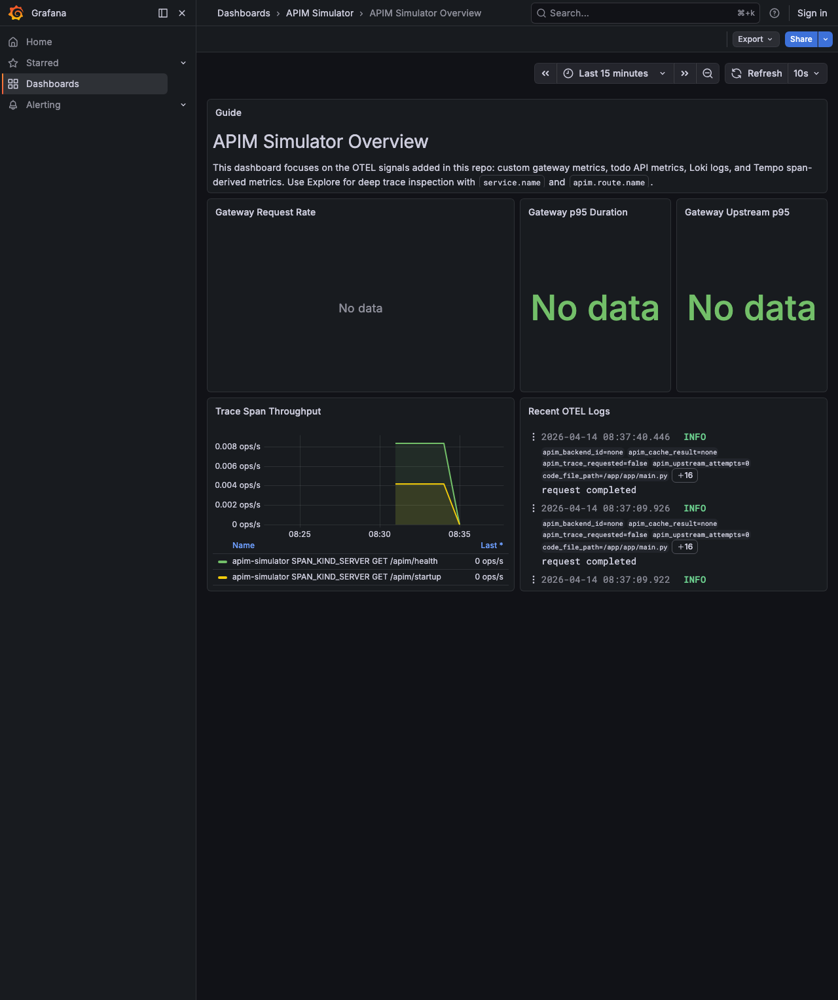

# APIM Simulator Walkthrough: Direct Public Gateway With OTEL

Generated from a live run against the local repository.

`make up-otel` adds the LGTM stack on `localhost:3001` so APIM traffic is visible in Grafana, Loki, Tempo, and Prometheus.

```bash
set -euo pipefail
make down >/dev/null 2>&1 || true
log="$(mktemp)"
make up-otel >"$log" 2>&1 || { cat "$log"; exit 1; }
for _ in $(seq 1 90); do
  curl -fsS http://localhost:8000/apim/health >/dev/null 2>&1 && curl -fsS http://localhost:3001/api/health >/dev/null 2>&1 && break
  sleep 1
done
docker compose -f compose.yml -f compose.public.yml -f compose.otel.yml ps --format json | jq -sS .
rm -f "$log"

```

```output
[
  {
    "Command": "\"/app/.venv/bin/pyth…\"",
    "CreatedAt": "2026-04-14 08:37:06 +0100 BST",
    "ExitCode": 0,
    "Health": "",
    "ID": "769d72baf98f",
    "Image": "apim-simulator:latest",
    "Labels": "com.docker.dhi.url=https://dhi.io/catalog/python,desktop.docker.io/ports.scheme=v2,com.docker.dhi.compliance=cis,com.docker.dhi.date.end-of-life=2029-10-31,com.docker.dhi.definition=image/python/debian-13/3.13,com.docker.dhi.entitlement=public,com.docker.dhi.title=Python 3.13.x,com.docker.dhi.version=3.13.13-debian13,desktop.docker.io/ports/8000/tcp=:8000,com.docker.compose.config-hash=b389fb38dd27453fa599cc64aa7e56ce183c6f4b512195894289acdaf05e9504,com.docker.compose.image=sha256:0b3d17ed4de25d3be75822a3144dadb0ea976a12ced3353163ea97d4477916af,com.docker.compose.project=apim-simulator,com.docker.compose.project.working_dir=/Users/nickromney/Developer/personal/apim-simulator,com.docker.compose.service=apim-simulator,com.docker.dhi.created=2026-04-11T22:45:39Z,com.docker.dhi.distro=debian-13,com.docker.dhi.name=dhi/python,com.docker.compose.depends_on=mock-backend:service_started:false,lgtm:service_started:false,com.docker.compose.oneoff=False,com.docker.compose.project.config_files=/Users/nickromney/Developer/personal/apim-simulator/compose.yml,/Users/nickromney/Developer/personal/apim-simulator/compose.public.yml,/Users/nickromney/Developer/personal/apim-simulator/compose.otel.yml,com.docker.compose.version=5.1.1,com.docker.dhi.chain-id=sha256:b9e7c6e6bf9a389eaa805f1244eea298c7ecd133127518ede00ede39add3df83,com.docker.dhi.flavor=,com.docker.dhi.shell=,com.docker.dhi.variant=runtime,com.docker.compose.container-number=1,com.docker.dhi.date.release=2024-10-07,com.docker.dhi.package-manager=",
    "LocalVolumes": "0",
    "Mounts": "",
    "Name": "apim-simulator-apim-simulator-1",
    "Names": "apim-simulator-apim-simulator-1",
    "Networks": "apim-simulator_apim",
    "Ports": "0.0.0.0:8000->8000/tcp, [::]:8000->8000/tcp",
    "Project": "apim-simulator",
    "Publishers": [
      {
        "Protocol": "tcp",
        "PublishedPort": 8000,
        "TargetPort": 8000,
        "URL": "0.0.0.0"
      },
      {
        "Protocol": "tcp",
        "PublishedPort": 8000,
        "TargetPort": 8000,
        "URL": "::"
      }
    ],
    "RunningFor": "3 seconds ago",
    "Service": "apim-simulator",
    "Size": "0B",
    "State": "running",
    "Status": "Up 2 seconds"
  },
  {
    "Command": "\"/otel-lgtm/run-all.…\"",
    "CreatedAt": "2026-04-14 08:37:06 +0100 BST",
    "ExitCode": 0,
    "Health": "starting",
    "ID": "0d3e91c7ae5d",
    "Image": "grafana/otel-lgtm:0.24.0@sha256:a7fbde2893d86ae4807701bc482736243e584eb90b5faa273d291ffff2a1374f",
    "Labels": "com.docker.compose.image=sha256:a7fbde2893d86ae4807701bc482736243e584eb90b5faa273d291ffff2a1374f,com.docker.compose.project=apim-simulator,com.docker.compose.project.config_files=/Users/nickromney/Developer/personal/apim-simulator/compose.yml,/Users/nickromney/Developer/personal/apim-simulator/compose.public.yml,/Users/nickromney/Developer/personal/apim-simulator/compose.otel.yml,desktop.docker.io/binds/1/Target=/otel-lgtm/grafana/conf/provisioning/dashboards/apim-simulator.yaml,desktop.docker.io/ports/4317/tcp=:4317,org.opencontainers.image.created=2026-04-10T09:33:00.461Z,com.docker.compose.oneoff=False,com.docker.compose.version=5.1.1,desktop.docker.io/ports/3000/tcp=:3001,distribution-scope=public,io.openshift.expose-services=,org.opencontainers.image.documentation=https://github.com/grafana/docker-otel-lgtm/blob/main/README.md,vcs-ref=7ac6a7cf03434cc414b5f1228c63b52069cf0f65,com.docker.compose.project.working_dir=/Users/nickromney/Developer/personal/apim-simulator,io.k8s.description=An open source backend for OpenTelemetry that's intended for development, demo, and testing environments.,io.k8s.display-name=Grafana LGTM,org.opencontainers.image.url=https://github.com/grafana/docker-otel-lgtm,release=,summary=An OpenTelemetry backend in a Docker image,build-date=,description=An open source backend for OpenTelemetry that's intended for development, demo, and testing environments.,desktop.docker.io/binds/2/SourceKind=hostFile,maintainer=Grafana Labs,org.opencontainers.image.ref.name=v0.24.0,org.opencontainers.image.source=https://github.com/grafana/docker-otel-lgtm,com.redhat.license_terms=https://www.redhat.com/en/about/red-hat-end-user-license-agreements#UBI,com.docker.compose.config-hash=f31c7704af9d12db3f7f1306f5e58421efd0f4b6f9ea2bf20eb6b7f0bd018875,org.opencontainers.image.authors=Grafana Labs,org.opencontainers.image.description=OpenTelemetry backend in a Docker image,org.opencontainers.image.licenses=Apache-2.0,url=https://github.com/grafana/docker-otel-lgtm,com.docker.compose.depends_on=,cpe=,desktop.docker.io/binds/1/SourceKind=hostFile,desktop.docker.io/binds/2/Target=/otel-lgtm/custom-dashboards,desktop.docker.io/ports.scheme=v2,io.buildah.version=,org.opencontainers.image.revision=7ac6a7cf03434cc414b5f1228c63b52069cf0f65,org.opencontainers.image.vendor=Grafana Labs,com.docker.compose.container-number=1,com.docker.compose.service=lgtm,vcs-type=git,vendor=Grafana Labs,com.redhat.component=ubi9-micro-container,desktop.docker.io/binds/1/Source=/Users/nickromney/Developer/personal/apim-simulator/observability/grafana/provisioning/dashboards/apim-simulator.yaml,desktop.docker.io/binds/2/Source=/Users/nickromney/Developer/personal/apim-simulator/observability/grafana/dashboards,desktop.docker.io/ports/4318/tcp=:4318,name=grafana/otel-lgtm,org.opencontainers.image.title=docker-otel-lgtm,org.opencontainers.image.version=0.24.0,version=v0.24.0,architecture=aarch64",
    "LocalVolumes": "1",
    "Mounts": "/host_mnt/User…,/host_mnt/User…,apim-simulator…",
    "Name": "apim-simulator-lgtm-1",
    "Names": "apim-simulator-lgtm-1",
    "Networks": "apim-simulator_apim",
    "Ports": "0.0.0.0:4317-4318->4317-4318/tcp, [::]:4317-4318->4317-4318/tcp, 0.0.0.0:3001->3000/tcp, [::]:3001->3000/tcp",
    "Project": "apim-simulator",
    "Publishers": [
      {
        "Protocol": "tcp",
        "PublishedPort": 3001,
        "TargetPort": 3000,
        "URL": "0.0.0.0"
      },
      {
        "Protocol": "tcp",
        "PublishedPort": 3001,
        "TargetPort": 3000,
        "URL": "::"
      },
      {
        "Protocol": "tcp",
        "PublishedPort": 4317,
        "TargetPort": 4317,
        "URL": "0.0.0.0"
      },
      {
        "Protocol": "tcp",
        "PublishedPort": 4317,
        "TargetPort": 4317,
        "URL": "::"
      },
      {
        "Protocol": "tcp",
        "PublishedPort": 4318,
        "TargetPort": 4318,
        "URL": "0.0.0.0"
      },
      {
        "Protocol": "tcp",
        "PublishedPort": 4318,
        "TargetPort": 4318,
        "URL": "::"
      }
    ],
    "RunningFor": "3 seconds ago",
    "Service": "lgtm",
    "Size": "0B",
    "State": "running",
    "Status": "Up 2 seconds (health: starting)"
  },
  {
    "Command": "\"python server.py\"",
    "CreatedAt": "2026-04-14 08:37:06 +0100 BST",
    "ExitCode": 0,
    "Health": "",
    "ID": "af82cc6e083e",
    "Image": "apim-simulator-mock-backend:latest",
    "Labels": "com.docker.dhi.definition=image/python/debian-13/3.13,com.docker.dhi.distro=debian-13,com.docker.dhi.title=Python 3.13.x,desktop.docker.io/ports.scheme=v2,com.docker.compose.depends_on=,com.docker.dhi.chain-id=sha256:e68172a1b009e121980466426bb3c0b7a6184cc9d5a4200b57ee2dc4292779da,com.docker.dhi.created=2026-04-08T03:14:50Z,com.docker.dhi.entitlement=public,com.docker.dhi.name=dhi/python,com.docker.dhi.shell=,com.docker.dhi.variant=runtime,com.docker.dhi.version=3.13.12-debian13,com.docker.compose.config-hash=815e10da41b3af6176108902ed23ffc47edfaf9c27a33e160094fa0330e92164,com.docker.compose.container-number=1,com.docker.compose.oneoff=False,com.docker.compose.project.working_dir=/Users/nickromney/Developer/personal/apim-simulator,com.docker.dhi.compliance=cis,com.docker.dhi.date.release=2024-10-07,com.docker.dhi.url=https://dhi.io/catalog/python,com.docker.compose.project.config_files=/Users/nickromney/Developer/personal/apim-simulator/compose.yml,/Users/nickromney/Developer/personal/apim-simulator/compose.public.yml,/Users/nickromney/Developer/personal/apim-simulator/compose.otel.yml,com.docker.compose.version=5.1.1,com.docker.dhi.flavor=,com.docker.dhi.package-manager=,com.docker.dhi.date.end-of-life=2029-10-31,com.docker.compose.image=sha256:73f9b0a2e4050a5e1d9024c0b0e24ba7227d9cde85780f9b721fce73c69c85b5,com.docker.compose.project=apim-simulator,com.docker.compose.service=mock-backend",
    "LocalVolumes": "0",
    "Mounts": "",
    "Name": "apim-simulator-mock-backend-1",
    "Names": "apim-simulator-mock-backend-1",
    "Networks": "apim-simulator_apim",
    "Ports": "8080/tcp",
    "Project": "apim-simulator",
    "Publishers": [
      {
        "Protocol": "tcp",
        "PublishedPort": 0,
        "TargetPort": 8080,
        "URL": ""
      }
    ],
    "RunningFor": "3 seconds ago",
    "Service": "mock-backend",
    "Size": "0B",
    "State": "running",
    "Status": "Up 2 seconds"
  }
]
```

```bash
set -euo pipefail
verify_log="$(mktemp)"
make verify-otel >"$verify_log" 2>&1 || { cat "$verify_log"; exit 1; }
apim_health="$(curl -fsS http://localhost:8000/apim/health)"
grafana_health="$(curl -fsS http://localhost:3001/api/health)"
jq -n \
  --argjson apim_health "$apim_health" \
  --argjson grafana_health "$grafana_health" \
  --arg verify_log "$(cat "$verify_log")" \
  '{
    apim_health: $apim_health,
    grafana_health: $grafana_health,
    verify_otel: "passed",
    verify_output: ($verify_log | split("\n") | map(select(length > 0)))
  }'
rm -f "$verify_log"

```

```output
{
  "apim_health": {
    "status": "healthy"
  },
  "grafana_health": {
    "database": "ok",
    "version": "12.4.2",
    "commit": "ebade4c739e1aface4ce094934ad85374887a680"
  },
  "verify_otel": "passed",
  "verify_output": [
    "uv run python scripts/verify_otel.py",
    "Grafana healthy: version=12.4.2",
    "APIM metrics visible: 2 series",
    "Loki services: apim-simulator, hello-api",
    "Tempo services: apim-simulator, hello-api",
    "otel verification passed"
  ]
}
```

```bash {image}
set -euo pipefail
rodney stop >/dev/null 2>&1 || true
rm -f "$HOME/.rodney/chrome-data/SingletonLock"
rodney start >/tmp/rodney-start.log 2>&1 || true
sleep 2
rodney open http://localhost:3001/d/apim-simulator-overview/apim-simulator-overview >/dev/null
rodney waitload >/dev/null
rodney waitstable >/dev/null
rodney sleep 2 >/dev/null
rodney screenshot walkthrough-core-grafana.png

```


