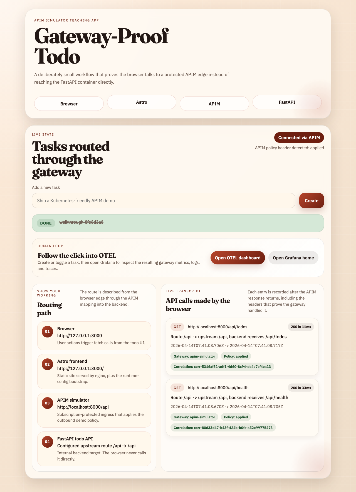

# APIM Simulator Walkthrough: Example Stacks

*2026-04-14T07:39:04Z*

This document covers the higher-level examples shipped with the repo: the hello starter variants, the browser-backed todo demo, and the Bruno collection used to exercise the todo API through APIM.

## Hello Starter
`make up-hello` puts the smallest checked-in backend behind APIM with anonymous access.

```bash
set -euo pipefail
make down >/dev/null 2>&1 || true
log="$(mktemp)"
make up-hello >"$log" 2>&1 || { cat "$log"; exit 1; }
for _ in $(seq 1 90); do
  curl -fsS http://localhost:8000/api/health >/dev/null 2>&1 && break
  sleep 1
done
docker compose -f compose.yml -f compose.public.yml -f compose.hello.yml ps --format json | jq -sS .
rm -f "$log"

```

```output
[
  {
    "Command": "\"/app/.venv/bin/pyth…\"",
    "CreatedAt": "2026-04-14 08:39:09 +0100 BST",
    "ExitCode": 0,
    "Health": "",
    "ID": "8a732dcc97b9",
    "Image": "apim-simulator:latest",
    "Labels": "com.docker.dhi.variant=runtime,com.docker.compose.depends_on=mock-backend:service_started:false,hello-api:service_healthy:false,com.docker.compose.project.config_files=/Users/nickromney/Developer/personal/apim-simulator/compose.yml,/Users/nickromney/Developer/personal/apim-simulator/compose.public.yml,/Users/nickromney/Developer/personal/apim-simulator/compose.hello.yml,com.docker.dhi.chain-id=sha256:b9e7c6e6bf9a389eaa805f1244eea298c7ecd133127518ede00ede39add3df83,com.docker.dhi.created=2026-04-11T22:45:39Z,com.docker.dhi.date.end-of-life=2029-10-31,com.docker.dhi.entitlement=public,com.docker.dhi.version=3.13.13-debian13,com.docker.dhi.compliance=cis,com.docker.dhi.date.release=2024-10-07,com.docker.dhi.distro=debian-13,com.docker.dhi.name=dhi/python,com.docker.dhi.package-manager=,com.docker.dhi.url=https://dhi.io/catalog/python,desktop.docker.io/ports.scheme=v2,com.docker.compose.oneoff=False,com.docker.compose.project.working_dir=/Users/nickromney/Developer/personal/apim-simulator,com.docker.compose.version=5.1.1,com.docker.dhi.flavor=,com.docker.dhi.title=Python 3.13.x,desktop.docker.io/ports/8000/tcp=:8000,com.docker.compose.config-hash=b6b6780623736c6444d7560b446a6ad75298d4035cbfd17ab352d058194c24af,com.docker.compose.container-number=1,com.docker.compose.image=sha256:9260b4d23f6a4b22be4880aff282a9c5792bd5804b31d84b24a094d17174f7ec,com.docker.compose.project=apim-simulator,com.docker.compose.service=apim-simulator,com.docker.dhi.definition=image/python/debian-13/3.13,com.docker.dhi.shell=",
    "LocalVolumes": "0",
    "Mounts": "",
    "Name": "apim-simulator-apim-simulator-1",
    "Names": "apim-simulator-apim-simulator-1",
    "Networks": "apim-simulator_apim",
    "Ports": "0.0.0.0:8000->8000/tcp, [::]:8000->8000/tcp",
    "Project": "apim-simulator",
    "Publishers": [
      {
        "Protocol": "tcp",
        "PublishedPort": 8000,
        "TargetPort": 8000,
        "URL": "0.0.0.0"
      },
      {
        "Protocol": "tcp",
        "PublishedPort": 8000,
        "TargetPort": 8000,
        "URL": "::"
      }
    ],
    "RunningFor": "8 seconds ago",
    "Service": "apim-simulator",
    "Size": "0B",
    "State": "running",
    "Status": "Up 2 seconds"
  },
  {
    "Command": "\"/app/.venv/bin/uvic…\"",
    "CreatedAt": "2026-04-14 08:39:09 +0100 BST",
    "ExitCode": 0,
    "Health": "healthy",
    "ID": "e716e2b28917",
    "Image": "apim-simulator-hello-api:latest",
    "Labels": "desktop.docker.io/ports.scheme=v2,com.docker.dhi.created=2026-04-11T22:45:39Z,com.docker.compose.container-number=1,com.docker.compose.depends_on=,com.docker.compose.oneoff=False,com.docker.compose.project.working_dir=/Users/nickromney/Developer/personal/apim-simulator,com.docker.dhi.variant=runtime,com.docker.compose.config-hash=67f3fb3e730931d9496f989084f451727082e3f09840e8df8a4194d43f2b4014,com.docker.compose.project=apim-simulator,com.docker.dhi.date.end-of-life=2029-10-31,com.docker.dhi.date.release=2024-10-07,com.docker.dhi.shell=,com.docker.compose.project.config_files=/Users/nickromney/Developer/personal/apim-simulator/compose.yml,/Users/nickromney/Developer/personal/apim-simulator/compose.public.yml,/Users/nickromney/Developer/personal/apim-simulator/compose.hello.yml,com.docker.compose.service=hello-api,com.docker.compose.version=5.1.1,com.docker.dhi.chain-id=sha256:b9e7c6e6bf9a389eaa805f1244eea298c7ecd133127518ede00ede39add3df83,com.docker.dhi.definition=image/python/debian-13/3.13,com.docker.dhi.distro=debian-13,com.docker.dhi.entitlement=public,com.docker.dhi.name=dhi/python,com.docker.compose.image=sha256:566923ff83c90e980f62aacf12547d0bb1294d830b3777e7e9fa7bcd99472099,com.docker.dhi.compliance=cis,com.docker.dhi.flavor=,com.docker.dhi.package-manager=,com.docker.dhi.title=Python 3.13.x,com.docker.dhi.url=https://dhi.io/catalog/python,com.docker.dhi.version=3.13.13-debian13",
    "LocalVolumes": "0",
    "Mounts": "",
    "Name": "apim-simulator-hello-api-1",
    "Names": "apim-simulator-hello-api-1",
    "Networks": "apim-simulator_apim",
    "Ports": "8000/tcp",
    "Project": "apim-simulator",
    "Publishers": [
      {
        "Protocol": "tcp",
        "PublishedPort": 0,
        "TargetPort": 8000,
        "URL": ""
      }
    ],
    "RunningFor": "8 seconds ago",
    "Service": "hello-api",
    "Size": "0B",
    "State": "running",
    "Status": "Up 7 seconds (healthy)"
  },
  {
    "Command": "\"python server.py\"",
    "CreatedAt": "2026-04-14 08:39:09 +0100 BST",
    "ExitCode": 0,
    "Health": "",
    "ID": "23b9572b1095",
    "Image": "apim-simulator-mock-backend:latest",
    "Labels": "com.docker.compose.version=5.1.1,com.docker.dhi.distro=debian-13,com.docker.dhi.name=dhi/python,com.docker.dhi.shell=,com.docker.dhi.url=https://dhi.io/catalog/python,com.docker.dhi.date.end-of-life=2029-10-31,com.docker.compose.container-number=1,com.docker.compose.project=apim-simulator,com.docker.compose.project.config_files=/Users/nickromney/Developer/personal/apim-simulator/compose.yml,/Users/nickromney/Developer/personal/apim-simulator/compose.public.yml,/Users/nickromney/Developer/personal/apim-simulator/compose.hello.yml,com.docker.dhi.created=2026-04-08T03:14:50Z,com.docker.dhi.definition=image/python/debian-13/3.13,com.docker.dhi.package-manager=,com.docker.dhi.variant=runtime,com.docker.compose.depends_on=,com.docker.compose.image=sha256:6ed5c9bb9fa255cc19ec043d290205fceeca77ac4a5fb514ff3e52120ad68819,com.docker.compose.service=mock-backend,com.docker.dhi.date.release=2024-10-07,com.docker.dhi.version=3.13.12-debian13,desktop.docker.io/ports.scheme=v2,com.docker.compose.oneoff=False,com.docker.compose.project.working_dir=/Users/nickromney/Developer/personal/apim-simulator,com.docker.dhi.chain-id=sha256:e68172a1b009e121980466426bb3c0b7a6184cc9d5a4200b57ee2dc4292779da,com.docker.dhi.compliance=cis,com.docker.dhi.entitlement=public,com.docker.dhi.flavor=,com.docker.dhi.title=Python 3.13.x,com.docker.compose.config-hash=815e10da41b3af6176108902ed23ffc47edfaf9c27a33e160094fa0330e92164",
    "LocalVolumes": "0",
    "Mounts": "",
    "Name": "apim-simulator-mock-backend-1",
    "Names": "apim-simulator-mock-backend-1",
    "Networks": "apim-simulator_apim",
    "Ports": "8080/tcp",
    "Project": "apim-simulator",
    "Publishers": [
      {
        "Protocol": "tcp",
        "PublishedPort": 0,
        "TargetPort": 8080,
        "URL": ""
      }
    ],
    "RunningFor": "8 seconds ago",
    "Service": "mock-backend",
    "Size": "0B",
    "State": "running",
    "Status": "Up 7 seconds"
  }
]
```

```bash
set -euo pipefail
health="$(curl -fsS http://localhost:8000/api/health)"
hello="$(curl -fsS 'http://localhost:8000/api/hello?name=team')"
jq -n \
  --argjson health "$health" \
  --argjson hello "$hello" \
  '{health: $health, hello: $hello}'

```

```output
{
  "health": {
    "status": "ok",
    "service": "hello-api"
  },
  "hello": {
    "message": "hello, team"
  }
}
```

## Hello Starter With Subscription
`make up-hello-subscription` adds APIM product protection and the demo subscription key checks.

```bash
set -euo pipefail
make down >/dev/null 2>&1 || true
log="$(mktemp)"
make up-hello-subscription >"$log" 2>&1 || { cat "$log"; exit 1; }
for _ in $(seq 1 90); do
  curl -fsS http://localhost:8000/apim/health >/dev/null 2>&1 && break
  sleep 1
done
docker compose -f compose.yml -f compose.public.yml -f compose.hello.yml ps --format json | jq -sS .
rm -f "$log"

```

```output
[
  {
    "Command": "\"/app/.venv/bin/pyth…\"",
    "CreatedAt": "2026-04-14 08:39:21 +0100 BST",
    "ExitCode": 0,
    "Health": "",
    "ID": "d6de800b78de",
    "Image": "apim-simulator:latest",
    "Labels": "com.docker.dhi.definition=image/python/debian-13/3.13,com.docker.dhi.distro=debian-13,com.docker.dhi.shell=,com.docker.dhi.version=3.13.13-debian13,com.docker.dhi.created=2026-04-11T22:45:39Z,com.docker.compose.config-hash=5e0f1b57733ee6c34e55ab32920ae08d87d724f52119f96a617a1d377eb338ee,com.docker.compose.depends_on=mock-backend:service_started:false,hello-api:service_healthy:false,com.docker.compose.image=sha256:c4293d2f9cc128f016d4983330c9f28405f2a0345f91411e89e6001c2c7cb83e,com.docker.compose.oneoff=False,com.docker.compose.project.config_files=/Users/nickromney/Developer/personal/apim-simulator/compose.yml,/Users/nickromney/Developer/personal/apim-simulator/compose.public.yml,/Users/nickromney/Developer/personal/apim-simulator/compose.hello.yml,com.docker.compose.service=apim-simulator,com.docker.dhi.flavor=,com.docker.compose.version=5.1.1,com.docker.dhi.compliance=cis,com.docker.dhi.name=dhi/python,com.docker.dhi.package-manager=,com.docker.dhi.title=Python 3.13.x,com.docker.dhi.url=https://dhi.io/catalog/python,com.docker.dhi.variant=runtime,desktop.docker.io/ports.scheme=v2,com.docker.dhi.date.end-of-life=2029-10-31,com.docker.compose.project=apim-simulator,com.docker.dhi.chain-id=sha256:b9e7c6e6bf9a389eaa805f1244eea298c7ecd133127518ede00ede39add3df83,com.docker.dhi.date.release=2024-10-07,com.docker.dhi.entitlement=public,desktop.docker.io/ports/8000/tcp=:8000,com.docker.compose.container-number=1,com.docker.compose.project.working_dir=/Users/nickromney/Developer/personal/apim-simulator",
    "LocalVolumes": "0",
    "Mounts": "",
    "Name": "apim-simulator-apim-simulator-1",
    "Names": "apim-simulator-apim-simulator-1",
    "Networks": "apim-simulator_apim",
    "Ports": "0.0.0.0:8000->8000/tcp, [::]:8000->8000/tcp",
    "Project": "apim-simulator",
    "Publishers": [
      {
        "Protocol": "tcp",
        "PublishedPort": 8000,
        "TargetPort": 8000,
        "URL": "0.0.0.0"
      },
      {
        "Protocol": "tcp",
        "PublishedPort": 8000,
        "TargetPort": 8000,
        "URL": "::"
      }
    ],
    "RunningFor": "8 seconds ago",
    "Service": "apim-simulator",
    "Size": "0B",
    "State": "running",
    "Status": "Up 2 seconds"
  },
  {
    "Command": "\"/app/.venv/bin/uvic…\"",
    "CreatedAt": "2026-04-14 08:39:21 +0100 BST",
    "ExitCode": 0,
    "Health": "healthy",
    "ID": "fa391db1c801",
    "Image": "apim-simulator-hello-api:latest",
    "Labels": "com.docker.dhi.date.end-of-life=2029-10-31,com.docker.compose.config-hash=67f3fb3e730931d9496f989084f451727082e3f09840e8df8a4194d43f2b4014,com.docker.compose.container-number=1,com.docker.compose.depends_on=,com.docker.compose.image=sha256:0af7ad71da95d2c23820a770e51e7a915359a2263cb6c36512eab9febbb43f7f,com.docker.compose.project.working_dir=/Users/nickromney/Developer/personal/apim-simulator,com.docker.compose.version=5.1.1,com.docker.dhi.chain-id=sha256:b9e7c6e6bf9a389eaa805f1244eea298c7ecd133127518ede00ede39add3df83,com.docker.compose.oneoff=False,com.docker.compose.project=apim-simulator,com.docker.compose.service=hello-api,com.docker.dhi.created=2026-04-11T22:45:39Z,com.docker.dhi.compliance=cis,com.docker.dhi.date.release=2024-10-07,com.docker.dhi.name=dhi/python,com.docker.dhi.shell=,com.docker.dhi.distro=debian-13,com.docker.dhi.entitlement=public,com.docker.dhi.package-manager=,com.docker.dhi.url=https://dhi.io/catalog/python,desktop.docker.io/ports.scheme=v2,com.docker.compose.project.config_files=/Users/nickromney/Developer/personal/apim-simulator/compose.yml,/Users/nickromney/Developer/personal/apim-simulator/compose.public.yml,/Users/nickromney/Developer/personal/apim-simulator/compose.hello.yml,com.docker.dhi.definition=image/python/debian-13/3.13,com.docker.dhi.flavor=,com.docker.dhi.title=Python 3.13.x,com.docker.dhi.variant=runtime,com.docker.dhi.version=3.13.13-debian13",
    "LocalVolumes": "0",
    "Mounts": "",
    "Name": "apim-simulator-hello-api-1",
    "Names": "apim-simulator-hello-api-1",
    "Networks": "apim-simulator_apim",
    "Ports": "8000/tcp",
    "Project": "apim-simulator",
    "Publishers": [
      {
        "Protocol": "tcp",
        "PublishedPort": 0,
        "TargetPort": 8000,
        "URL": ""
      }
    ],
    "RunningFor": "8 seconds ago",
    "Service": "hello-api",
    "Size": "0B",
    "State": "running",
    "Status": "Up 7 seconds (healthy)"
  },
  {
    "Command": "\"python server.py\"",
    "CreatedAt": "2026-04-14 08:39:21 +0100 BST",
    "ExitCode": 0,
    "Health": "",
    "ID": "b5d8ae75d7b0",
    "Image": "apim-simulator-mock-backend:latest",
    "Labels": "com.docker.compose.depends_on=,com.docker.compose.version=5.1.1,com.docker.dhi.chain-id=sha256:e68172a1b009e121980466426bb3c0b7a6184cc9d5a4200b57ee2dc4292779da,com.docker.dhi.definition=image/python/debian-13/3.13,com.docker.dhi.entitlement=public,com.docker.compose.config-hash=815e10da41b3af6176108902ed23ffc47edfaf9c27a33e160094fa0330e92164,com.docker.compose.image=sha256:ee9e18647eed9b3146891afe64a676acf0828a44509427a8de92910416e1f7a4,com.docker.compose.project.config_files=/Users/nickromney/Developer/personal/apim-simulator/compose.yml,/Users/nickromney/Developer/personal/apim-simulator/compose.public.yml,/Users/nickromney/Developer/personal/apim-simulator/compose.hello.yml,com.docker.dhi.created=2026-04-08T03:14:50Z,com.docker.dhi.package-manager=,com.docker.dhi.title=Python 3.13.x,com.docker.dhi.url=https://dhi.io/catalog/python,com.docker.dhi.version=3.13.12-debian13,com.docker.compose.container-number=1,com.docker.compose.oneoff=False,com.docker.compose.project.working_dir=/Users/nickromney/Developer/personal/apim-simulator,com.docker.dhi.compliance=cis,com.docker.dhi.date.end-of-life=2029-10-31,com.docker.dhi.distro=debian-13,com.docker.dhi.shell=,com.docker.compose.project=apim-simulator,com.docker.compose.service=mock-backend,com.docker.dhi.date.release=2024-10-07,com.docker.dhi.flavor=,com.docker.dhi.name=dhi/python,com.docker.dhi.variant=runtime,desktop.docker.io/ports.scheme=v2",
    "LocalVolumes": "0",
    "Mounts": "",
    "Name": "apim-simulator-mock-backend-1",
    "Names": "apim-simulator-mock-backend-1",
    "Networks": "apim-simulator_apim",
    "Ports": "8080/tcp",
    "Project": "apim-simulator",
    "Publishers": [
      {
        "Protocol": "tcp",
        "PublishedPort": 0,
        "TargetPort": 8080,
        "URL": ""
      }
    ],
    "RunningFor": "8 seconds ago",
    "Service": "mock-backend",
    "Size": "0B",
    "State": "running",
    "Status": "Up 7 seconds"
  }
]
```

```bash
set -euo pipefail
uv run python - <<'PY'
import json
import httpx

client = httpx.Client(timeout=10.0)
missing = client.get("http://localhost:8000/api/health")
invalid = client.get(
    "http://localhost:8000/api/health",
    headers={"Ocp-Apim-Subscription-Key": "hello-demo-key-invalid"},
)
valid = client.get(
    "http://localhost:8000/api/hello?name=subscription",
    headers={"Ocp-Apim-Subscription-Key": "hello-demo-key"},
)
valid.raise_for_status()
summary = {
    "missing_subscription": {"status": missing.status_code, "body": missing.json()},
    "invalid_subscription": {"status": invalid.status_code, "body": invalid.json()},
    "valid_subscription": {
        "status": valid.status_code,
        "policy_header": valid.headers.get("x-hello-policy"),
        "body": valid.json(),
    },
}
print(json.dumps(summary, indent=2, sort_keys=True))
PY

```

```output
{
  "invalid_subscription": {
    "body": {
      "detail": "Invalid subscription key"
    },
    "status": 401
  },
  "missing_subscription": {
    "body": {
      "detail": "Missing subscription key"
    },
    "status": 401
  },
  "valid_subscription": {
    "body": {
      "message": "hello, subscription"
    },
    "policy_header": "applied",
    "status": 200
  }
}
```

## Hello Starter With OIDC
`make up-hello-oidc` keeps the hello backend but fronts it with Keycloak-backed bearer token validation.

```bash
set -euo pipefail
make down >/dev/null 2>&1 || true
log="$(mktemp)"
make up-hello-oidc >"$log" 2>&1 || { cat "$log"; exit 1; }
for _ in $(seq 1 90); do
  curl -fsS http://localhost:8000/apim/health >/dev/null 2>&1 && curl -fsS http://localhost:8180/realms/subnet-calculator/.well-known/openid-configuration >/dev/null 2>&1 && break
  sleep 1
done
docker compose -f compose.yml -f compose.public.yml -f compose.oidc.yml -f compose.hello.yml ps --format json | jq -sS .
rm -f "$log"

```

```output
[
  {
    "Command": "\"/app/.venv/bin/pyth…\"",
    "CreatedAt": "2026-04-14 08:39:34 +0100 BST",
    "ExitCode": 0,
    "Health": "",
    "ID": "9d6f6d433dbc",
    "Image": "apim-simulator:latest",
    "Labels": "desktop.docker.io/ports.scheme=v2,desktop.docker.io/ports/8000/tcp=:8000,com.docker.compose.config-hash=c0a37452f793404171aa254ac00aa12e2526a5ded88f1188a0641484ec32569a,com.docker.compose.container-number=1,com.docker.compose.project.working_dir=/Users/nickromney/Developer/personal/apim-simulator,com.docker.dhi.definition=image/python/debian-13/3.13,com.docker.dhi.distro=debian-13,com.docker.dhi.name=dhi/python,com.docker.dhi.package-manager=,com.docker.dhi.shell=,com.docker.compose.project=apim-simulator,com.docker.compose.project.config_files=/Users/nickromney/Developer/personal/apim-simulator/compose.yml,/Users/nickromney/Developer/personal/apim-simulator/compose.public.yml,/Users/nickromney/Developer/personal/apim-simulator/compose.oidc.yml,/Users/nickromney/Developer/personal/apim-simulator/compose.hello.yml,com.docker.dhi.date.release=2024-10-07,com.docker.dhi.title=Python 3.13.x,com.docker.dhi.url=https://dhi.io/catalog/python,com.docker.dhi.variant=runtime,com.docker.compose.depends_on=mock-backend:service_started:false,keycloak:service_healthy:false,hello-api:service_healthy:false,com.docker.compose.image=sha256:81bac406110cbf97c06c2228feffd5558443264d535a8756e5d0adebd47b91b9,com.docker.compose.oneoff=False,com.docker.dhi.compliance=cis,com.docker.dhi.created=2026-04-11T22:45:39Z,com.docker.dhi.entitlement=public,com.docker.compose.service=apim-simulator,com.docker.compose.version=5.1.1,com.docker.dhi.chain-id=sha256:b9e7c6e6bf9a389eaa805f1244eea298c7ecd133127518ede00ede39add3df83,com.docker.dhi.date.end-of-life=2029-10-31,com.docker.dhi.flavor=,com.docker.dhi.version=3.13.13-debian13",
    "LocalVolumes": "0",
    "Mounts": "",
    "Name": "apim-simulator-apim-simulator-1",
    "Names": "apim-simulator-apim-simulator-1",
    "Networks": "apim-simulator_apim",
    "Ports": "0.0.0.0:8000->8000/tcp, [::]:8000->8000/tcp",
    "Project": "apim-simulator",
    "Publishers": [
      {
        "Protocol": "tcp",
        "PublishedPort": 8000,
        "TargetPort": 8000,
        "URL": "0.0.0.0"
      },
      {
        "Protocol": "tcp",
        "PublishedPort": 8000,
        "TargetPort": 8000,
        "URL": "::"
      }
    ],
    "RunningFor": "13 seconds ago",
    "Service": "apim-simulator",
    "Size": "0B",
    "State": "running",
    "Status": "Up 2 seconds"
  },
  {
    "Command": "\"/app/.venv/bin/uvic…\"",
    "CreatedAt": "2026-04-14 08:39:34 +0100 BST",
    "ExitCode": 0,
    "Health": "healthy",
    "ID": "df080ea06b0d",
    "Image": "apim-simulator-hello-api:latest",
    "Labels": "com.docker.dhi.variant=runtime,com.docker.dhi.created=2026-04-11T22:45:39Z,com.docker.compose.image=sha256:74d8bb88337efdfd908afe7fbde6ede24ce6586349f52eaf5ca21b407609624c,com.docker.dhi.definition=image/python/debian-13/3.13,com.docker.dhi.title=Python 3.13.x,com.docker.dhi.version=3.13.13-debian13,desktop.docker.io/ports.scheme=v2,com.docker.compose.project=apim-simulator,com.docker.compose.project.config_files=/Users/nickromney/Developer/personal/apim-simulator/compose.yml,/Users/nickromney/Developer/personal/apim-simulator/compose.public.yml,/Users/nickromney/Developer/personal/apim-simulator/compose.oidc.yml,/Users/nickromney/Developer/personal/apim-simulator/compose.hello.yml,com.docker.dhi.distro=debian-13,com.docker.dhi.shell=,com.docker.dhi.url=https://dhi.io/catalog/python,com.docker.dhi.date.end-of-life=2029-10-31,com.docker.compose.config-hash=67f3fb3e730931d9496f989084f451727082e3f09840e8df8a4194d43f2b4014,com.docker.compose.depends_on=,com.docker.compose.project.working_dir=/Users/nickromney/Developer/personal/apim-simulator,com.docker.compose.service=hello-api,com.docker.compose.version=5.1.1,com.docker.dhi.chain-id=sha256:b9e7c6e6bf9a389eaa805f1244eea298c7ecd133127518ede00ede39add3df83,com.docker.dhi.compliance=cis,com.docker.compose.container-number=1,com.docker.compose.oneoff=False,com.docker.dhi.date.release=2024-10-07,com.docker.dhi.entitlement=public,com.docker.dhi.flavor=,com.docker.dhi.name=dhi/python,com.docker.dhi.package-manager=",
    "LocalVolumes": "0",
    "Mounts": "",
    "Name": "apim-simulator-hello-api-1",
    "Names": "apim-simulator-hello-api-1",
    "Networks": "apim-simulator_apim",
    "Ports": "8000/tcp",
    "Project": "apim-simulator",
    "Publishers": [
      {
        "Protocol": "tcp",
        "PublishedPort": 0,
        "TargetPort": 8000,
        "URL": ""
      }
    ],
    "RunningFor": "13 seconds ago",
    "Service": "hello-api",
    "Size": "0B",
    "State": "running",
    "Status": "Up 13 seconds (healthy)"
  },
  {
    "Command": "\"/opt/keycloak/bin/k…\"",
    "CreatedAt": "2026-04-14 08:39:34 +0100 BST",
    "ExitCode": 0,
    "Health": "healthy",
    "ID": "af5fd4fa9ef4",
    "Image": "quay.io/keycloak/keycloak:26.4.7",
    "Labels": "com.docker.compose.version=5.1.1,desktop.docker.io/binds/1/Source=/Users/nickromney/Developer/personal/apim-simulator/examples/subnet-calculator/keycloak/realm-export.json,io.buildah.version=1.41.4,io.openshift.expose-services=,maintainer=https://www.keycloak.org/,org.opencontainers.image.documentation=https://www.keycloak.org/documentation,org.opencontainers.image.revision=aa3baec457ee0cdfdff6de1ce256319180a76ee6,vcs-ref=,com.docker.compose.container-number=1,com.docker.compose.depends_on=,com.docker.compose.project.config_files=/Users/nickromney/Developer/personal/apim-simulator/compose.yml,/Users/nickromney/Developer/personal/apim-simulator/compose.public.yml,/Users/nickromney/Developer/personal/apim-simulator/compose.oidc.yml,/Users/nickromney/Developer/personal/apim-simulator/compose.hello.yml,com.docker.compose.service=keycloak,io.openshift.tags=keycloak security identity,org.opencontainers.image.version=26.4.7,summary=Keycloak Server Image,vcs-type=git,com.docker.compose.project.working_dir=/Users/nickromney/Developer/personal/apim-simulator,com.redhat.license_terms=,desktop.docker.io/binds/1/SourceKind=hostFile,com.redhat.build-host=,io.k8s.description=Keycloak Server Image,org.opencontainers.image.created=2025-12-01T08:14:24.495Z,org.opencontainers.image.description=,org.opencontainers.image.licenses=Apache-2.0,org.opencontainers.image.source=https://github.com/keycloak-rel/keycloak-rel,org.opencontainers.image.title=keycloak-rel,org.opencontainers.image.url=https://github.com/keycloak-rel/keycloak-rel,architecture=aarch64,com.docker.compose.image=sha256:9409c59bdfb65dbffa20b11e6f18b8abb9281d480c7ca402f51ed3d5977e6007,com.redhat.component=,description=Keycloak Server Image,distribution-scope=public,release=,url=https://www.keycloak.org/,vendor=https://www.keycloak.org/,com.docker.compose.project=apim-simulator,desktop.docker.io/ports.scheme=v2,io.k8s.display-name=Keycloak Server,version=26.4.7,build-date=2025-11-12T17:00:10Z,cpe=cpe:/a:redhat:enterprise_linux:9::appstream,desktop.docker.io/binds/1/Target=/opt/keycloak/data/import/realm-export.json,desktop.docker.io/ports/8080/tcp=:8180,name=keycloak,com.docker.compose.config-hash=ef29ccb00803353c0b6c2627c8f8c5c5b4c07338465efad85e1e1df4aad6ff6c,com.docker.compose.oneoff=False",
    "LocalVolumes": "1",
    "Mounts": "apim-simulator…,/host_mnt/User…",
    "Name": "apim-simulator-keycloak-1",
    "Names": "apim-simulator-keycloak-1",
    "Networks": "apim-simulator_apim",
    "Ports": "0.0.0.0:8180->8080/tcp, [::]:8180->8080/tcp",
    "Project": "apim-simulator",
    "Publishers": [
      {
        "Protocol": "tcp",
        "PublishedPort": 8180,
        "TargetPort": 8080,
        "URL": "0.0.0.0"
      },
      {
        "Protocol": "tcp",
        "PublishedPort": 8180,
        "TargetPort": 8080,
        "URL": "::"
      }
    ],
    "RunningFor": "13 seconds ago",
    "Service": "keycloak",
    "Size": "0B",
    "State": "running",
    "Status": "Up 13 seconds (healthy)"
  },
  {
    "Command": "\"python server.py\"",
    "CreatedAt": "2026-04-14 08:39:34 +0100 BST",
    "ExitCode": 0,
    "Health": "",
    "ID": "762653086c45",
    "Image": "apim-simulator-mock-backend:latest",
    "Labels": "com.docker.dhi.variant=runtime,com.docker.compose.project=apim-simulator,com.docker.compose.version=5.1.1,com.docker.dhi.chain-id=sha256:e68172a1b009e121980466426bb3c0b7a6184cc9d5a4200b57ee2dc4292779da,com.docker.dhi.definition=image/python/debian-13/3.13,com.docker.dhi.distro=debian-13,com.docker.compose.config-hash=815e10da41b3af6176108902ed23ffc47edfaf9c27a33e160094fa0330e92164,com.docker.dhi.created=2026-04-08T03:14:50Z,com.docker.dhi.flavor=,com.docker.dhi.url=https://dhi.io/catalog/python,com.docker.dhi.version=3.13.12-debian13,desktop.docker.io/ports.scheme=v2,com.docker.compose.container-number=1,com.docker.compose.image=sha256:753cdc245329a9ee6f14a18c775ae15cdd8b06aad3b71bf5eca486b58724213c,com.docker.compose.project.config_files=/Users/nickromney/Developer/personal/apim-simulator/compose.yml,/Users/nickromney/Developer/personal/apim-simulator/compose.public.yml,/Users/nickromney/Developer/personal/apim-simulator/compose.oidc.yml,/Users/nickromney/Developer/personal/apim-simulator/compose.hello.yml,com.docker.dhi.date.end-of-life=2029-10-31,com.docker.dhi.date.release=2024-10-07,com.docker.dhi.name=dhi/python,com.docker.dhi.package-manager=,com.docker.dhi.shell=,com.docker.compose.depends_on=,com.docker.compose.oneoff=False,com.docker.compose.project.working_dir=/Users/nickromney/Developer/personal/apim-simulator,com.docker.compose.service=mock-backend,com.docker.dhi.compliance=cis,com.docker.dhi.entitlement=public,com.docker.dhi.title=Python 3.13.x",
    "LocalVolumes": "0",
    "Mounts": "",
    "Name": "apim-simulator-mock-backend-1",
    "Names": "apim-simulator-mock-backend-1",
    "Networks": "apim-simulator_apim",
    "Ports": "8080/tcp",
    "Project": "apim-simulator",
    "Publishers": [
      {
        "Protocol": "tcp",
        "PublishedPort": 0,
        "TargetPort": 8080,
        "URL": ""
      }
    ],
    "RunningFor": "13 seconds ago",
    "Service": "mock-backend",
    "Size": "0B",
    "State": "running",
    "Status": "Up 13 seconds"
  }
]
```

```bash
set -euo pipefail
smoke_log="$(mktemp)"
SMOKE_HELLO_MODE=oidc-jwt make smoke-hello >"$smoke_log" 2>&1 || { cat "$smoke_log"; exit 1; }
well_known="$(curl -fsS http://localhost:8180/realms/subnet-calculator/.well-known/openid-configuration)"
jq -n \
  --argjson well_known "$well_known" \
  --arg smoke_log "$(cat "$smoke_log")" \
  '{
    oidc: {
      issuer: $well_known.issuer,
      token_endpoint: $well_known.token_endpoint
    },
    smoke_hello: "passed",
    smoke_output: ($smoke_log | split("\n") | map(select(length > 0)))
  }'
rm -f "$smoke_log"

```

```output
{
  "oidc": {
    "issuer": "http://localhost:8180/realms/subnet-calculator",
    "token_endpoint": "http://localhost:8180/realms/subnet-calculator/protocol/openid-connect/token"
  },
  "smoke_hello": "passed",
  "smoke_output": [
    "uv run python scripts/smoke_hello.py",
    "hello smoke passed",
    "- mode: oidc-jwt",
    "- missing bearer: 401",
    "- valid token: 200"
  ]
}
```

## Hello Starter With OIDC And Subscription
`make up-hello-oidc-subscription` combines bearer token checks with the APIM product subscription gate.

```bash
set -euo pipefail
make down >/dev/null 2>&1 || true
log="$(mktemp)"
make up-hello-oidc-subscription >"$log" 2>&1 || { cat "$log"; exit 1; }
for _ in $(seq 1 90); do
  curl -fsS http://localhost:8000/apim/health >/dev/null 2>&1 && curl -fsS http://localhost:8180/realms/subnet-calculator/.well-known/openid-configuration >/dev/null 2>&1 && break
  sleep 1
done
docker compose -f compose.yml -f compose.public.yml -f compose.oidc.yml -f compose.hello.yml ps --format json | jq -sS .
rm -f "$log"

```

```output
[
  {
    "Command": "\"/app/.venv/bin/pyth…\"",
    "CreatedAt": "2026-04-14 08:39:53 +0100 BST",
    "ExitCode": 0,
    "Health": "",
    "ID": "faec1cfb3bef",
    "Image": "apim-simulator:latest",
    "Labels": "com.docker.dhi.url=https://dhi.io/catalog/python,com.docker.dhi.variant=runtime,com.docker.dhi.version=3.13.13-debian13,com.docker.compose.project.config_files=/Users/nickromney/Developer/personal/apim-simulator/compose.yml,/Users/nickromney/Developer/personal/apim-simulator/compose.public.yml,/Users/nickromney/Developer/personal/apim-simulator/compose.oidc.yml,/Users/nickromney/Developer/personal/apim-simulator/compose.hello.yml,com.docker.dhi.compliance=cis,com.docker.dhi.date.end-of-life=2029-10-31,desktop.docker.io/ports/8000/tcp=:8000,com.docker.compose.image=sha256:b224c4ed5e210c73e11967251cfa3f26ebc5b97f544b6fd161d7f5f7889f44e4,com.docker.compose.oneoff=False,com.docker.compose.project=apim-simulator,com.docker.compose.project.working_dir=/Users/nickromney/Developer/personal/apim-simulator,com.docker.dhi.chain-id=sha256:b9e7c6e6bf9a389eaa805f1244eea298c7ecd133127518ede00ede39add3df83,com.docker.dhi.date.release=2024-10-07,com.docker.dhi.entitlement=public,desktop.docker.io/ports.scheme=v2,com.docker.compose.config-hash=182bceddcd030d4fbd1463d617d6b52c9273c2e4eb75b8aa7363001625553890,com.docker.compose.container-number=1,com.docker.compose.depends_on=hello-api:service_healthy:false,mock-backend:service_started:false,keycloak:service_healthy:false,com.docker.compose.service=apim-simulator,com.docker.compose.version=5.1.1,com.docker.dhi.distro=debian-13,com.docker.dhi.flavor=,com.docker.dhi.name=dhi/python,com.docker.dhi.created=2026-04-11T22:45:39Z,com.docker.dhi.definition=image/python/debian-13/3.13,com.docker.dhi.package-manager=,com.docker.dhi.shell=,com.docker.dhi.title=Python 3.13.x",
    "LocalVolumes": "0",
    "Mounts": "",
    "Name": "apim-simulator-apim-simulator-1",
    "Names": "apim-simulator-apim-simulator-1",
    "Networks": "apim-simulator_apim",
    "Ports": "0.0.0.0:8000->8000/tcp, [::]:8000->8000/tcp",
    "Project": "apim-simulator",
    "Publishers": [
      {
        "Protocol": "tcp",
        "PublishedPort": 8000,
        "TargetPort": 8000,
        "URL": "0.0.0.0"
      },
      {
        "Protocol": "tcp",
        "PublishedPort": 8000,
        "TargetPort": 8000,
        "URL": "::"
      }
    ],
    "RunningFor": "13 seconds ago",
    "Service": "apim-simulator",
    "Size": "0B",
    "State": "running",
    "Status": "Up 2 seconds"
  },
  {
    "Command": "\"/app/.venv/bin/uvic…\"",
    "CreatedAt": "2026-04-14 08:39:53 +0100 BST",
    "ExitCode": 0,
    "Health": "healthy",
    "ID": "3a4ff73ace6b",
    "Image": "apim-simulator-hello-api:latest",
    "Labels": "com.docker.dhi.definition=image/python/debian-13/3.13,com.docker.dhi.distro=debian-13,com.docker.dhi.title=Python 3.13.x,com.docker.compose.project=apim-simulator,com.docker.compose.project.config_files=/Users/nickromney/Developer/personal/apim-simulator/compose.yml,/Users/nickromney/Developer/personal/apim-simulator/compose.public.yml,/Users/nickromney/Developer/personal/apim-simulator/compose.oidc.yml,/Users/nickromney/Developer/personal/apim-simulator/compose.hello.yml,com.docker.compose.version=5.1.1,com.docker.dhi.created=2026-04-11T22:45:39Z,com.docker.dhi.name=dhi/python,com.docker.dhi.package-manager=,desktop.docker.io/ports.scheme=v2,com.docker.compose.config-hash=67f3fb3e730931d9496f989084f451727082e3f09840e8df8a4194d43f2b4014,com.docker.compose.image=sha256:9518578dc7d3358cefe91487466152af9e758f0a4676664cbde78bd7df41d0d0,com.docker.dhi.chain-id=sha256:b9e7c6e6bf9a389eaa805f1244eea298c7ecd133127518ede00ede39add3df83,com.docker.dhi.compliance=cis,com.docker.dhi.flavor=,com.docker.dhi.shell=,com.docker.dhi.url=https://dhi.io/catalog/python,com.docker.dhi.variant=runtime,com.docker.compose.container-number=1,com.docker.compose.depends_on=,com.docker.compose.project.working_dir=/Users/nickromney/Developer/personal/apim-simulator,com.docker.compose.service=hello-api,com.docker.dhi.date.release=2024-10-07,com.docker.dhi.entitlement=public,com.docker.dhi.version=3.13.13-debian13,com.docker.compose.oneoff=False,com.docker.dhi.date.end-of-life=2029-10-31",
    "LocalVolumes": "0",
    "Mounts": "",
    "Name": "apim-simulator-hello-api-1",
    "Names": "apim-simulator-hello-api-1",
    "Networks": "apim-simulator_apim",
    "Ports": "8000/tcp",
    "Project": "apim-simulator",
    "Publishers": [
      {
        "Protocol": "tcp",
        "PublishedPort": 0,
        "TargetPort": 8000,
        "URL": ""
      }
    ],
    "RunningFor": "13 seconds ago",
    "Service": "hello-api",
    "Size": "0B",
    "State": "running",
    "Status": "Up 13 seconds (healthy)"
  },
  {
    "Command": "\"/opt/keycloak/bin/k…\"",
    "CreatedAt": "2026-04-14 08:39:53 +0100 BST",
    "ExitCode": 0,
    "Health": "healthy",
    "ID": "37949fbdd3cc",
    "Image": "quay.io/keycloak/keycloak:26.4.7",
    "Labels": "vcs-ref=,vcs-type=git,io.k8s.display-name=Keycloak Server,io.openshift.tags=keycloak security identity,com.docker.compose.config-hash=ef29ccb00803353c0b6c2627c8f8c5c5b4c07338465efad85e1e1df4aad6ff6c,desktop.docker.io/ports/8080/tcp=:8180,io.buildah.version=1.41.4,url=https://www.keycloak.org/,architecture=aarch64,com.docker.compose.image=sha256:9409c59bdfb65dbffa20b11e6f18b8abb9281d480c7ca402f51ed3d5977e6007,com.docker.compose.service=keycloak,com.docker.compose.version=5.1.1,com.redhat.build-host=,io.openshift.expose-services=,org.opencontainers.image.created=2025-12-01T08:14:24.495Z,release=,com.docker.compose.oneoff=False,desktop.docker.io/binds/0/SourceKind=hostFile,desktop.docker.io/binds/0/Target=/opt/keycloak/data/import/realm-export.json,version=26.4.7,com.redhat.license_terms=,name=keycloak,vendor=https://www.keycloak.org/,com.docker.compose.container-number=1,com.docker.compose.project.config_files=/Users/nickromney/Developer/personal/apim-simulator/compose.yml,/Users/nickromney/Developer/personal/apim-simulator/compose.public.yml,/Users/nickromney/Developer/personal/apim-simulator/compose.oidc.yml,/Users/nickromney/Developer/personal/apim-simulator/compose.hello.yml,com.redhat.component=,cpe=cpe:/a:redhat:enterprise_linux:9::appstream,description=Keycloak Server Image,desktop.docker.io/binds/0/Source=/Users/nickromney/Developer/personal/apim-simulator/examples/subnet-calculator/keycloak/realm-export.json,org.opencontainers.image.licenses=Apache-2.0,org.opencontainers.image.revision=aa3baec457ee0cdfdff6de1ce256319180a76ee6,com.docker.compose.project=apim-simulator,distribution-scope=public,maintainer=https://www.keycloak.org/,org.opencontainers.image.source=https://github.com/keycloak-rel/keycloak-rel,org.opencontainers.image.title=keycloak-rel,org.opencontainers.image.url=https://github.com/keycloak-rel/keycloak-rel,org.opencontainers.image.version=26.4.7,summary=Keycloak Server Image,org.opencontainers.image.description=,org.opencontainers.image.documentation=https://www.keycloak.org/documentation,build-date=2025-11-12T17:00:10Z,com.docker.compose.depends_on=,com.docker.compose.project.working_dir=/Users/nickromney/Developer/personal/apim-simulator,desktop.docker.io/ports.scheme=v2,io.k8s.description=Keycloak Server Image",
    "LocalVolumes": "1",
    "Mounts": "apim-simulator…,/host_mnt/User…",
    "Name": "apim-simulator-keycloak-1",
    "Names": "apim-simulator-keycloak-1",
    "Networks": "apim-simulator_apim",
    "Ports": "0.0.0.0:8180->8080/tcp, [::]:8180->8080/tcp",
    "Project": "apim-simulator",
    "Publishers": [
      {
        "Protocol": "tcp",
        "PublishedPort": 8180,
        "TargetPort": 8080,
        "URL": "0.0.0.0"
      },
      {
        "Protocol": "tcp",
        "PublishedPort": 8180,
        "TargetPort": 8080,
        "URL": "::"
      }
    ],
    "RunningFor": "13 seconds ago",
    "Service": "keycloak",
    "Size": "0B",
    "State": "running",
    "Status": "Up 13 seconds (healthy)"
  },
  {
    "Command": "\"python server.py\"",
    "CreatedAt": "2026-04-14 08:39:53 +0100 BST",
    "ExitCode": 0,
    "Health": "",
    "ID": "236c84b5aaa1",
    "Image": "apim-simulator-mock-backend:latest",
    "Labels": "com.docker.dhi.shell=,com.docker.dhi.variant=runtime,desktop.docker.io/ports.scheme=v2,com.docker.compose.depends_on=,com.docker.compose.project=apim-simulator,com.docker.compose.project.config_files=/Users/nickromney/Developer/personal/apim-simulator/compose.yml,/Users/nickromney/Developer/personal/apim-simulator/compose.public.yml,/Users/nickromney/Developer/personal/apim-simulator/compose.oidc.yml,/Users/nickromney/Developer/personal/apim-simulator/compose.hello.yml,com.docker.dhi.chain-id=sha256:e68172a1b009e121980466426bb3c0b7a6184cc9d5a4200b57ee2dc4292779da,com.docker.dhi.compliance=cis,com.docker.dhi.version=3.13.12-debian13,com.docker.compose.oneoff=False,com.docker.compose.version=5.1.1,com.docker.dhi.created=2026-04-08T03:14:50Z,com.docker.dhi.flavor=,com.docker.dhi.package-manager=,com.docker.dhi.url=https://dhi.io/catalog/python,com.docker.dhi.date.end-of-life=2029-10-31,com.docker.compose.config-hash=815e10da41b3af6176108902ed23ffc47edfaf9c27a33e160094fa0330e92164,com.docker.compose.project.working_dir=/Users/nickromney/Developer/personal/apim-simulator,com.docker.compose.service=mock-backend,com.docker.dhi.definition=image/python/debian-13/3.13,com.docker.dhi.entitlement=public,com.docker.dhi.title=Python 3.13.x,com.docker.compose.container-number=1,com.docker.compose.image=sha256:b4043e9ce28836dc4ba9aff29d0b2f359cf7e815c98a9acb981cfe9e9ac50db9,com.docker.dhi.date.release=2024-10-07,com.docker.dhi.distro=debian-13,com.docker.dhi.name=dhi/python",
    "LocalVolumes": "0",
    "Mounts": "",
    "Name": "apim-simulator-mock-backend-1",
    "Names": "apim-simulator-mock-backend-1",
    "Networks": "apim-simulator_apim",
    "Ports": "8080/tcp",
    "Project": "apim-simulator",
    "Publishers": [
      {
        "Protocol": "tcp",
        "PublishedPort": 0,
        "TargetPort": 8080,
        "URL": ""
      }
    ],
    "RunningFor": "13 seconds ago",
    "Service": "mock-backend",
    "Size": "0B",
    "State": "running",
    "Status": "Up 13 seconds"
  }
]
```

```bash
set -euo pipefail
smoke_log="$(mktemp)"
SMOKE_HELLO_MODE=oidc-subscription make smoke-hello >"$smoke_log" 2>&1 || { cat "$smoke_log"; exit 1; }
well_known="$(curl -fsS http://localhost:8180/realms/subnet-calculator/.well-known/openid-configuration)"
jq -n \
  --argjson well_known "$well_known" \
  --arg smoke_log "$(cat "$smoke_log")" \
  '{
    oidc: {
      issuer: $well_known.issuer,
      token_endpoint: $well_known.token_endpoint
    },
    smoke_hello: "passed",
    smoke_output: ($smoke_log | split("\n") | map(select(length > 0)))
  }'
rm -f "$smoke_log"

```

```output
{
  "oidc": {
    "issuer": "http://localhost:8180/realms/subnet-calculator",
    "token_endpoint": "http://localhost:8180/realms/subnet-calculator/protocol/openid-connect/token"
  },
  "smoke_hello": "passed",
  "smoke_output": [
    "uv run python scripts/smoke_hello.py",
    "hello smoke passed",
    "- mode: oidc-subscription",
    "- missing bearer: 401",
    "- valid token: 200"
  ]
}
```

## Hello Starter With OTEL
`make up-hello-otel` adds the same LGTM stack used by the core OTEL walkthrough, but this time the hello backend emits its own logs, metrics, and traces too.

```bash
set -euo pipefail
make down >/dev/null 2>&1 || true
log="$(mktemp)"
make up-hello-otel >"$log" 2>&1 || { cat "$log"; exit 1; }
for _ in $(seq 1 90); do
  curl -fsS http://localhost:8000/api/health >/dev/null 2>&1 && curl -fsS http://localhost:3001/api/health >/dev/null 2>&1 && break
  sleep 1
done
docker compose -f compose.yml -f compose.public.yml -f compose.hello.yml -f compose.otel.yml -f compose.hello.otel.yml ps --format json | jq -sS .
rm -f "$log"

```

```output
[
  {
    "Command": "\"/app/.venv/bin/pyth…\"",
    "CreatedAt": "2026-04-14 08:40:13 +0100 BST",
    "ExitCode": 0,
    "Health": "",
    "ID": "c3464e9cd5ac",
    "Image": "apim-simulator:latest",
    "Labels": "com.docker.dhi.date.release=2024-10-07,com.docker.dhi.definition=image/python/debian-13/3.13,com.docker.dhi.distro=debian-13,com.docker.dhi.flavor=,com.docker.compose.container-number=1,com.docker.dhi.created=2026-04-11T22:45:39Z,com.docker.dhi.entitlement=public,com.docker.dhi.package-manager=,com.docker.dhi.title=Python 3.13.x,com.docker.dhi.variant=runtime,desktop.docker.io/ports.scheme=v2,desktop.docker.io/ports/8000/tcp=:8000,com.docker.compose.config-hash=90a4add8d085e4442f52b9897b8b2c66640dad4aa27189b11a8b366edde7f022,com.docker.compose.depends_on=mock-backend:service_started:false,hello-api:service_healthy:false,lgtm:service_started:false,com.docker.compose.image=sha256:16362ef0a873ab27c2d12724fb4dd20bb39e2863156c6ddc3a855f81fa249f81,com.docker.compose.service=apim-simulator,com.docker.dhi.chain-id=sha256:b9e7c6e6bf9a389eaa805f1244eea298c7ecd133127518ede00ede39add3df83,com.docker.dhi.name=dhi/python,com.docker.dhi.shell=,com.docker.compose.project.working_dir=/Users/nickromney/Developer/personal/apim-simulator,com.docker.compose.version=5.1.1,com.docker.dhi.date.end-of-life=2029-10-31,com.docker.dhi.url=https://dhi.io/catalog/python,com.docker.dhi.version=3.13.13-debian13,com.docker.compose.oneoff=False,com.docker.compose.project=apim-simulator,com.docker.compose.project.config_files=/Users/nickromney/Developer/personal/apim-simulator/compose.yml,/Users/nickromney/Developer/personal/apim-simulator/compose.public.yml,/Users/nickromney/Developer/personal/apim-simulator/compose.hello.yml,/Users/nickromney/Developer/personal/apim-simulator/compose.otel.yml,/Users/nickromney/Developer/personal/apim-simulator/compose.hello.otel.yml,com.docker.dhi.compliance=cis",
    "LocalVolumes": "0",
    "Mounts": "",
    "Name": "apim-simulator-apim-simulator-1",
    "Names": "apim-simulator-apim-simulator-1",
    "Networks": "apim-simulator_apim",
    "Ports": "0.0.0.0:8000->8000/tcp, [::]:8000->8000/tcp",
    "Project": "apim-simulator",
    "Publishers": [
      {
        "Protocol": "tcp",
        "PublishedPort": 8000,
        "TargetPort": 8000,
        "URL": "0.0.0.0"
      },
      {
        "Protocol": "tcp",
        "PublishedPort": 8000,
        "TargetPort": 8000,
        "URL": "::"
      }
    ],
    "RunningFor": "8 seconds ago",
    "Service": "apim-simulator",
    "Size": "0B",
    "State": "running",
    "Status": "Up 2 seconds"
  },
  {
    "Command": "\"/app/.venv/bin/uvic…\"",
    "CreatedAt": "2026-04-14 08:40:12 +0100 BST",
    "ExitCode": 0,
    "Health": "healthy",
    "ID": "f242c99b097e",
    "Image": "apim-simulator-hello-api:latest",
    "Labels": "com.docker.dhi.compliance=cis,com.docker.dhi.date.end-of-life=2029-10-31,com.docker.dhi.distro=debian-13,com.docker.compose.config-hash=c1d5e4a868757e2096ca450e9d0fb54da63358552922cc688def7155790e0d33,com.docker.compose.image=sha256:a6dafeecf294aa3004ba0d3c2dcc220fdc6c4ecb91dc2204aff4336a8c11bc93,com.docker.dhi.flavor=,com.docker.dhi.package-manager=,com.docker.dhi.url=https://dhi.io/catalog/python,com.docker.compose.project.working_dir=/Users/nickromney/Developer/personal/apim-simulator,com.docker.dhi.entitlement=public,com.docker.dhi.shell=,com.docker.dhi.variant=runtime,com.docker.dhi.version=3.13.13-debian13,desktop.docker.io/ports.scheme=v2,com.docker.compose.container-number=1,com.docker.compose.depends_on=lgtm:service_started:false,com.docker.compose.project=apim-simulator,com.docker.dhi.created=2026-04-11T22:45:39Z,com.docker.dhi.date.release=2024-10-07,com.docker.dhi.definition=image/python/debian-13/3.13,com.docker.dhi.name=dhi/python,com.docker.dhi.title=Python 3.13.x,com.docker.compose.oneoff=False,com.docker.compose.project.config_files=/Users/nickromney/Developer/personal/apim-simulator/compose.yml,/Users/nickromney/Developer/personal/apim-simulator/compose.public.yml,/Users/nickromney/Developer/personal/apim-simulator/compose.hello.yml,/Users/nickromney/Developer/personal/apim-simulator/compose.otel.yml,/Users/nickromney/Developer/personal/apim-simulator/compose.hello.otel.yml,com.docker.compose.service=hello-api,com.docker.compose.version=5.1.1,com.docker.dhi.chain-id=sha256:b9e7c6e6bf9a389eaa805f1244eea298c7ecd133127518ede00ede39add3df83",
    "LocalVolumes": "0",
    "Mounts": "",
    "Name": "apim-simulator-hello-api-1",
    "Names": "apim-simulator-hello-api-1",
    "Networks": "apim-simulator_apim",
    "Ports": "8000/tcp",
    "Project": "apim-simulator",
    "Publishers": [
      {
        "Protocol": "tcp",
        "PublishedPort": 0,
        "TargetPort": 8000,
        "URL": ""
      }
    ],
    "RunningFor": "9 seconds ago",
    "Service": "hello-api",
    "Size": "0B",
    "State": "running",
    "Status": "Up 8 seconds (healthy)"
  },
  {
    "Command": "\"/otel-lgtm/run-all.…\"",
    "CreatedAt": "2026-04-14 08:40:12 +0100 BST",
    "ExitCode": 0,
    "Health": "starting",
    "ID": "a74afb94a853",
    "Image": "grafana/otel-lgtm:0.24.0@sha256:a7fbde2893d86ae4807701bc482736243e584eb90b5faa273d291ffff2a1374f",
    "Labels": "desktop.docker.io/ports/4317/tcp=:4317,com.docker.compose.container-number=1,com.docker.compose.version=5.1.1,com.redhat.license_terms=https://www.redhat.com/en/about/red-hat-end-user-license-agreements#UBI,desktop.docker.io/binds/1/SourceKind=hostFile,io.k8s.description=An open source backend for OpenTelemetry that's intended for development, demo, and testing environments.,org.opencontainers.image.created=2026-04-10T09:33:00.461Z,org.opencontainers.image.description=OpenTelemetry backend in a Docker image,desktop.docker.io/binds/2/Target=/otel-lgtm/custom-dashboards,desktop.docker.io/ports.scheme=v2,io.k8s.display-name=Grafana LGTM,io.openshift.expose-services=,org.opencontainers.image.documentation=https://github.com/grafana/docker-otel-lgtm/blob/main/README.md,org.opencontainers.image.title=docker-otel-lgtm,url=https://github.com/grafana/docker-otel-lgtm,version=v0.24.0,io.buildah.version=,org.opencontainers.image.revision=7ac6a7cf03434cc414b5f1228c63b52069cf0f65,architecture=aarch64,build-date=,com.docker.compose.service=lgtm,com.redhat.component=ubi9-micro-container,desktop.docker.io/binds/2/SourceKind=hostFile,org.opencontainers.image.ref.name=v0.24.0,vcs-ref=7ac6a7cf03434cc414b5f1228c63b52069cf0f65,vcs-type=git,com.docker.compose.image=sha256:a7fbde2893d86ae4807701bc482736243e584eb90b5faa273d291ffff2a1374f,com.docker.compose.oneoff=False,com.docker.compose.project.config_files=/Users/nickromney/Developer/personal/apim-simulator/compose.yml,/Users/nickromney/Developer/personal/apim-simulator/compose.public.yml,/Users/nickromney/Developer/personal/apim-simulator/compose.hello.yml,/Users/nickromney/Developer/personal/apim-simulator/compose.otel.yml,/Users/nickromney/Developer/personal/apim-simulator/compose.hello.otel.yml,desktop.docker.io/binds/1/Source=/Users/nickromney/Developer/personal/apim-simulator/observability/grafana/provisioning/dashboards/apim-simulator.yaml,desktop.docker.io/binds/1/Target=/otel-lgtm/grafana/conf/provisioning/dashboards/apim-simulator.yaml,desktop.docker.io/ports/3000/tcp=:3001,org.opencontainers.image.source=https://github.com/grafana/docker-otel-lgtm,release=,com.docker.compose.config-hash=f31c7704af9d12db3f7f1306f5e58421efd0f4b6f9ea2bf20eb6b7f0bd018875,com.docker.compose.depends_on=,com.docker.compose.project=apim-simulator,description=An open source backend for OpenTelemetry that's intended for development, demo, and testing environments.,distribution-scope=public,maintainer=Grafana Labs,name=grafana/otel-lgtm,org.opencontainers.image.authors=Grafana Labs,com.docker.compose.project.working_dir=/Users/nickromney/Developer/personal/apim-simulator,cpe=,desktop.docker.io/binds/2/Source=/Users/nickromney/Developer/personal/apim-simulator/observability/grafana/dashboards,desktop.docker.io/ports/4318/tcp=:4318,org.opencontainers.image.licenses=Apache-2.0,org.opencontainers.image.version=0.24.0,summary=An OpenTelemetry backend in a Docker image,vendor=Grafana Labs,org.opencontainers.image.url=https://github.com/grafana/docker-otel-lgtm,org.opencontainers.image.vendor=Grafana Labs",
    "LocalVolumes": "1",
    "Mounts": "apim-simulator…,/host_mnt/User…,/host_mnt/User…",
    "Name": "apim-simulator-lgtm-1",
    "Names": "apim-simulator-lgtm-1",
    "Networks": "apim-simulator_apim",
    "Ports": "0.0.0.0:4317-4318->4317-4318/tcp, [::]:4317-4318->4317-4318/tcp, 0.0.0.0:3001->3000/tcp, [::]:3001->3000/tcp",
    "Project": "apim-simulator",
    "Publishers": [
      {
        "Protocol": "tcp",
        "PublishedPort": 3001,
        "TargetPort": 3000,
        "URL": "0.0.0.0"
      },
      {
        "Protocol": "tcp",
        "PublishedPort": 3001,
        "TargetPort": 3000,
        "URL": "::"
      },
      {
        "Protocol": "tcp",
        "PublishedPort": 4317,
        "TargetPort": 4317,
        "URL": "0.0.0.0"
      },
      {
        "Protocol": "tcp",
        "PublishedPort": 4317,
        "TargetPort": 4317,
        "URL": "::"
      },
      {
        "Protocol": "tcp",
        "PublishedPort": 4318,
        "TargetPort": 4318,
        "URL": "0.0.0.0"
      },
      {
        "Protocol": "tcp",
        "PublishedPort": 4318,
        "TargetPort": 4318,
        "URL": "::"
      }
    ],
    "RunningFor": "9 seconds ago",
    "Service": "lgtm",
    "Size": "0B",
    "State": "running",
    "Status": "Up 8 seconds (health: starting)"
  },
  {
    "Command": "\"python server.py\"",
    "CreatedAt": "2026-04-14 08:40:12 +0100 BST",
    "ExitCode": 0,
    "Health": "",
    "ID": "74c661f5bbbd",
    "Image": "apim-simulator-mock-backend:latest",
    "Labels": "com.docker.dhi.package-manager=,com.docker.dhi.version=3.13.12-debian13,com.docker.dhi.chain-id=sha256:e68172a1b009e121980466426bb3c0b7a6184cc9d5a4200b57ee2dc4292779da,com.docker.dhi.entitlement=public,com.docker.dhi.flavor=,com.docker.dhi.name=dhi/python,com.docker.dhi.url=https://dhi.io/catalog/python,com.docker.compose.container-number=1,com.docker.compose.depends_on=,com.docker.compose.version=5.1.1,com.docker.dhi.date.end-of-life=2029-10-31,com.docker.dhi.distro=debian-13,com.docker.dhi.shell=,desktop.docker.io/ports.scheme=v2,com.docker.compose.config-hash=815e10da41b3af6176108902ed23ffc47edfaf9c27a33e160094fa0330e92164,com.docker.compose.project=apim-simulator,com.docker.compose.project.working_dir=/Users/nickromney/Developer/personal/apim-simulator,com.docker.dhi.compliance=cis,com.docker.dhi.created=2026-04-08T03:14:50Z,com.docker.dhi.definition=image/python/debian-13/3.13,com.docker.dhi.title=Python 3.13.x,com.docker.dhi.variant=runtime,com.docker.compose.image=sha256:b1818f77aaf2059c803add2a180806d0afe45e44be1e9c6b502bc77251cc6eb8,com.docker.compose.oneoff=False,com.docker.compose.project.config_files=/Users/nickromney/Developer/personal/apim-simulator/compose.yml,/Users/nickromney/Developer/personal/apim-simulator/compose.public.yml,/Users/nickromney/Developer/personal/apim-simulator/compose.hello.yml,/Users/nickromney/Developer/personal/apim-simulator/compose.otel.yml,/Users/nickromney/Developer/personal/apim-simulator/compose.hello.otel.yml,com.docker.compose.service=mock-backend,com.docker.dhi.date.release=2024-10-07",
    "LocalVolumes": "0",
    "Mounts": "",
    "Name": "apim-simulator-mock-backend-1",
    "Names": "apim-simulator-mock-backend-1",
    "Networks": "apim-simulator_apim",
    "Ports": "8080/tcp",
    "Project": "apim-simulator",
    "Publishers": [
      {
        "Protocol": "tcp",
        "PublishedPort": 0,
        "TargetPort": 8080,
        "URL": ""
      }
    ],
    "RunningFor": "9 seconds ago",
    "Service": "mock-backend",
    "Size": "0B",
    "State": "running",
    "Status": "Up 8 seconds"
  }
]
```

```bash
set -euo pipefail
verify_log="$(mktemp)"
make verify-hello-otel >"$verify_log" 2>&1 || { cat "$verify_log"; exit 1; }
grafana_health="$(curl -fsS http://localhost:3001/api/health)"
jq -n \
  --argjson grafana_health "$grafana_health" \
  --arg verify_log "$(cat "$verify_log")" \
  '{
    grafana_health: $grafana_health,
    verify_hello_otel: "passed",
    verify_output: ($verify_log | split("\n") | map(select(length > 0)))
  }'
rm -f "$verify_log"

```

```output
{
  "grafana_health": {
    "database": "ok",
    "version": "12.4.2",
    "commit": "ebade4c739e1aface4ce094934ad85374887a680"
  },
  "verify_hello_otel": "passed",
  "verify_output": [
    "uv run python scripts/verify_hello_otel.py",
    "Grafana healthy: version=12.4.2",
    "APIM metrics visible: 2 series",
    "hello-api metrics visible: 1 series",
    "Loki services: apim-simulator, hello-api",
    "hello-api log sample: health checked",
    "Tempo services: apim-simulator, hello-api",
    "Tempo APIM route tags: Hello API:Health, Hello API:Hello",
    "hello otel verification passed"
  ]
}
```

## Todo Demo
`make up-todo` is the most user-facing stack in the repo: Astro frontend on `http://localhost:3000`, APIM on `localhost:8000`, and the FastAPI todo backend behind it.

```bash
set -euo pipefail
make down >/dev/null 2>&1 || true
log="$(mktemp)"
make up-todo >"$log" 2>&1 || { cat "$log"; exit 1; }
ready=false
for _ in $(seq 1 120); do
  if curl -fsS "$TODO_FRONTEND_BASE_URL" 2>/dev/null | rg -q 'Gateway-Proof Todo' \
    && curl -fsS http://localhost:8000/apim/health >/dev/null 2>&1; then
    ready=true
    break
  fi
  sleep 1
done
if [[ "$ready" != true ]]; then
  echo "todo demo did not become ready within 120 seconds" >&2
  docker compose -f compose.todo.yml ps -a --format json | jq -sS .
  docker compose -f compose.todo.yml logs --tail 200 todo-frontend apim-simulator todo-api || true
  exit 1
fi
docker compose -f compose.todo.yml ps --format json | jq -sS .
rm -f "$log"

```

```output
[
  {
    "Command": "\"/app/.venv/bin/pyth…\"",
    "CreatedAt": "2026-04-14 08:40:53 +0100 BST",
    "ExitCode": 0,
    "Health": "healthy",
    "ID": "2a401637d2dd",
    "Image": "apim-simulator:latest",
    "Labels": "com.docker.compose.service=apim-simulator,com.docker.dhi.flavor=,com.docker.dhi.variant=runtime,com.docker.dhi.version=3.13.13-debian13,com.docker.compose.config-hash=8738a60af0dac1614affc8c687225bbb78a4cd601d4a974a65ff5a44515d3ae8,com.docker.compose.project.config_files=/Users/nickromney/Developer/personal/apim-simulator/compose.todo.yml,com.docker.compose.project.working_dir=/Users/nickromney/Developer/personal/apim-simulator,com.docker.compose.version=5.1.1,com.docker.dhi.chain-id=sha256:b9e7c6e6bf9a389eaa805f1244eea298c7ecd133127518ede00ede39add3df83,com.docker.dhi.compliance=cis,com.docker.dhi.created=2026-04-11T22:45:39Z,com.docker.dhi.url=https://dhi.io/catalog/python,com.docker.compose.depends_on=todo-api:service_healthy:false,com.docker.compose.oneoff=False,com.docker.compose.project=apim-simulator-todo,com.docker.dhi.date.end-of-life=2029-10-31,com.docker.dhi.date.release=2024-10-07,com.docker.dhi.definition=image/python/debian-13/3.13,com.docker.dhi.entitlement=public,com.docker.dhi.shell=,com.docker.compose.container-number=1,com.docker.compose.image=sha256:b1a1285f226da0077c9222f239d019f2f34894aa4257e44a4d49bea46a102fdf,com.docker.dhi.distro=debian-13,com.docker.dhi.name=dhi/python,com.docker.dhi.package-manager=,com.docker.dhi.title=Python 3.13.x,desktop.docker.io/ports.scheme=v2,desktop.docker.io/ports/8000/tcp=:8000",
    "LocalVolumes": "0",
    "Mounts": "",
    "Name": "apim-simulator-todo-apim-simulator-1",
    "Names": "apim-simulator-todo-apim-simulator-1",
    "Networks": "apim-simulator-todo_todo",
    "Ports": "0.0.0.0:8000->8000/tcp, [::]:8000->8000/tcp",
    "Project": "apim-simulator-todo",
    "Publishers": [
      {
        "Protocol": "tcp",
        "PublishedPort": 8000,
        "TargetPort": 8000,
        "URL": "0.0.0.0"
      },
      {
        "Protocol": "tcp",
        "PublishedPort": 8000,
        "TargetPort": 8000,
        "URL": "::"
      }
    ],
    "RunningFor": "11 seconds ago",
    "Service": "apim-simulator",
    "Size": "0B",
    "State": "running",
    "Status": "Up 5 seconds (healthy)"
  },
  {
    "Command": "\"/app/.venv/bin/uvic…\"",
    "CreatedAt": "2026-04-14 08:40:53 +0100 BST",
    "ExitCode": 0,
    "Health": "healthy",
    "ID": "f6a6bf448a27",
    "Image": "apim-simulator-todo-api:latest",
    "Labels": "com.docker.dhi.distro=debian-13,com.docker.dhi.entitlement=public,com.docker.compose.container-number=1,com.docker.compose.depends_on=,com.docker.compose.project.config_files=/Users/nickromney/Developer/personal/apim-simulator/compose.todo.yml,com.docker.compose.version=5.1.1,com.docker.dhi.definition=image/python/debian-13/3.13,com.docker.dhi.flavor=,com.docker.dhi.name=dhi/python,com.docker.dhi.shell=,com.docker.compose.project=apim-simulator-todo,com.docker.dhi.compliance=cis,com.docker.dhi.date.release=2024-10-07,com.docker.dhi.url=https://dhi.io/catalog/python,com.docker.dhi.version=3.13.13-debian13,com.docker.compose.config-hash=c9c986d25726af3f0529b93e15b253c49805c0bdbe242518ab033706ed1ea648,com.docker.dhi.date.end-of-life=2029-10-31,com.docker.dhi.package-manager=,com.docker.dhi.title=Python 3.13.x,com.docker.dhi.variant=runtime,desktop.docker.io/ports.scheme=v2,com.docker.compose.image=sha256:dde0dc12ba17fa672228f9b2303c3690334ac6de96d06a1a10528620b05518ea,com.docker.compose.oneoff=False,com.docker.compose.project.working_dir=/Users/nickromney/Developer/personal/apim-simulator,com.docker.compose.service=todo-api,com.docker.dhi.chain-id=sha256:b9e7c6e6bf9a389eaa805f1244eea298c7ecd133127518ede00ede39add3df83,com.docker.dhi.created=2026-04-11T22:45:39Z",
    "LocalVolumes": "0",
    "Mounts": "",
    "Name": "apim-simulator-todo-todo-api-1",
    "Names": "apim-simulator-todo-todo-api-1",
    "Networks": "apim-simulator-todo_todo",
    "Ports": "8000/tcp",
    "Project": "apim-simulator-todo",
    "Publishers": [
      {
        "Protocol": "tcp",
        "PublishedPort": 0,
        "TargetPort": 8000,
        "URL": ""
      }
    ],
    "RunningFor": "11 seconds ago",
    "Service": "todo-api",
    "Size": "0B",
    "State": "running",
    "Status": "Up 11 seconds (healthy)"
  },
  {
    "Command": "\"/usr/local/bin/runt…\"",
    "CreatedAt": "2026-04-14 08:40:53 +0100 BST",
    "ExitCode": 0,
    "Health": "",
    "ID": "0df71682d040",
    "Image": "apim-simulator-todo-frontend:latest",
    "Labels": "com.docker.compose.oneoff=False,com.docker.compose.service=todo-frontend,com.docker.compose.version=5.1.1,com.docker.dhi.chain-id=sha256:12d6f6bfdcac60cd53148007d8b5ee2c5a827f82ad0a8568232264eb95b6f5e2,com.docker.dhi.compliance=cis,com.docker.dhi.distro=debian-13,com.docker.dhi.url=https://dhi.io/catalog/nginx,com.docker.compose.project=apim-simulator-todo,com.docker.compose.project.config_files=/Users/nickromney/Developer/personal/apim-simulator/compose.todo.yml,com.docker.dhi.shell=,com.docker.dhi.title=Nginx mainline,com.docker.dhi.variant=runtime,desktop.docker.io/ports.scheme=v2,desktop.docker.io/ports/8080/tcp=:3000,com.docker.compose.container-number=1,com.docker.compose.depends_on=apim-simulator:service_healthy:false,com.docker.compose.image=sha256:8cc8258cecabd55658a8c567391a3c9721722df5ad80f83f5836cf5e3abffd43,com.docker.dhi.created=2026-02-05T05:17:44Z,com.docker.dhi.definition=image/nginx/debian-13/mainline,com.docker.compose.project.working_dir=/Users/nickromney/Developer/personal/apim-simulator,com.docker.dhi.date.release=2025-06-24,com.docker.dhi.flavor=,com.docker.dhi.name=dhi/nginx,com.docker.dhi.package-manager=,com.docker.dhi.version=1.29.5-debian13,com.docker.compose.config-hash=17d5e64e34e45171dbdf666aae54d0494904d7a7e0362c22269dd8301d868ce1",
    "LocalVolumes": "0",
    "Mounts": "",
    "Name": "apim-simulator-todo-todo-frontend-1",
    "Names": "apim-simulator-todo-todo-frontend-1",
    "Networks": "apim-simulator-todo_todo",
    "Ports": "0.0.0.0:3000->8080/tcp, [::]:3000->8080/tcp",
    "Project": "apim-simulator-todo",
    "Publishers": [
      {
        "Protocol": "tcp",
        "PublishedPort": 3000,
        "TargetPort": 8080,
        "URL": "0.0.0.0"
      },
      {
        "Protocol": "tcp",
        "PublishedPort": 3000,
        "TargetPort": 8080,
        "URL": "::"
      }
    ],
    "RunningFor": "11 seconds ago",
    "Service": "todo-frontend",
    "Size": "0B",
    "State": "running",
    "Status": "Up Less than a second"
  }
]
```

```bash
set -euo pipefail
uv run python - <<'PY'
import json
import os
import time
import uuid
import httpx

title = f"walkthrough-{uuid.uuid4().hex[:8]}"
client = httpx.Client(timeout=10.0)
apim_base_url = os.environ["TODO_APIM_BASE_URL"]
frontend_base_url = os.environ["TODO_FRONTEND_BASE_URL"]
subscription_key = os.environ.get("TODO_SUBSCRIPTION_KEY", "todo-demo-key")
invalid_subscription_key = os.environ.get("TODO_INVALID_SUBSCRIPTION_KEY", "todo-demo-key-invalid")

def wait_for(url: str, label: str, timeout_seconds: float = 60.0) -> None:
    deadline = time.time() + timeout_seconds
    while time.time() < deadline:
        try:
            response = client.get(url)
            if response.is_success:
                return
        except httpx.HTTPError:
            pass
        time.sleep(1)
    raise RuntimeError(f"timed out waiting for {label}: {url}")

wait_for(f"{apim_base_url}/apim/health", "gateway health")
deadline = time.time() + 120.0
frontend = None
while time.time() < deadline:
    try:
        candidate = client.get(frontend_base_url)
        if candidate.is_success and "Gateway-Proof Todo" in candidate.text:
            frontend = candidate
            break
    except httpx.HTTPError:
        pass
    time.sleep(1)
if frontend is None:
    raise RuntimeError(f"timed out waiting for todo frontend: {frontend_base_url}")
health = client.get(
    f"{apim_base_url}/api/health",
    headers={"Ocp-Apim-Subscription-Key": subscription_key},
)
health.raise_for_status()
missing = client.get(f"{apim_base_url}/api/todos")
invalid = client.get(
    f"{apim_base_url}/api/todos",
    headers={"Ocp-Apim-Subscription-Key": invalid_subscription_key},
)
created = client.post(
    f"{apim_base_url}/api/todos",
    headers={"Ocp-Apim-Subscription-Key": subscription_key},
    json={"title": title},
)
created.raise_for_status()
created_payload = created.json()
updated = client.patch(
    f"{apim_base_url}/api/todos/{created_payload['id']}",
    headers={"Ocp-Apim-Subscription-Key": subscription_key},
    json={"completed": True},
)
updated.raise_for_status()
listed = client.get(
    f"{apim_base_url}/api/todos",
    headers={"Ocp-Apim-Subscription-Key": subscription_key},
)
listed.raise_for_status()
listed_payload = listed.json()
summary = {
    "frontend_base_url": frontend_base_url,
    "frontend_title_present": "Gateway-Proof Todo" in frontend.text,
    "health": {
        "status": health.status_code,
        "policy_header": health.headers.get("x-todo-demo-policy"),
        "body": health.json(),
    },
    "missing_subscription": {"status": missing.status_code, "body": missing.json()},
    "invalid_subscription": {"status": invalid.status_code, "body": invalid.json()},
    "created_todo": created_payload,
    "updated_todo": updated.json(),
    "list_count": len(listed_payload["items"]),
}
print(json.dumps(summary, indent=2, sort_keys=True))
PY

```

```output
{
  "created_todo": {
    "completed": false,
    "id": 1,
    "title": "walkthrough-8fe8d3a6"
  },
  "frontend_base_url": "http://127.0.0.1:3000",
  "frontend_title_present": true,
  "health": {
    "body": {
      "service": "todo-api",
      "status": "ok"
    },
    "policy_header": "applied",
    "status": 200
  },
  "invalid_subscription": {
    "body": {
      "detail": "Invalid subscription key"
    },
    "status": 401
  },
  "list_count": 1,
  "missing_subscription": {
    "body": {
      "detail": "Missing subscription key"
    },
    "status": 401
  },
  "updated_todo": {
    "completed": true,
    "id": 1,
    "title": "walkthrough-8fe8d3a6"
  }
}
```

```bash {image}
set -euo pipefail
rodney stop >/dev/null 2>&1 || true
rm -f "$HOME/.rodney/chrome-data/SingletonLock"
rodney start >/tmp/rodney-start.log 2>&1 || true
sleep 2
rodney open "$TODO_FRONTEND_BASE_URL" >/dev/null
rodney waitload >/dev/null
rodney waitstable >/dev/null
rodney sleep 2 >/dev/null
rodney screenshot walkthrough-example-todo.png

```



## Bruno Collection Against The Todo Demo
The Bruno collection under `examples/todo-app/api-clients/bruno/` exercises the todo API through APIM in the same order documented in `docs/API-CLIENT-GUIDE.md`.

```bash
set -euo pipefail
report="$(mktemp)"
log="$(mktemp)"
env_file="$(mktemp)"
cat >"$env_file" <<BRUNO_ENV
vars {
  apimBaseUrl: $TODO_APIM_BASE_URL
  frontendOrigin: $TODO_FRONTEND_BASE_URL
  subscriptionKey: todo-demo-key
  invalidSubscriptionKey: todo-demo-key-invalid
}
BRUNO_ENV
(cd examples/todo-app/api-clients/bruno && npm exec --yes --package=@usebruno/cli -- bru run --env-file "$env_file" --reporter-json "$report" . >"$log" 2>&1) || { cat "$log"; rm -f "$env_file"; exit 1; }
jq -S '
  def report:
    if type == "array" then .[0] else . end;

  report as $report
  | {
      collection: ($report.collection.name // "todo-demo-bruno"),
      passed_requests: ($report.summary.passedRequests // $report.stats.passed),
      failed_requests: ($report.summary.failedRequests // $report.stats.failed),
      passed_tests: ($report.summary.passedTests // null),
      failed_tests: ($report.summary.failedTests // null),
      requests: [
        $report.results[] | {
          name,
          status,
          tests: (
            (.testResults // .tests // [])
            | map({
                name: (.description // .name // "unnamed"),
                status
              })
          )
        }
      ]
    }
' "$report"
rm -f "$env_file" "$report" "$log"

```

```output
{
  "collection": "todo-demo-bruno",
  "failed_requests": 0,
  "failed_tests": 0,
  "passed_requests": 8,
  "passed_tests": 22,
  "requests": [
    {
      "name": "01 Health Through APIM",
      "status": "pass",
      "tests": [
        {
          "name": "health returns 200",
          "status": "pass"
        },
        {
          "name": "health payload is healthy",
          "status": "pass"
        },
        {
          "name": "apim policy header is present",
          "status": "pass"
        },
        {
          "name": "apim gateway header is present",
          "status": "pass"
        }
      ]
    },
    {
      "name": "02 CORS Preflight",
      "status": "pass",
      "tests": [
        {
          "name": "preflight returns 200",
          "status": "pass"
        },
        {
          "name": "preflight reflects allowed origin",
          "status": "pass"
        }
      ]
    },
    {
      "name": "03 Missing Subscription Key",
      "status": "pass",
      "tests": [
        {
          "name": "missing key returns 401",
          "status": "pass"
        },
        {
          "name": "missing key message is explicit",
          "status": "pass"
        }
      ]
    },
    {
      "name": "04 Invalid Subscription Key",
      "status": "pass",
      "tests": [
        {
          "name": "invalid key returns 401",
          "status": "pass"
        },
        {
          "name": "invalid key message is explicit",
          "status": "pass"
        }
      ]
    },
    {
      "name": "05 List Todos",
      "status": "pass",
      "tests": [
        {
          "name": "list returns 200",
          "status": "pass"
        },
        {
          "name": "list returns items array",
          "status": "pass"
        },
        {
          "name": "list carries policy header",
          "status": "pass"
        }
      ]
    },
    {
      "name": "06 Create Todo",
      "status": "pass",
      "tests": [
        {
          "name": "create returns 201",
          "status": "pass"
        },
        {
          "name": "create returns an id",
          "status": "pass"
        },
        {
          "name": "create preserves title",
          "status": "pass"
        },
        {
          "name": "create carries policy header",
          "status": "pass"
        }
      ]
    },
    {
      "name": "07 Toggle Created Todo",
      "status": "pass",
      "tests": [
        {
          "name": "toggle returns 200",
          "status": "pass"
        },
        {
          "name": "toggle completes the created todo",
          "status": "pass"
        },
        {
          "name": "toggle carries policy header",
          "status": "pass"
        }
      ]
    },
    {
      "name": "08 List After Toggle",
      "status": "pass",
      "tests": [
        {
          "name": "final list returns 200",
          "status": "pass"
        },
        {
          "name": "final list contains the created todo",
          "status": "pass"
        }
      ]
    }
  ]
}
```

## Todo Demo With OTEL
`make up-todo-otel` combines the browser-backed todo flow with the LGTM stack so the APIM route tags and todo backend telemetry are both visible.

```bash
set -euo pipefail
make down >/dev/null 2>&1 || true
log="$(mktemp)"
make up-todo-otel >"$log" 2>&1 || { cat "$log"; exit 1; }
ready=false
for _ in $(seq 1 120); do
  if curl -fsS "$TODO_FRONTEND_BASE_URL" 2>/dev/null | rg -q 'Gateway-Proof Todo' \
    && curl -fsS http://localhost:3001/api/health >/dev/null 2>&1; then
    ready=true
    break
  fi
  sleep 1
done
if [[ "$ready" != true ]]; then
  echo "todo OTEL demo did not become ready within 120 seconds" >&2
  docker compose -f compose.todo.yml -f compose.todo.otel.yml ps -a --format json | jq -sS .
  docker compose -f compose.todo.yml -f compose.todo.otel.yml logs --tail 200 todo-frontend apim-simulator todo-api lgtm || true
  exit 1
fi
docker compose -f compose.todo.yml -f compose.todo.otel.yml ps --format json | jq -sS .
rm -f "$log"

```

```output
[
  {
    "Command": "\"/app/.venv/bin/pyth…\"",
    "CreatedAt": "2026-04-14 08:41:19 +0100 BST",
    "ExitCode": 0,
    "Health": "healthy",
    "ID": "8edf841142d7",
    "Image": "apim-simulator:latest",
    "Labels": "com.docker.compose.image=sha256:e2e47b60b0b0fb0b78db280221c6b46cff5e07dec7154acfff5f6ea59fa0d5a9,com.docker.compose.project=apim-simulator-todo,com.docker.compose.service=apim-simulator,com.docker.dhi.created=2026-04-11T22:45:39Z,com.docker.dhi.date.end-of-life=2029-10-31,com.docker.dhi.date.release=2024-10-07,com.docker.dhi.entitlement=public,com.docker.dhi.package-manager=,com.docker.compose.depends_on=lgtm:service_started:false,todo-api:service_healthy:false,com.docker.compose.project.working_dir=/Users/nickromney/Developer/personal/apim-simulator,com.docker.dhi.version=3.13.13-debian13,desktop.docker.io/ports/8000/tcp=:8000,com.docker.compose.config-hash=dd229ee3d85482b29953098a94255a6ca31e19476c4e101f7d6832f1b6f5f600,com.docker.compose.oneoff=False,com.docker.dhi.definition=image/python/debian-13/3.13,com.docker.dhi.distro=debian-13,com.docker.dhi.title=Python 3.13.x,com.docker.dhi.url=https://dhi.io/catalog/python,com.docker.dhi.variant=runtime,desktop.docker.io/ports.scheme=v2,com.docker.compose.container-number=1,com.docker.compose.project.config_files=/Users/nickromney/Developer/personal/apim-simulator/compose.todo.yml,/Users/nickromney/Developer/personal/apim-simulator/compose.todo.otel.yml,com.docker.compose.version=5.1.1,com.docker.dhi.chain-id=sha256:b9e7c6e6bf9a389eaa805f1244eea298c7ecd133127518ede00ede39add3df83,com.docker.dhi.compliance=cis,com.docker.dhi.flavor=,com.docker.dhi.name=dhi/python,com.docker.dhi.shell=",
    "LocalVolumes": "0",
    "Mounts": "",
    "Name": "apim-simulator-todo-apim-simulator-1",
    "Names": "apim-simulator-todo-apim-simulator-1",
    "Networks": "apim-simulator-todo_todo",
    "Ports": "0.0.0.0:8000->8000/tcp, [::]:8000->8000/tcp",
    "Project": "apim-simulator-todo",
    "Publishers": [
      {
        "Protocol": "tcp",
        "PublishedPort": 8000,
        "TargetPort": 8000,
        "URL": "0.0.0.0"
      },
      {
        "Protocol": "tcp",
        "PublishedPort": 8000,
        "TargetPort": 8000,
        "URL": "::"
      }
    ],
    "RunningFor": "12 seconds ago",
    "Service": "apim-simulator",
    "Size": "0B",
    "State": "running",
    "Status": "Up 6 seconds (healthy)"
  },
  {
    "Command": "\"/otel-lgtm/run-all.…\"",
    "CreatedAt": "2026-04-14 08:41:18 +0100 BST",
    "ExitCode": 0,
    "Health": "starting",
    "ID": "5f766622f8b6",
    "Image": "grafana/otel-lgtm:0.24.0@sha256:a7fbde2893d86ae4807701bc482736243e584eb90b5faa273d291ffff2a1374f",
    "Labels": "desktop.docker.io/binds/0/Target=/otel-lgtm/grafana/conf/provisioning/dashboards/apim-simulator.yaml,desktop.docker.io/binds/1/SourceKind=hostFile,desktop.docker.io/binds/1/Target=/otel-lgtm/custom-dashboards,name=grafana/otel-lgtm,org.opencontainers.image.vendor=Grafana Labs,vendor=Grafana Labs,desktop.docker.io/ports/3000/tcp=:3001,org.opencontainers.image.ref.name=v0.24.0,org.opencontainers.image.url=https://github.com/grafana/docker-otel-lgtm,url=https://github.com/grafana/docker-otel-lgtm,vcs-ref=7ac6a7cf03434cc414b5f1228c63b52069cf0f65,vcs-type=git,com.docker.compose.project.working_dir=/Users/nickromney/Developer/personal/apim-simulator,com.docker.compose.version=5.1.1,desktop.docker.io/binds/0/Source=/Users/nickromney/Developer/personal/apim-simulator/observability/grafana/provisioning/dashboards/apim-simulator.yaml,distribution-scope=public,io.openshift.expose-services=,maintainer=Grafana Labs,org.opencontainers.image.created=2026-04-10T09:33:00.461Z,org.opencontainers.image.description=OpenTelemetry backend in a Docker image,com.docker.compose.service=lgtm,com.docker.compose.project.config_files=/Users/nickromney/Developer/personal/apim-simulator/compose.todo.yml,/Users/nickromney/Developer/personal/apim-simulator/compose.todo.otel.yml,desktop.docker.io/binds/1/Source=/Users/nickromney/Developer/personal/apim-simulator/observability/grafana/dashboards,desktop.docker.io/ports.scheme=v2,io.k8s.display-name=Grafana LGTM,org.opencontainers.image.title=docker-otel-lgtm,release=,version=v0.24.0,com.docker.compose.project=apim-simulator-todo,com.redhat.component=ubi9-micro-container,description=An open source backend for OpenTelemetry that's intended for development, demo, and testing environments.,desktop.docker.io/binds/0/SourceKind=hostFile,io.buildah.version=,io.k8s.description=An open source backend for OpenTelemetry that's intended for development, demo, and testing environments.,org.opencontainers.image.authors=Grafana Labs,org.opencontainers.image.documentation=https://github.com/grafana/docker-otel-lgtm/blob/main/README.md,architecture=aarch64,build-date=,com.docker.compose.container-number=1,com.docker.compose.depends_on=,cpe=,desktop.docker.io/ports/4317/tcp=:4317,org.opencontainers.image.revision=7ac6a7cf03434cc414b5f1228c63b52069cf0f65,org.opencontainers.image.source=https://github.com/grafana/docker-otel-lgtm,com.redhat.license_terms=https://www.redhat.com/en/about/red-hat-end-user-license-agreements#UBI,desktop.docker.io/ports/4318/tcp=:4318,summary=An OpenTelemetry backend in a Docker image,com.docker.compose.config-hash=1f66469d6cf5e9adabc28c03c91acf21e7fdc4fb5568e6d6f6a74a52037cd669,com.docker.compose.image=sha256:a7fbde2893d86ae4807701bc482736243e584eb90b5faa273d291ffff2a1374f,com.docker.compose.oneoff=False,org.opencontainers.image.licenses=Apache-2.0,org.opencontainers.image.version=0.24.0",
    "LocalVolumes": "1",
    "Mounts": "apim-simulator…,/host_mnt/User…,/host_mnt/User…",
    "Name": "apim-simulator-todo-lgtm-1",
    "Names": "apim-simulator-todo-lgtm-1",
    "Networks": "apim-simulator-todo_todo",
    "Ports": "0.0.0.0:4317-4318->4317-4318/tcp, [::]:4317-4318->4317-4318/tcp, 0.0.0.0:3001->3000/tcp, [::]:3001->3000/tcp",
    "Project": "apim-simulator-todo",
    "Publishers": [
      {
        "Protocol": "tcp",
        "PublishedPort": 3001,
        "TargetPort": 3000,
        "URL": "0.0.0.0"
      },
      {
        "Protocol": "tcp",
        "PublishedPort": 3001,
        "TargetPort": 3000,
        "URL": "::"
      },
      {
        "Protocol": "tcp",
        "PublishedPort": 4317,
        "TargetPort": 4317,
        "URL": "0.0.0.0"
      },
      {
        "Protocol": "tcp",
        "PublishedPort": 4317,
        "TargetPort": 4317,
        "URL": "::"
      },
      {
        "Protocol": "tcp",
        "PublishedPort": 4318,
        "TargetPort": 4318,
        "URL": "0.0.0.0"
      },
      {
        "Protocol": "tcp",
        "PublishedPort": 4318,
        "TargetPort": 4318,
        "URL": "::"
      }
    ],
    "RunningFor": "13 seconds ago",
    "Service": "lgtm",
    "Size": "0B",
    "State": "running",
    "Status": "Up 11 seconds (health: starting)"
  },
  {
    "Command": "\"/app/.venv/bin/uvic…\"",
    "CreatedAt": "2026-04-14 08:41:19 +0100 BST",
    "ExitCode": 0,
    "Health": "healthy",
    "ID": "7ebd5ee0d25f",
    "Image": "apim-simulator-todo-api:latest",
    "Labels": "com.docker.dhi.date.release=2024-10-07,com.docker.dhi.name=dhi/python,com.docker.dhi.shell=,com.docker.dhi.chain-id=sha256:b9e7c6e6bf9a389eaa805f1244eea298c7ecd133127518ede00ede39add3df83,com.docker.dhi.created=2026-04-11T22:45:39Z,com.docker.compose.service=todo-api,com.docker.compose.version=5.1.1,com.docker.dhi.entitlement=public,com.docker.dhi.flavor=,com.docker.dhi.package-manager=,com.docker.dhi.title=Python 3.13.x,com.docker.dhi.date.end-of-life=2029-10-31,com.docker.dhi.distro=debian-13,com.docker.dhi.url=https://dhi.io/catalog/python,com.docker.dhi.variant=runtime,com.docker.dhi.version=3.13.13-debian13,desktop.docker.io/ports.scheme=v2,com.docker.dhi.compliance=cis,com.docker.compose.config-hash=c0668f4ea44c78a4e5970c2ce1e95bc8f743b3a9c15eb03df8d027f6b3020bf9,com.docker.compose.container-number=1,com.docker.compose.oneoff=False,com.docker.compose.project=apim-simulator-todo,com.docker.compose.project.config_files=/Users/nickromney/Developer/personal/apim-simulator/compose.todo.yml,/Users/nickromney/Developer/personal/apim-simulator/compose.todo.otel.yml,com.docker.compose.project.working_dir=/Users/nickromney/Developer/personal/apim-simulator,com.docker.dhi.definition=image/python/debian-13/3.13,com.docker.compose.depends_on=lgtm:service_started:false,com.docker.compose.image=sha256:42894a85d9667c0e5e15fd3c5375904a4666286003f7dd8f050d11293cd3346a",
    "LocalVolumes": "0",
    "Mounts": "",
    "Name": "apim-simulator-todo-todo-api-1",
    "Names": "apim-simulator-todo-todo-api-1",
    "Networks": "apim-simulator-todo_todo",
    "Ports": "8000/tcp",
    "Project": "apim-simulator-todo",
    "Publishers": [
      {
        "Protocol": "tcp",
        "PublishedPort": 0,
        "TargetPort": 8000,
        "URL": ""
      }
    ],
    "RunningFor": "12 seconds ago",
    "Service": "todo-api",
    "Size": "0B",
    "State": "running",
    "Status": "Up 11 seconds (healthy)"
  },
  {
    "Command": "\"/usr/local/bin/runt…\"",
    "CreatedAt": "2026-04-14 08:41:19 +0100 BST",
    "ExitCode": 0,
    "Health": "",
    "ID": "cf0557a98cbd",
    "Image": "apim-simulator-todo-frontend:latest",
    "Labels": "com.docker.dhi.distro=debian-13,com.docker.dhi.url=https://dhi.io/catalog/nginx,com.docker.dhi.variant=runtime,com.docker.dhi.version=1.29.5-debian13,desktop.docker.io/ports.scheme=v2,com.docker.compose.config-hash=17d5e64e34e45171dbdf666aae54d0494904d7a7e0362c22269dd8301d868ce1,com.docker.compose.image=sha256:f77f47ad2362cac77cf4c4216009a4bf8a98b08f67ff9e92186170efe204b02a,com.docker.compose.project=apim-simulator-todo,com.docker.compose.project.config_files=/Users/nickromney/Developer/personal/apim-simulator/compose.todo.yml,/Users/nickromney/Developer/personal/apim-simulator/compose.todo.otel.yml,com.docker.dhi.date.release=2025-06-24,com.docker.dhi.shell=,com.docker.compose.container-number=1,com.docker.dhi.chain-id=sha256:12d6f6bfdcac60cd53148007d8b5ee2c5a827f82ad0a8568232264eb95b6f5e2,com.docker.dhi.compliance=cis,com.docker.dhi.created=2026-02-05T05:17:44Z,com.docker.dhi.definition=image/nginx/debian-13/mainline,com.docker.dhi.flavor=,com.docker.dhi.name=dhi/nginx,com.docker.dhi.package-manager=,com.docker.compose.depends_on=apim-simulator:service_healthy:false,com.docker.compose.oneoff=False,com.docker.compose.project.working_dir=/Users/nickromney/Developer/personal/apim-simulator,com.docker.dhi.title=Nginx mainline,desktop.docker.io/ports/8080/tcp=:3000,com.docker.compose.service=todo-frontend,com.docker.compose.version=5.1.1",
    "LocalVolumes": "0",
    "Mounts": "",
    "Name": "apim-simulator-todo-todo-frontend-1",
    "Names": "apim-simulator-todo-todo-frontend-1",
    "Networks": "apim-simulator-todo_todo",
    "Ports": "0.0.0.0:3000->8080/tcp, [::]:3000->8080/tcp",
    "Project": "apim-simulator-todo",
    "Publishers": [
      {
        "Protocol": "tcp",
        "PublishedPort": 3000,
        "TargetPort": 8080,
        "URL": "0.0.0.0"
      },
      {
        "Protocol": "tcp",
        "PublishedPort": 3000,
        "TargetPort": 8080,
        "URL": "::"
      }
    ],
    "RunningFor": "12 seconds ago",
    "Service": "todo-frontend",
    "Size": "0B",
    "State": "running",
    "Status": "Up Less than a second"
  }
]
```

```bash
set -euo pipefail
verify_log="$(mktemp)"
make verify-todo-otel >"$verify_log" 2>&1 || { cat "$verify_log"; exit 1; }
grafana_health="$(curl -fsS http://localhost:3001/api/health)"
jq -n \
  --argjson grafana_health "$grafana_health" \
  --arg verify_log "$(cat "$verify_log")" \
  '{
    grafana_health: $grafana_health,
    verify_todo_otel: "passed",
    verify_output: ($verify_log | split("\n") | map(select(length > 0)))
  }'
rm -f "$verify_log"

```

```output
{
  "grafana_health": {
    "database": "ok",
    "version": "12.4.2",
    "commit": "ebade4c739e1aface4ce094934ad85374887a680"
  },
  "verify_todo_otel": "passed",
  "verify_output": [
    "VERIFY_OTEL_TODO=true uv run python scripts/verify_otel.py",
    "Grafana healthy: version=12.4.2",
    "APIM metrics visible: 6 series",
    "Loki services: apim-simulator, todo-api",
    "Tempo services: apim-simulator, todo-api",
    "Todo metrics visible: 4 series",
    "Tempo APIM route tags: Todo API:Create Todo, Todo API:Health, Todo API:List Todos, Todo API:Update Todo",
    "otel verification passed"
  ]
}
```
