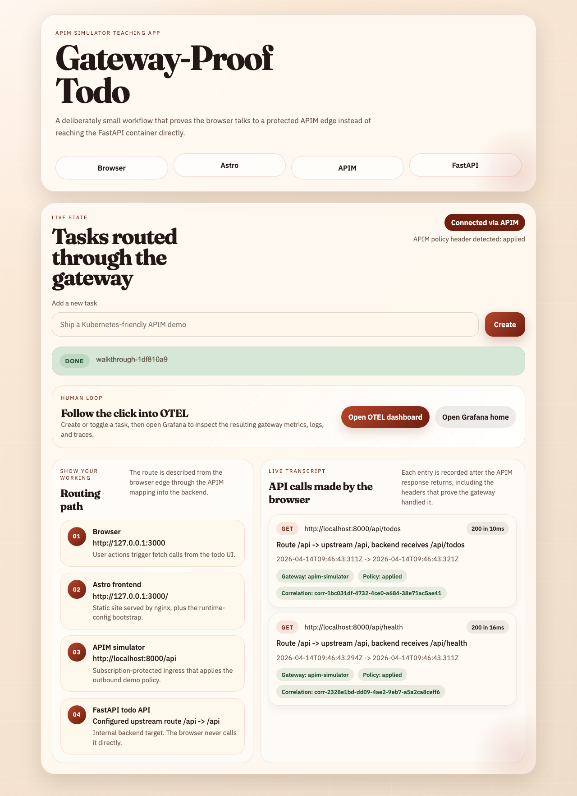

# APIM Simulator Walkthrough: Todo Demo

Generated from a live run against the local repository.

`make up-todo` is the most user-facing stack in the repo: Astro frontend on `http://localhost:3000`, APIM on `localhost:8000`, and the FastAPI todo backend behind it.

```bash
set -euo pipefail
make down >/dev/null 2>&1 || true
log="$(mktemp)"
make up-todo >"$log" 2>&1 || { cat "$log"; exit 1; }
ready=false
for _ in $(seq 1 120); do
  if curl -fsS "$TODO_FRONTEND_BASE_URL" 2>/dev/null | rg -q 'Gateway-Proof Todo' \
    && curl -fsS http://localhost:8000/apim/health >/dev/null 2>&1; then
    ready=true
    break
  fi
  sleep 1
done
if [[ "$ready" != true ]]; then
  echo "todo demo did not become ready within 120 seconds" >&2
  docker compose -f compose.todo.yml ps -a --format json | jq -sS .
  docker compose -f compose.todo.yml logs --tail 200 todo-frontend apim-simulator todo-api || true
  exit 1
fi
docker compose -f compose.todo.yml ps --format json | jq -sS .
rm -f "$log"

```

```output
[
  {
    "Command": "\"/app/.venv/bin/pyth…\"",
    "CreatedAt": "2026-04-14 10:46:27 +0100 BST",
    "ExitCode": 0,
    "Health": "healthy",
    "ID": "e1be1b4ca20a",
    "Image": "apim-simulator:latest",
    "Labels": "com.docker.compose.config-hash=8738a60af0dac1614affc8c687225bbb78a4cd601d4a974a65ff5a44515d3ae8,com.docker.compose.project=apim-simulator-todo,com.docker.dhi.chain-id=sha256:b9e7c6e6bf9a389eaa805f1244eea298c7ecd133127518ede00ede39add3df83,com.docker.dhi.distro=debian-13,com.docker.dhi.url=https://dhi.io/catalog/python,com.docker.dhi.version=3.13.13-debian13,desktop.docker.io/ports/8000/tcp=:8000,com.docker.dhi.date.end-of-life=2029-10-31,com.docker.compose.container-number=1,com.docker.compose.image=sha256:54a3eb6673318b679adb4bdd5b76883e4315055750ae58af399bf45ad37c88c9,com.docker.compose.version=5.1.1,com.docker.dhi.date.release=2024-10-07,com.docker.dhi.flavor=,com.docker.dhi.package-manager=,com.docker.dhi.shell=,com.docker.compose.oneoff=False,com.docker.compose.project.config_files=./compose.todo.yml,com.docker.dhi.definition=image/python/debian-13/3.13,com.docker.dhi.entitlement=public,com.docker.dhi.name=dhi/python,com.docker.dhi.title=Python 3.13.x,com.docker.dhi.variant=runtime,desktop.docker.io/ports.scheme=v2,com.docker.compose.depends_on=todo-api:service_healthy:false,com.docker.compose.project.working_dir=.,com.docker.compose.service=apim-simulator,com.docker.dhi.compliance=cis,com.docker.dhi.created=2026-04-11T22:45:39Z",
    "LocalVolumes": "0",
    "Mounts": "",
    "Name": "apim-simulator-todo-apim-simulator-1",
    "Names": "apim-simulator-todo-apim-simulator-1",
    "Networks": "apim-simulator-todo_todo",
    "Ports": "0.0.0.0:8000->8000/tcp, [::]:8000->8000/tcp",
    "Project": "apim-simulator-todo",
    "Publishers": [
      {
        "Protocol": "tcp",
        "PublishedPort": 8000,
        "TargetPort": 8000,
        "URL": "0.0.0.0"
      },
      {
        "Protocol": "tcp",
        "PublishedPort": 8000,
        "TargetPort": 8000,
        "URL": "::"
      }
    ],
    "RunningFor": "12 seconds ago",
    "Service": "apim-simulator",
    "Size": "0B",
    "State": "running",
    "Status": "Up 6 seconds (healthy)"
  },
  {
    "Command": "\"/app/.venv/bin/uvic…\"",
    "CreatedAt": "2026-04-14 10:46:27 +0100 BST",
    "ExitCode": 0,
    "Health": "healthy",
    "ID": "74702b39a6e3",
    "Image": "apim-simulator-todo-api:latest",
    "Labels": "com.docker.compose.project.working_dir=.,com.docker.dhi.created=2026-04-11T22:45:39Z,com.docker.dhi.date.release=2024-10-07,com.docker.dhi.flavor=,com.docker.dhi.name=dhi/python,com.docker.dhi.title=Python 3.13.x,com.docker.dhi.version=3.13.13-debian13,com.docker.compose.config-hash=c9c986d25726af3f0529b93e15b253c49805c0bdbe242518ab033706ed1ea648,com.docker.compose.depends_on=,com.docker.compose.service=todo-api,com.docker.dhi.chain-id=sha256:b9e7c6e6bf9a389eaa805f1244eea298c7ecd133127518ede00ede39add3df83,com.docker.dhi.compliance=cis,com.docker.dhi.distro=debian-13,desktop.docker.io/ports.scheme=v2,com.docker.compose.project.config_files=./compose.todo.yml,com.docker.compose.version=5.1.1,com.docker.dhi.date.end-of-life=2029-10-31,com.docker.dhi.definition=image/python/debian-13/3.13,com.docker.dhi.package-manager=,com.docker.compose.container-number=1,com.docker.compose.image=sha256:1856562c59571c694e49a618bf71d7d0f72b45f95ebd53a5a58a52ce097f9b81,com.docker.compose.oneoff=False,com.docker.dhi.entitlement=public,com.docker.dhi.shell=,com.docker.dhi.url=https://dhi.io/catalog/python,com.docker.dhi.variant=runtime,com.docker.compose.project=apim-simulator-todo",
    "LocalVolumes": "0",
    "Mounts": "",
    "Name": "apim-simulator-todo-todo-api-1",
    "Names": "apim-simulator-todo-todo-api-1",
    "Networks": "apim-simulator-todo_todo",
    "Ports": "8000/tcp",
    "Project": "apim-simulator-todo",
    "Publishers": [
      {
        "Protocol": "tcp",
        "PublishedPort": 0,
        "TargetPort": 8000,
        "URL": ""
      }
    ],
    "RunningFor": "12 seconds ago",
    "Service": "todo-api",
    "Size": "0B",
    "State": "running",
    "Status": "Up 11 seconds (healthy)"
  },
  {
    "Command": "\"/usr/local/bin/runt…\"",
    "CreatedAt": "2026-04-14 10:46:27 +0100 BST",
    "ExitCode": 0,
    "Health": "",
    "ID": "e28b821accb8",
    "Image": "apim-simulator-todo-frontend:latest",
    "Labels": "com.docker.compose.container-number=1,com.docker.compose.project.working_dir=.,com.docker.compose.service=todo-frontend,com.docker.compose.version=5.1.1,com.docker.dhi.date.release=2025-06-24,desktop.docker.io/ports.scheme=v2,com.docker.compose.oneoff=False,com.docker.dhi.chain-id=sha256:12d6f6bfdcac60cd53148007d8b5ee2c5a827f82ad0a8568232264eb95b6f5e2,com.docker.dhi.flavor=,com.docker.dhi.name=dhi/nginx,com.docker.dhi.package-manager=,com.docker.dhi.shell=,com.docker.dhi.url=https://dhi.io/catalog/nginx,desktop.docker.io/ports/8080/tcp=:3000,com.docker.compose.image=sha256:a434a760ae3871c55206133dd4758ac7786bb4d71fc617d590ed73e2f37c7f7e,com.docker.compose.project=apim-simulator-todo,com.docker.dhi.created=2026-02-05T05:17:44Z,com.docker.dhi.distro=debian-13,com.docker.dhi.title=Nginx mainline,com.docker.dhi.version=1.29.5-debian13,com.docker.compose.depends_on=apim-simulator:service_healthy:false,com.docker.compose.project.config_files=./compose.todo.yml,com.docker.dhi.compliance=cis,com.docker.dhi.definition=image/nginx/debian-13/mainline,com.docker.dhi.variant=runtime,com.docker.compose.config-hash=17d5e64e34e45171dbdf666aae54d0494904d7a7e0362c22269dd8301d868ce1",
    "LocalVolumes": "0",
    "Mounts": "",
    "Name": "apim-simulator-todo-todo-frontend-1",
    "Names": "apim-simulator-todo-todo-frontend-1",
    "Networks": "apim-simulator-todo_todo",
    "Ports": "0.0.0.0:3000->8080/tcp, [::]:3000->8080/tcp",
    "Project": "apim-simulator-todo",
    "Publishers": [
      {
        "Protocol": "tcp",
        "PublishedPort": 3000,
        "TargetPort": 8080,
        "URL": "0.0.0.0"
      },
      {
        "Protocol": "tcp",
        "PublishedPort": 3000,
        "TargetPort": 8080,
        "URL": "::"
      }
    ],
    "RunningFor": "12 seconds ago",
    "Service": "todo-frontend",
    "Size": "0B",
    "State": "running",
    "Status": "Up Less than a second"
  }
]
```

```bash
set -euo pipefail
uv run --project . python - <<'PY'
import json
import os
import time
import uuid
import httpx

title = f"walkthrough-{uuid.uuid4().hex[:8]}"
client = httpx.Client(timeout=10.0)
apim_base_url = os.environ["TODO_APIM_BASE_URL"]
frontend_base_url = os.environ["TODO_FRONTEND_BASE_URL"]
subscription_key = os.environ.get("TODO_SUBSCRIPTION_KEY", "todo-demo-key")
invalid_subscription_key = os.environ.get("TODO_INVALID_SUBSCRIPTION_KEY", "todo-demo-key-invalid")

def wait_for(url: str, label: str, timeout_seconds: float = 60.0) -> None:
    deadline = time.time() + timeout_seconds
    while time.time() < deadline:
        try:
            response = client.get(url)
            if response.is_success:
                return
        except httpx.HTTPError:
            pass
        time.sleep(1)
    raise RuntimeError(f"timed out waiting for {label}: {url}")

wait_for(f"{apim_base_url}/apim/health", "gateway health")
deadline = time.time() + 120.0
frontend = None
while time.time() < deadline:
    try:
        candidate = client.get(frontend_base_url)
        if candidate.is_success and "Gateway-Proof Todo" in candidate.text:
            frontend = candidate
            break
    except httpx.HTTPError:
        pass
    time.sleep(1)
if frontend is None:
    raise RuntimeError(f"timed out waiting for todo frontend: {frontend_base_url}")
health = client.get(
    f"{apim_base_url}/api/health",
    headers={"Ocp-Apim-Subscription-Key": subscription_key},
)
health.raise_for_status()
missing = client.get(f"{apim_base_url}/api/todos")
invalid = client.get(
    f"{apim_base_url}/api/todos",
    headers={"Ocp-Apim-Subscription-Key": invalid_subscription_key},
)
created = client.post(
    f"{apim_base_url}/api/todos",
    headers={"Ocp-Apim-Subscription-Key": subscription_key},
    json={"title": title},
)
created.raise_for_status()
created_payload = created.json()
updated = client.patch(
    f"{apim_base_url}/api/todos/{created_payload['id']}",
    headers={"Ocp-Apim-Subscription-Key": subscription_key},
    json={"completed": True},
)
updated.raise_for_status()
listed = client.get(
    f"{apim_base_url}/api/todos",
    headers={"Ocp-Apim-Subscription-Key": subscription_key},
)
listed.raise_for_status()
listed_payload = listed.json()
summary = {
    "frontend_base_url": frontend_base_url,
    "frontend_title_present": "Gateway-Proof Todo" in frontend.text,
    "health": {
        "status": health.status_code,
        "policy_header": health.headers.get("x-todo-demo-policy"),
        "body": health.json(),
    },
    "missing_subscription": {"status": missing.status_code, "body": missing.json()},
    "invalid_subscription": {"status": invalid.status_code, "body": invalid.json()},
    "created_todo": created_payload,
    "updated_todo": updated.json(),
    "list_count": len(listed_payload["items"]),
}
print(json.dumps(summary, indent=2, sort_keys=True))
PY

```

```output
{
  "created_todo": {
    "completed": false,
    "id": 1,
    "title": "walkthrough-1df810a9"
  },
  "frontend_base_url": "http://127.0.0.1:3000",
  "frontend_title_present": true,
  "health": {
    "body": {
      "service": "todo-api",
      "status": "ok"
    },
    "policy_header": "applied",
    "status": 200
  },
  "invalid_subscription": {
    "body": {
      "detail": "Invalid subscription key"
    },
    "status": 401
  },
  "list_count": 1,
  "missing_subscription": {
    "body": {
      "detail": "Missing subscription key"
    },
    "status": 401
  },
  "updated_todo": {
    "completed": true,
    "id": 1,
    "title": "walkthrough-1df810a9"
  }
}
```

```bash {image}
set -euo pipefail
rodney stop >/dev/null 2>&1 || true
rm -f "$HOME/.rodney/chrome-data/SingletonLock"
rodney start >/tmp/rodney-start.log 2>&1 || true
sleep 2
rodney open "$TODO_FRONTEND_BASE_URL" >/dev/null
rodney waitload >/dev/null
rodney waitstable >/dev/null
rodney sleep 2 >/dev/null
rodney screenshot walkthrough-example-todo.png

```


